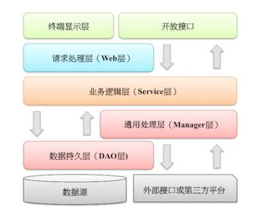

## 阿里巴巴java开发手册的学习笔记
 ### doc
 
 [为什么阿里代码规约要求避免使用 Apache BeanUtils 进行属性复制](https://mp.weixin.qq.com/s/PHdYfAWzGOLojGAeOFTCLQ)
 
 [为什么阿里巴巴不建议在for循环中使用"+"进行字符串拼接](https://mp.weixin.qq.com/s/8g8zey7ulQ05BhQH1ET3QQ)
 
 [《阿里巴巴Java工作手册》学习笔记](https://mp.weixin.qq.com/s/billJO4dFRlOhH21SCZpIw)
 
 
 [枚举很好用啊，为啥阿里不建议返回值用枚举？](https://mp.weixin.qq.com/s/lkZzglR7tNlKZ0lwOK8HYg)
 
 [为什么阿里巴巴要禁用Executors创建线程池？](https://mp.weixin.qq.com/s/lqECXPKz1iuyvMZMYJhOlQ)

### 编程规约

#### 命名风格
* 禁止符号开头
* 禁止中英文混合
* UpperCamelCase命名,例外:DO、BO、DTO、VO、AO、PO、UID
* lowerCamelCase:方法名、参数名、成员变量、局部变量
* 常量大写,单词用下划线分开,力求表达清楚，不要嫌单词长
* 抽象类用Abstract开头;异常类用Exception结尾;测试类用Test结尾
* POJO类布尔类型的变量禁止is前缀,例如:isActive是否激活
* package名小写,单数形式
* 避免不规范的缩写
* 模块、接口、类、方法使用了代理模式，命名时体现具体的设计模式,例如:OrderFactory
* 接口中的方法和属性不加修饰符(public也不要加),加上Javadoc注释
* SOA的理念,接口实现类用Impl后缀
* 枚举后缀名Enum,成员名称全部大写,单词用下划线分开
* 各层命名规约
  **Service/DAO层方法规约
    1. 获取单个对象 get前缀
    2. 获取多个对象 list前缀,复数形式结尾如:listObjects
    3. 统计         count前缀
    4. 插入         insert/save前缀
    5. 删除         remove/delete前缀
    6. 修改         update前缀
  **领域模型规约
    1. 数据对象:    表名DO
    2. 数据传输对象:业务名DTO
    3. 展示对象:    网页名称VO
    4. POJO是DO/DTO/BO/VO的统称,禁止命名XXXPOJO

#### 常量定义
    * 常量类按功能划分，禁止一个类维护所有常量类
    * Long代替long,避免和1进行混淆

#### 代码格式
    * if/for/while/switch/do 等保留字与括号之间都必须加空格
    * 任何二目、 三目运算符的左右两边都需要加一个空格
    * 注释的双斜线与注释内容之间有且仅有一个空格,例如:// 这是示例注释，请注意在双斜线之后有一个空格
    * 单行字符数限制不超过 120 个，超出需要换行
    * 单个方法的总行数不超过 80 行(包括注释、空格、换行)
    * 方法参数在定义和传入时，多个参数逗号后边必须加空格,例如:method(args1, args2, args3);
    * 文件编码为UTF-8
    * 不同逻辑之间,插入一个空行分割

#### OOP规约
    * 重写方法,加@Override
    * 参数列表,不可变参数放最后,不推荐使用不可变参数
    * 不能用过时的类或方法
    * 判断相等,不为空放左边,推荐使用java.util.Objects.equals("1","2")
    * 定义 DO/DTO/VO 等 POJO 类时，不要设定任何属性默认值
    * 序列化类新增属性时，请不要修改 serialVersionUID 字段，避免反序列失败
    * 构造方法里面禁止加入任何业务逻辑，如果有初始化逻辑，请放在 init 方法中
    * POJO 类必须写 toString 方法
    * 使用索引访问用 String 的 split 方法得到的数组时，需做最后一个分隔符后有无
      内容的检查,例如:String str = "a,b,c,,";
   #### 集合处理
    * 集合初始化时， 指定集合初始值大小
      initialCapacity = (需要存储的元素个数 / 负载因子) + 1。
      注意负载因子（即 loader factor） 默认为 0.75， 如果暂时无法确定初始值大小，请设置为 16（即默认值）
    * map遍历,entrySet,拒绝keySet,推荐Map.foreach

#### 并发处理

#### 控制语句
    * 禁止单行,例如:if (condition) statements;
    * 少用if-else,禁止if-else三层,使用卫语句、策略模式、状态模式解决

#### 注释规约
    * 类、类属性、类方法的注释必须使用 Javadoc 规范，使用/**内容*/格式
    * 所有的抽象方法（包括接口中的方法） 必须要用 Javadoc 注释、除了返回值、参数、
      异常说明外，还必须指出该方法做什么事情，实现什么功能  
    * 所有的类都必须添加创建者和创建日期
    * 代码修改的同时，注释也要进行相应的修改，尤其是参数、返回值、异常、核心逻辑
      等的修改

#### 其他
    * 获取当前毫秒数 System.currentTimeMillis(); 而不是 new Date().getTime();统计时间等场景，推荐使用 Instant 类
    * 关闭资源 try-with-resource
        try (FileInputStream fileInput = new FileInputStream(one);
                        FileOutputStream fileOutput = new FileOutputStream(two);){
        } catch
        
        可关闭的资源必须实现 java.lang.AutoCloseable 接口

### 异常日志
   * 推荐slf4j
   * 条件输出&占位符
       if (logger.isDebugEnabled()) {
          logger.debug("Processing trade with id: " + id + " and symbol: " + symbol);
       }
   * 谨慎记录日志,避免记录敏感数据   
   
   * [为什么阿里巴巴禁止直接使用日志系统(Log4j、Logback)中的 API](https://mp.weixin.qq.com/s/pkukoU-83H6YCSWw3abJXw)
 

### 单元测试
   * 独立性,不能调用其他单元测试用例
   * 自动化,不能用System.out,而用assert验证
   * 核心业务、应用、模块增量更新,确保单元测试通过,覆盖率100%

### 安全规约
   * 用户个人数据,做权限校验
   * 禁止敏感数据直接展示,如支付密码
   * 参数校验
   * 有限资源做疲劳校验、数量控制,如短信发送
   * 敏感词汇过滤,等风控策略

### mysql数据库
    
    * 表示是否的字段,用is_xxx方式命名,数据类型unsigned tinyint,（1 表示是， 0 表示否）
      POJO类不要加is前缀
    * 表名和字段名小写
    * 禁止使用保留字
    * 小数类型为 decimal，禁止使用 float 和 double
    * 字段长度大于5000,使用text,拆表,用id对应,避免影响其他表的效率
      选择合适的数据类型
    * 表必备字段,id 创建时间 修改时间
    * 字段适当冗余,提高查询效率
    * 单表500万行,或者单表容量超过2GB,才分库分表
    * 禁止3表join
    * count(*)会统计值为 NULL 的行，而 count(列名)不会统计此列为 NULL 值的行
    * 分页查询逻辑时，若 count 为 0 应直接返回，避免执行后面的分页语句
    * 禁止使用存储过程,可移植性和可调试性差
    * 避免in查询,如无法避免，控制in后边集合数量在1000以内
    * 字符集为utf-8,存储表情用utf8mb4
    
[阿里规范不建议多表join，可这SQL要怎么写啊？](https://mp.weixin.qq.com/s/dw288wIHhh1N9j5pVrlnDw)
[阿里不让多表join？我偏要！](http://blog.itpub.net/30393770/viewspace-2650450/)

#### ORM映射
   * 不更新无需改动的列  

### 工程结构

#### (一).应用分层
     划分规则:业务、模块
   
   
   
   * 开发接口层   rpc接口暴露,进行网关控制、流量控制
   * 终端显示层   模板渲染
   * Web层       访问控制转发、参数校验、不复用的业务简单处理
   * Service层   相对具体的业务逻辑服务层
   * Manager层  
    1). 对第三方平台接口的封装,预处理返回结果及转化异常信息
    2). 封装中间件、缓存方案的通用处理,如redis、mq
    3). dao层交互
   * dao层       数据库访问层
   * 外部接口或第三方平台:包括其他部门的RPC开放接口,基础平台,其他公司的HTTP接口
#### (二).分层异常处理规约
   
   不重复打印日志,throw Exception时不需要记录日志,异常不抛到web层

#### (三).分层领域模型规约
    * DO(Data Object):和数据库表结构一一对应
    * DTO(Data Transfer Object):数据传输对象,Service或Manager向外传输的对象
    * BO(Business Object):业务对象,由Service层输出的封装业务逻辑层的对象
    * AO(Application Object):应用对象,web层和Service层之前抽象的复用对象模型
    * VO(View Object):视图层对象
    * Query:数据查询对象

#### (四).第三方库
    
    * 统一定义版本号
    * 禁止GroupId和ArtifactId相同,但版本号不同   

### 设计规约
    
    * 状态超过4个,使用状态图表达状态变化
    * 抽取公共模块、代码、配置、方法,避免重复代码
    
## 22种代码的怀味道
一、重复代码
1、一个类中：提炼成一个函数
2、兄弟类中：提炼成一个函数，并且提取到父类中
3、两个不相关的类：提炼成一个函数，放到两个类中的一个类中或者一个单独的类中

二、过长函数
拆分成多个函数，将相关联的代码放在一个函数内，尽量保证每个函数只做一件事，且函数名见名之意

三、过大的类
保证每个类只做一件事，拆分成多个类

四、方法中过长的参数列
用对象做参数来减少参数个数

五、发散式变化
一个类做太多的事情了，万能类，经常因为不同的原因在不同的方向上发生变化，将会产生发散式变化，
将变化隔离，封装变化，把变化的和不变的部分分开，拆分成多个类

六、散弹式变化
一个变化引发多个类的修改，把需要修改的部分抽取出来，放到一个单独的类中

七、依恋情节
（红杏出墙的函数）使用了大量其他类的成员
函数对其他类的函数的调用比所处类还多，函数调用其他类的函数一般是需要其他类的数据，将该函数移动到它使用数据的类中，将数据和对数据的操作行为包装在一起，
具体是：如果该方法只调用了一个类的多个方法。将该方法移到调用类里。
如果该方法调用了多个类的多个方法。将该方法拆解。然后分离到调用类里

八、数据泥团
总是成堆出现在一起的数据，应该封装在一个单独的类中，比如你常常可以在很多地方看到相同的三四项数据：两个类中相同的字段、许多函数签名中相同的参数。这些总是绑在一起出现的数据真应该拥有属于它们自己的对象

九、基本类型偏执
用对象代替基本类型，并不是代替单个的基本类型，而是几个基本类型放在一起更有意义时应该使用对象，比如“电话号码”由基本号码，区号，地区等一起来描述时，就组装成对象，比每次都用基本类型字段描述更好。

十、switch 语句
大多数时候，一看到switch语句，你就应该考虑以多态来替换它。问题是多态该出现在哪儿？switch语句常常根据类型码进行选择，你要的是“与该类型码相关的函数或类”，所 以应该使用Extract Method将switch语句提炼到一个独立函数中，再以Move Method将它搬移到需要多态性的那个类里
如果一个 switch 操作只是执行简单的行为，就没有重构的必要了

十一、平行继承体系
每当为某个类增加一个子类，必须也为另一个类增加一个子类。消除这种重复性的一般策略是：让一个继承体系的实例引用另一个继承体系的实例。

十二、冗赘类
如果他不干活了，炒掉他吧。把这些不再重要的类里面的逻辑，合并到相关类，删掉旧的

十三、夸夸奇谈谈未来
我们经常会说：“我想总有一天需要做这事”，并因而企图以各样的钩子和特殊情况来处理一些非必要的事情。如果用不到，就不值得。删掉
比如某个抽象类其实没有太大作用，可以将超类和子类合为一体。将不必要的委托转移到另一个类中，并消除原先的类。如果函数的某些参数未被用上，那么就将参数移走。如果函数名称带有多余的抽象意味，就应该对它重命名，让它现实一些。简而言之就是删掉

十四、令人迷惑的临时字段
有时候你会发现：类中的某个实例变量仅为某种特定情况而设。这样的代码让人难以理解，因为你通常认为对象在所有时候都需要它的所有变量。
将这些临时变量集中到一个新类中管理

十五、过度耦合的消息链
有些时候我们在调用某个函数的时候往往会形成A->B->C->D.test(),这个时候如果你在A端，你就产生了Message Chains的坏味道。这种状态使的你客户代码在A中变成getB()->getC()->getD()->test(),这会使得客户代码在以后这些类关系发生变化的时候变得极易修改与相当不稳定。
可以使用隐藏“委托关系”，并在服务类上建立客户所需要的所有函数来打破这消息链，理论上你可以重构消息链上的任一对象。但这样做往往会让这些小对象都变成Middle Man(中间人)，通常更好的做法是：查看消息链最终对象是用来干什么的，看看是否能用Extract Method把他提炼到一个独立的函数中去，再运用Move Method把这个函数推入消息链，

十六、中间人
大部分都交给中介来处理了。用继承替代委托。

十七、狎昵关系
两个类彼此使用对方的私有的东西。
可以通过“移动方法”和“移动字段”帮它们划清界限，从而减少狎昵行径。如果两个类实在是情投意合，可以把两者共同点提炼到一个安全地点，让它们坦荡地使用这个新类，从而改变从双向依赖A->B,B->A变成A->C,B->C。或者通过隐藏“委托关系”让另一个类来为它们传递相思情，

十八、异曲同工的类
相似的类，有不同接口 
那么你需要使用Rename Method将这些接口统一到一个名字，然后通过Move Method将某些行为移动到适合的类当中去，重构之后你会发现他们似乎更适合成为兄弟类，以方便你把这个共同函数推到父类当中去，这个时候你可以运用Extract Superclass来进行提炼父类。

十九、不完美的库类
包一层函数或包成新的类。

二十、纯稚的数据类
类很简单，仅有公共成员变量，或简单操作函数。
将相关操作封装进去，减少public成员变量。

二十一、被拒绝的遗贈
（继承过多）父类里面方法很多，子类只用有限几个,用代理替代继承关系

二十二、过多的注释
如果你需要注释来解释一块代码做了什么，试试将该代码抽取为一个单独的函数；如果函数已经被提炼出来，但还是需要注释来解释其行为，试着对其重新命名。当你感觉需要撰写注释时，请先尝试重构，试着让所有注释都变得多余。好代码即注释。    