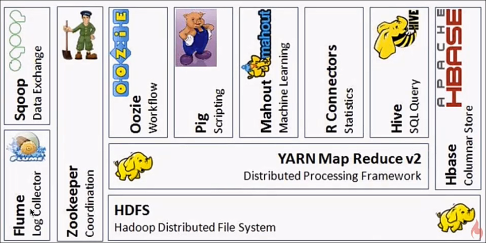
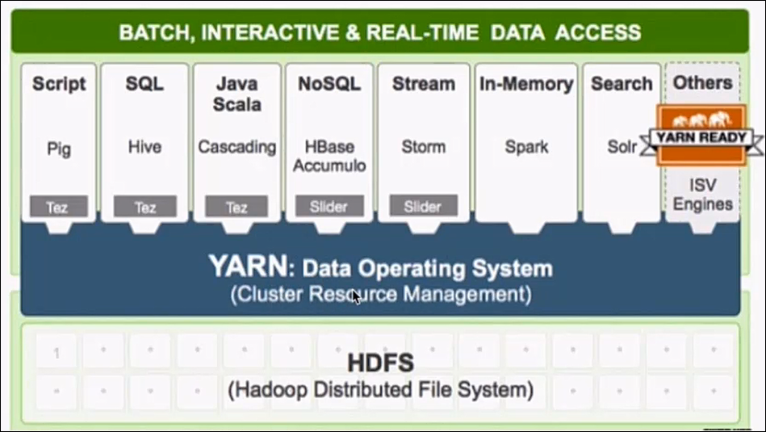
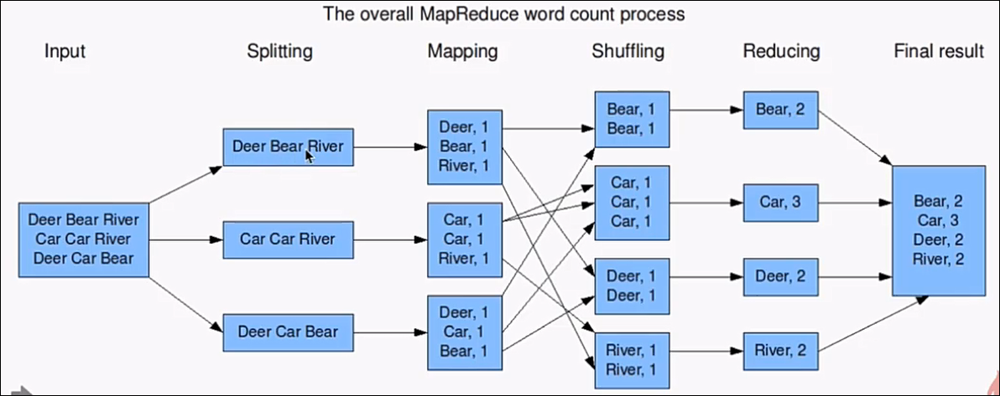

# hadoop

## 大纲

### 大数据概论 & Hadoop生态
* 大数据概念
* 大数据的特点（4V）
* 大数据应用场景
* 大数据发展前景
* 大数据部门业务流程分析
* 大数据部门组织结构（重点）
* Hadoop是什么
* Hadoop发展历史
* Hadoop三大发行版本
* Hadoop的优势（4高）

### Hadoop入门
* Hadoop组成
* HDFS架构概述
* YARN架构概述
* MapReduce架构概述
* 大数据技术生态体系
* 推荐系统框架图
* Hadoop运行环境搭建
* 虚拟机环境准备
* 安装JDK、安装Hadoop
* Hadoop目录结构

### Hadoop运行模式 
Hadoop运行模式
本地运行模式
官方Grep案例
官方WordCount案例
伪分布式运行模式
启动HDFS并运行MapReduce程序
启动YARN并运行MapReduce程序
配置历史服务器
配置日志的聚集
配置文件说明
完全分布式运行模式

### 完全分布式模式&源码编译
* 虚拟机准备
* 编写集群分发脚本xsync
* 集群配置
* 集群单点启动
* SSH无密登录配置
* 群起集群
* 集群启动/停止方式总结
* 集群时间同步
* Hadoop编译源码
* 常见错误及解决方案

### Hadoop 3.x新特性
* Hadoop 3.x和2.x主要区别
* 最低Java版本需求由7升级为8
* 引入纠删码
* Yarn 时间线服务升级到V2
* 重写了Shell脚本
* 引入了新的API依赖
* MapReduce 任务的本地化优化
* 支持超过两个NN
* 许多服务的默认端口改变了

### Hadoop3.x安装使用
* DataNode内部实现Balancer
* 重做的后台和任务堆内存管理
* HDFS实现服务器级别的Federation分流
* 容量调度器实现API级别的配置
* Yarn实现更多种资源类型的管理
* 配置环境变量
* 配置Hadoop核心文件

## doc

[用大白话告诉你小白都能看懂的Hadoop架构原理](https://mp.weixin.qq.com/s/mEk3m4MOuOrP5yub2onCGg)

[亿级PV，常见性能优化策略总结与真实案例](https://mp.weixin.qq.com/s/rpSMOieVEQ9r3f55WlvkLQ)

[大数据学习笔记1000条](https://mp.weixin.qq.com/s/x3GYmbnHJvPmGbZfaXcJ7w)

[Apache Griffin：分布式系统的数据质量解决方案](https://www.iteblog.com/archives/2492.html)

[大数据平台常用组件端口号](https://blog.csdn.net/jenrey/article/details/80719552)

## 简介
[传智大数据](http://www.itcast.cn/subject/cloudzly/index.shtml)

大数据5V特点:

1）Volume(大量) ['vɒljuːm]
    数据量大，包括采集、存储和计算的量都非常大。大数据的起始计量单位至少是P（1000个T）、E（100万个T）或Z（10亿个T）

2）Velocity(高速)[vəˈlɒsəti]
    数据增长速度快，处理速度也快，时效性要求高。比如搜索引擎要求几分钟前的新闻能够被用户查询到，个性化推荐算法尽可能要求实时完成推荐。这是大数据区别于传统数据挖掘的显著特征

3) Variety(多样)[və'raɪətɪ] 
    种类和来源多样化。包括结构化、半结构化和非结构化数据，具体表现为网络日志、音频、视频、图片、地理位置信息等等，多类型的数据对数据的处理能力提出了更高的要求

4) Value(低价值密度)['væljuː] 
    数据价值密度相对较低，或者说是浪里淘沙却又弥足珍贵。随着互联网以及物联网的广泛应用，信息感知无处不在，信息海量，但价值密度较低，如何结合业务逻辑并通过强大的机器算法来挖掘数据价值，是大数据时代最需要解决的问题

5) Veracity(速度)[vəˈræsəti] 
    实时推荐,提高订单转换率

[大数据5v指的是什么？——以沃尔玛为例](https://blog.csdn.net/goddess_ever_never/article/details/80063066)

## 架构

[阿里云 大数据架构如何做到流批一体？(lambda架构)](https://mp.weixin.qq.com/s/waoNAf7bFKgkyHbCMIMy_Q)

[如何设计一个超级牛牛牛逼的 Feed 流系统](https://mp.weixin.qq.com/s/vRjLfVHyKGX35N_mYjDD7A)
    
## Overview 
[hadoop官网](http://hadoop.apache.org)

[十年了，Hadoop的前世今生](https://blog.csdn.net/lfq1532632051/article/details/53219558)

### hadoop由来

项目作者的孩子对黄色大象玩具的命名

开源、分布式存储与分布式计算的平台

Hadoop能做什么：

1. 搭建大型数据仓库，PB级数据的存储、处理、分析、统计等业务

2. 搜索引擎、日志分析、数据挖掘、商业智能

## hadoop生态系统
* HDFS->分布式文件系统
* Yarn->分布式资源调度,xx on yarn,资源按需分配,提高集群资源的利用率
* Zookeeper->分布式协调服务,解决单点故障
* Flume->日志收集框架
* mahout-(数据挖掘库)机器学习,基于MapReduce的mahout停止维护,转向基于Spark
* Oozie->工作流程调度程序(工作流,A作业输出作为B作业的输出)
* Sqoop->数据同步工具,关系型数据库到hadoop生态上的数据交换工具
* Storm->分布式实时计算系统
* MapReduce->分布式计算框架
* Spark->快速，通用引擎用于大规模数据处理
* impala->实时查询数据
* Ambari->基于web的部署/管理/监控Hadoop集群的工具集
* Kafka->消息队列
* Phoenix->SQL中间层,构建于Hbase之上
* Hive->基于Hadoop的数据仓库
* pig->数据流处理,现基本不用
* Hbase->分布式列数据库
* R->用做统计分析



### Hadoop
    名称由来：项目作者DougCutting的孩子对黄色大象玩具的命名
    开源、分布式存储与分布式计算的平台,分布式计算的基础架构    
    
    狭义Hadoop VS 广义Hadoop
    狭义:HDFS、MapReduce、YARN
    广义:Hadoop生态系统,每个子系统只解决某一个特定的问题领域,小而精 

### HDFS（分布式文件系统）
    1. 源于Google在2003年10月发表的GFS论文
    2. 对GFS的克隆
    3. 特点：扩展性、容错性、海量数据存储
    4. 将文件切分成指定大小的数据块并且多副本存于多个机器上
    5. 数据切分、多副本、容错对用户是透明的

    
    
### YARN（资源管理）
    1. 整个集群资源的管理与调度
    2. 特点：扩展性、容错性、多框架资源统一调度 

    

### MapReduce（分布式计算框架）
    1. 2004年12月的GoogleMapReduce论文
    2. Google MapReduce的克隆版
    3. 特点：扩展性、容错性、海量数据的离线处理

### Hive
    最初用于解决海量结构化的日志数据统计问题.比如:统计访问量
    构建在hadoop之上的数据仓库
    定义一种类SQL的查询语言,HQL(类似但不完全相同)->hibernate HQL
    通常于进行离线数据处理
    底层采用多种执行引擎(Spark、Tez、MapReduce)
    支持多种不同的压缩格式(gzip snappy bzip2)、存储格式(TextFile SequenceFile RCFile ORC Parquet)、自定义函数(UDF)
    
        

## 特点：
1.开源、社区活跃
2.成熟，涉及范围广

## hadop常用发行版及选型
Apache Hadoop
CDH:Cloudera Distributed		70%
HDP:Hortonworks Data Platform	

[cdh](http://archive.cloudera.com/cdh5/cdh/5/)

cdh-5.7.0
生产或者测试环境选择对应CDH版本时，一定要采用尾号是一样的版本

[apache下载地址](http://archive.apache.org/dist/)

## hadoop环境搭建

### doc
[hadoop官方单机安装](http://archive.cloudera.com/cdh5/cdh/5/hadoop/hadoop-project-dist/hadoop-common/SingleCluster.html)

### 步骤
1) 下载Hadoop
	[cdh下载地址](http://archive.cloudera.com/cdh5/cdh/5/)
	2.6.0-cdh5.7.0

	wget http://archive.cloudera.com/cdh5/cdh/5/hadoop-2.6.0-cdh5.7.0.tar.gz

2）安装jdk
	下载
	解压到app目录：tar -zxvf jdk-7u51-linux-x64.tar.gz -C ~/app/
	验证安装是否成功：~/app/jdk1.7.0_51/bin      ./java -version
	建议把bin目录配置到系统环境变量(~/.bash_profile)中
		export JAVA_HOME=/home/hadoop/app/jdk1.7.0_51
		export PATH=$JAVA_HOME/bin:$PATH
3）机器参数设置
	1. hostname: hadoop001
    2. 修改机器名: /etc/sysconfig/network
		NETWORKING=yes
		HOSTNAME=hadoop001
	3. 设置ip和hostname的映射关系: /etc/hosts
		192.168.199.200 hadoop001
		127.0.0.1 localhost
	4. ssh免密码登陆(本步骤可以省略，但是后面你重启hadoop进程时是需要手工输入密码才行)
       .ssh
        known_hosts 记录ssh访问过计算机的公钥(public key)
        id_rsa      生成的私钥
        id_rsa.pub  生成的公钥
        authorized_keys 存放授权过得无密登录服务器公钥
```
ssh-keygen (全部回车,无需输入)

ssh-copy-id -i /root/.ssh/id_rsa.pub node01

ssh-copy-id -i /root/.ssh/id_rsa.pub node02

ssh-copy-id -i /root/.ssh/id_rsa.pub node03

ssh-copy-id -i /root/.ssh/id_rsa.pub node04

ssh-copy-id -i /root/.ssh/id_rsa.pub node05

ssh node1
```        
		> ssh-keygen -t dsa -P '' -f ~/.ssh/id_dsa
        > cat ~/.ssh/id_dsa.pub >> ~/.ssh/authorized_keys
        > ssh localhost

4）Hadoop配置文件修改: ~/app/hadoop-2.6.0-cdh5.7.0/etc/hadoop
	1. hadoop-env.sh
		export JAVA_HOME=/home/hadoop/app/jdk1.7.0_51
    2. core-site.xml
        hadoop1.0 9000 默认,hadoop2.0 8200默认
```
    <property>
        <name>fs.defaultFS</name>
        <value>hdfs://hadoop001:8020</value>
    </property>	
    
    <property>
        <name>hadoop.tmp.dir</name>
        <value>/home/hadoop/app/tmp</value>
    </property>	
```
   3. hdfs-site.xml
```    
<property>
    <name>dfs.replication</name>
    <value>1</value>
</property>
```
5）格式化HDFS
	注意：这一步操作，只是在第一次时执行，每次如果都格式化的话，那么HDFS上的数据就会被清空
	bin/hdfs namenode -format

6）启动HDFS
	sbin/start-dfs.sh

	验证是否启动成功:
		jps
			DataNode
			SecondaryNameNode
			NameNode

		可视化界面
			http://hadoop001:50070/
			
       3.0  http://hadoop001:9870/

    
    安全模式关闭 hdfs dfsadmin -safemode leave
    
    安全模式开启  hdfs dfsadmin -safemode enter
    
7）停止HDFS
	sbin/stop-dfs.sh
	
8) window
[hadoop2.7.3的hadoop.dll和winutils.exe](https://download.csdn.net/download/chenxf10/9621093)
hadoop本地库
HADOOP_HOME	

## Spring for Apache Hadoop

### 1、[Overview](https://spring.io/projects/spring-hadoop)
Spring Hadoop简化了Apache Hadoop，提供了一个统一的配置模型以及简单易用的API来使用HDFS、MapReduce、Pig以及Hive。
还集成了其它Spring生态系统项目，如Spring Integration和Spring Batch

### 2、Features特点
* Support to create Hadoop applications that are configured using Dependency Injection and run as standard Java applications vs. using Hadoop command line utilities.
  >支持创建Hadoop应用，配置使用依赖注入和运行标准的java应用程序和使用Hadoop的命令行工具
* Integration with Spring Boot to simply creat Spring apps that connect to HDFS to read and write data.
  >集成Spring Boot，可以简单地创建Spring应用程序去连接HDFS进行读写数据
* Create and configure applications that use Java MapReduce, Streaming, Hive, Pig, or HBase
  >创建和配置，使用java的MapReduce，Streaming，Hive，Pig或HBase
* Extensions to Spring Batch to support creating Hadoop based workflows for any type of Hadoop Job or HDFS operation.
  >扩展Spring Batch支持创建基于Hadoop的工作流的任何类型的Hadoop Job或HDFS的操作
* Script HDFS operations using any JVM based scripting language.
  >脚本HDFS操作使用任何基于JVM的脚本语言
* Easily create custom Spring Boot based aplications that can be deployed to execute on YARN.
  >基于SpringBoot轻松地创建自定义的基础应用，应用可以部署在YARN上
* DAO support (Template & Callbacks) for HBase.
  >支持DAO，可以使用模板或回调的方式操作Hbase
* Support for Hadoop Security.
  >支持Hadoop安全验证

### 3、Spring Boot Config
```
<dependencies>
    <dependency>
        <groupId>org.springframework.data</groupId>
        <artifactId>spring-data-hadoop</artifactId>
        <version>2.5.0.RELEASE</version>
    </dependency>
</dependencies>
```

### 4、Quick start

### 5、Doc&Api
https://docs.spring.io/spring-hadoop/docs/2.5.0.RELEASE/reference/html/
https://docs.spring.io/spring-hadoop/docs/2.5.0.RELEASE/api/
http://blog.51cto.com/zero01/2094901?from=singlemessage

### 6、spring-hadoop
[Using a Windows client together with a Linux cluster](https://github.com/spring-projects/spring-hadoop/wiki/Using-a-Windows-client-together-with-a-Linux-cluster)


## Hadoop3.0

###端口改变
https://issues.apache.org/jira/browse/HDFS-9427

Daemon	App	Hadoop2 	Hadoop3 

NameNode Port	Hadoop HDFS NameNode	8020 / 9000	9820

Hadoop HDFS NameNode HTTP UI	50070	9870

Hadoop HDFS NameNode HTTPS UI	50470	9871

Secondary NameNode Port	Secondary NameNode HTTP	50091	9869


#### Namenode 端口: 
50470 --> 9871
50070 --> 9870
8020 --> 9820

#### Secondary NN 端口:
50091 --> 9869
50090 --> 9868

#### Datanode 端口: 
50020 --> 9867
50010 --> 9866
50475 --> 9865
50075 --> 9864

##### 史上最快! 10小时大数据入门

[(一)-大数据概述](https://www.jianshu.com/p/e67f2cc89b83)

[(二)-初识Hadoop](https://www.jianshu.com/p/830765229fc2)

[(三)-分布式文件系统HDFS](https://www.jianshu.com/p/e35817bdc4a8)

[(四)-分布式资源调度YARN](https://www.jianshu.com/p/f59165b9c049)

[(五)-分布式计算框架MapReduce](https://www.jianshu.com/p/b39a50f070d2)

[(六)- Hadoop 项目实战](https://www.jianshu.com/p/c7b7ea540149)

[(七)- Hadoop 分布式环境搭建](https://www.jianshu.com/p/d7c47bcbbd01)

[(八)- Hadoop 集成 Spring 的使用](https://www.jianshu.com/p/89222ac3d84b)

[(九)- 前沿技术拓展Spark,Flink,Beam](https://www.jianshu.com/p/4d0341a4d7d7)

(十)-Hadoop3.x新特性
    
- [Hadoop 3.x 新特性剖析系列1](https://www.cnblogs.com/smartloli/p/8827623.html)
     
- [Hadoop 3.x 新特性剖析系列2](https://www.cnblogs.com/smartloli/p/9028267.html)

##### JAVA&大数据架构方向

架构不是一个职业而是一种能力,每一种架构师只不过是在不同的领域里面使用不同的技术,没有什么可对比,就好比如你问一个篮球明星和一个足球明星有什么区别一样！

01  架构师需要考虑四个问题
1. 确定系统干什么不干什么,也就是说系统的边界在哪里？
2. 确定架构内部的模块与模块之间的关系,以及模块与外部之间的关系是什么？
3. 架构确定以后,有能力去指导开发去继续设计和演化,如果开发设计和演化出来的东西和架构不一致也是有问题的。
4. 确定非功能性需求,安全性,可扩展性,可用性,可维护性。

02  Java架构方向人才
● 系统的技术选型和可行性评估；

你这可以理解为：你家的房子户型设置，硬件软件配置必须要有自己的经验，装修完之后总得适用，不浪费成本，偏激一点总不能到处是柜子。

● 分布式技术框架的把控；

你这可以理解为：你家的柜子可以做出多种组合，你家的被子是放在A柜，枕头放B柜，床单放C柜，这得看你的划分用途。

● 深入发掘和分析业务需求，重点模块的设计、方案评审与技术支持，技术难点攻坚，应用系统分布式技术的落地，撰写技术方案和系统设计,最终完成编码工作；

你这可以理解为：柜子可以用来放东西，也可以用来拼装；如果组合柜，那可以拼出一些艺术品，那就看你的空间思维了。

● 针对产品性能和架构优化，确保系统的架构质量；

你这可以理解为：柜子如果没有按照之前图纸来规划安装摆放，你就会发现有些地方是可以改进的，及时完全参照图纸，你还是会想如何改进，这就会产生一些小想法；你可能会想如何装更多的物品，如何方便取物，如何整理方便。

● 优秀的抽象设计能力，思路清晰，善于思考，能独立分析和解决问题及编写解决方案；

你这可以理解为：哇，你家的装修真棒，这时你的邻居，或亲威朋友想参考你的想法，你可以提供一整套安装配置方案，现在你就是专家，因为他们想利用空间，发挥你的空间想像力。需要你来指导装修，提高装修质量，减少控制装修成本等等。

● 熟悉linux，能熟练应用shell/python等脚本语言；

● 扎实的Java基础知识，熟悉IO、多线程及并发技术；

● 熟练掌握redis、mongodb、netty、kafka等中间件；

● 对JVM原理有扎实的理解，对服务器端设计和编程有深入理解；

你这可以理解为：你对基建设施了如指掌，编译原理很清楚，恭喜你，你已经超过我了。

● 算法基础扎实，熟悉常见的数据结构，熟悉常用的设计模式，深入理解分布式算法和主流分布式系统，了解主流消息队列工作原理；

你这可以理解为：排序，索引，存储，去重，平滑等一些算法有深入了解，恭喜你，你已经是数学专家级了。

● 有丰富的分布式、高并发、高负载、高可用性系统设计经验，熟悉分布式缓存、消息等机制。
03  大数据架构方向人才
● 针对大数据平台的设计和开发制定数据架构规范，进行核心代码编写；

你这可以理解为：有设计图纸的能力，能够指导各个组件安装部署，以及数据的数据抽象能力。

● 针对数据基础架构和数据处理体系的升级和优化，技术难题攻关，持续提升核心系统性能，保证系统的安全、稳定、高效运行；

你这可以理解为：数据的价值，在于你的抽取采集能力是否高深，是否便于加工，标注。各组件的稳定性，兼容性，是否有预警，在于你的规划和监控接口是否到位。

● 大规模数据实时化、大数据技术容器化、私有云实施方案、数据模型规范化等方面根据不同项目的技术发展路线；

你这可以理解为：引入 Docker 的镜像机制来完善自己的容器;同时计算能力、数据结构抽象、定义，要用自己的风格和规范。能用最简单的配置，迅速跑起来流式streaming或离线处理spark程序.

● 跟踪大数据相关领域的技术趋势，竞争对手的产品、技术动态；

● 大数据平台的稳定性和性能优化及技术攻关；

● 产品研发过程中关键设计的把关和研发；

● 精通大数据生态圈主流技术和产品，如Hive、Storm、Flink、Spark，ELK、Kafka，Zookeeper、Yarn，presto，Hue等，对Spark分布式计算的底层原理有深度理解，对复杂系统的性能优化和稳定性的一线实战经验；

● 精通实时数据仓库设计，深刻理解MR运行原理和机制，能进行任务执行效率的优化，熟悉开源数据交换工具如sqoop，streamset，kettle，datax等

● 熟悉elasticsearch、Lucene、Solr、Kylin、Phoenix、Alluxio等相关技

● 具有规划和决策能力，善于捕捉业务需求、架构设计存在的问题，并能给出有效的解决措施和方法 。

● 数据预测，预警，人工智能，图像识别，智能语音，物联网数据采集，标注等。线性计算，神经网络，知识图谱，都要有自己的项目，而且能迅速组建团队，成就你的客户，你就是未来的行家和赢家。

04  两者侧重点不同
★ Java架构

● 开发语言

● 分布式，高可用

● 设计模式

● 支撑业务的系统架构或者工具集

★ 大数据架构
● 不局限开发语言，有Java,Scala,Python,Go等更有裨益

● 人工智能，商业智能，数据挖掘

● 离线，实时，高效率，高可用

● 结构化数据，半结构化数据

● Hadoop生态圈

● 使用的模型越来越复杂，计算量指数级上升

● 组件集

05  总之

了解到用户的痛点，抓住用户的喜好，改善用户的体验。

一个好的产品，一定要让用户感觉到爽。核心问题还是哪些数据值的采集，每个开发，码者都应该站在产品的角度去思考问题，如何描绘出适合我们的一套智能化，自动化的问题解决方案
