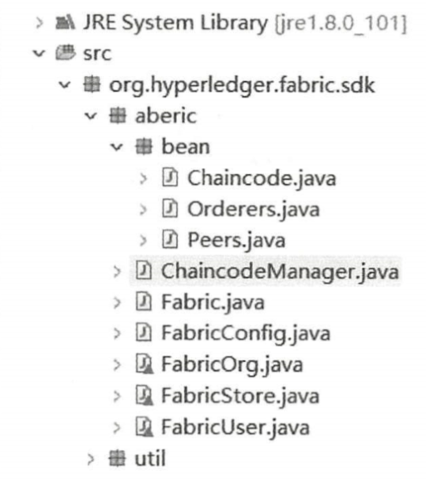
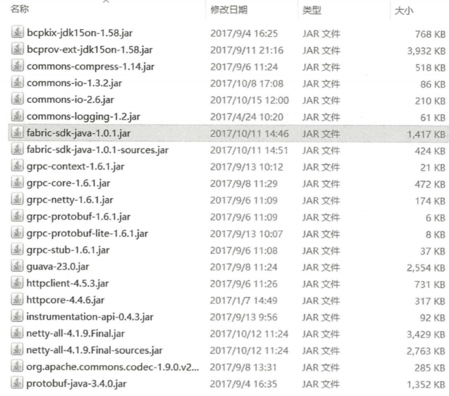

#  Java-SDK 客户端

HyperLedger Fabric 计划为各种各样的编程语言提供大量的 SDK。首先提供了 Node.js 和 Java SDK。在随后的版本中，将陆续提供可生产使用的 Python、 Restful 和 GoSDK。 尤其是在 HyperLedger Fabric 1 O 版本之后，官方开始极力推荐使用 SDK 来实现交互的操 作，原本在 0.6 版本上的 Restful API 己经被废弃 。

JAVA-SDK 可以参考 GitHub 地址为  https://github.com/hyperledger/fabric-sdk-java 

Node-SDK 可以参考 GitHub 地址为 https://github.com/hyperledger/fabric-sdk-node

 本书的 SDK 是以 Fabric-Java-SDK 为基础，该 SDK 有助于促进 Java 应用程序**管理 HyperLedger Channel 和用户智能合约的生命周期。** 

SDK 还提供了一种方法来**执行用户智能合约、查询区块和 Channel 上的交易，并监控 Channel 上的事件**。 

SDK 没有为应用程序定义的 Channel 和客户端构件提供持久性的方法。这将留给嵌入应用 程序以最佳管理。 Channel 可以在客户端的上下文中通过 Java 序列化方法进行序列化。反序列 化的 Channel 不处于初始状态。 应用程序需要处理不同版本之间的事务和事务状态管理。 

该 SDK 还为 HyperLedger 的认证机构提供了一个客户端。然而， SDK 并不依赖于证书颁 发机构的特定实现。其他的证书颁发机构可以通过实现 SDK 的注册接口来使用 。 

官方提供的 SDK 的 DEMO 较难入手，本书在官方 SDK DEMO 的基础上做了一次整理， 能够更加清晰简单地入门并使用 JAVA-SDK 进行交互。

## SDK项目前置条件







```xml
<?xml version="1.0" encoding="UTF-8"?>
<project xmlns="http://maven.apache.org/POM/4.0.0"
         xmlns:xsi="http://www.w3.org/2001/XMLSchema-instance"
         xsi:schemaLocation="http://maven.apache.org/POM/4.0.0 http://maven.apache.org/xsd/maven-4.0.0.xsd">
    <modelVersion>4.0.0</modelVersion>

    <groupId>com.leelovejava</groupId>
    <artifactId>aberic</artifactId>
    <version>1.0-SNAPSHOT</version>

    <properties>
        <java.version>1.8</java.version>
        <project.build.sourceEncoding>UTF-8</project.build.sourceEncoding>
        <springboot.version>2.2.6.RELEASE</springboot.version>
        <commons-lang3.version>3.10</commons-lang3.version>
        <fabric-geteway.version>2.0.0</fabric-geteway.version>
        <fastjson.version>1.2.68</fastjson.version>
        <bouncycastle.version>1.59</bouncycastle.version>
        <grpc.version>1.6.1</grpc.version>
        <slf4j.version>1.7.25</slf4j.version>
        <log4j.version>2.10.0</log4j.version>
    </properties>

    <dependencies>
        <!--https://github.com/hyperledger/fabric-sdk-java-->
        <dependency>
            <groupId>org.hyperledger.fabric-sdk-java</groupId>
            <artifactId>fabric-sdk-java</artifactId>
            <version>1.4.7</version>
        </dependency>
        <dependency>
            <groupId>org.apache.logging.log4j</groupId>
            <artifactId>log4j-core</artifactId>
            <version>${log4j.version}</version>
        </dependency>
        <dependency>
            <groupId>org.apache.logging.log4j</groupId>
            <artifactId>log4j-api</artifactId>
            <version>${log4j.version}</version>
        </dependency>
        <dependency>
            <groupId>org.slf4j</groupId>
            <artifactId>slf4j-api</artifactId>
            <version>${slf4j.version}</version>
        </dependency>
        <dependency>
            <groupId>org.slf4j</groupId>
            <artifactId>slf4j-log4j12</artifactId>
            <version>${slf4j.version}</version>
            <scope>test</scope>
        </dependency>
        <dependency>
            <groupId>org.bouncycastle</groupId>
            <artifactId>bcpkix-jdk15on</artifactId>
            <version>${bouncycastle.version}</version>
        </dependency>
        <dependency>
            <groupId>org.bouncycastle</groupId>
            <artifactId>bcprov-ext-jdk15on</artifactId>
            <version>${bouncycastle.version}</version>
        </dependency>
        <dependency>
            <groupId>io.grpc</groupId>
            <artifactId>grpc-context</artifactId>
            <version>${grpc.version}</version>
        </dependency>
        <dependency>
            <groupId>io.grpc</groupId>
            <artifactId>grpc-core</artifactId>
            <version>${grpc.version}</version>
        </dependency>
        <dependency>
            <groupId>io.grpc</groupId>
            <artifactId>grpc-netty</artifactId>
            <version>${grpc.version}</version>
        </dependency>
        <dependency>
            <groupId>io.grpc</groupId>
            <artifactId>grpc-protobuf</artifactId>
            <version>${grpc.version}</version>
        </dependency>
        <dependency>
            <groupId>io.grpc</groupId>
            <artifactId>grpc-protobuf-lite</artifactId>
            <version>${grpc.version}</version>
        </dependency>
        <dependency>
            <groupId>io.grpc</groupId>
            <artifactId>grpc-stub</artifactId>
            <version>${grpc.version}</version>
        </dependency>
        <dependency>
            <groupId>com.google.guava</groupId>
            <artifactId>guava</artifactId>
            <version>23.0</version>
        </dependency>
        <dependency>
            <groupId>org.apache.httpcomponents</groupId>
            <artifactId>httpclient</artifactId>
            <version>4.5.5</version>
        </dependency>

        <dependency>
            <groupId>org.apache.httpcomponents</groupId>
            <artifactId>httpcore</artifactId>
            <version>4.4.9</version>
        </dependency>

        <dependency>
            <groupId>com.google.instrumentation</groupId>
            <artifactId>instrumentation-api</artifactId>
            <version>0.4.3</version>
        </dependency>
        <dependency>
            <groupId>io.netty</groupId>
            <artifactId>netty-all</artifactId>
            <version>4.1.9.Final</version>
        </dependency>

        <dependency>
            <groupId>commons-codec</groupId>
            <artifactId>commons-codec</artifactId>
            <version>1.11</version>
        </dependency>
        <dependency>
            <groupId>com.google.protobuf</groupId>
            <artifactId>protobuf-java</artifactId>
            <version>3.5.1</version>
        </dependency>
    </dependencies>

    <build>
        <plugins>
            <plugin>
                <groupId>org.apache.maven.plugins</groupId>
                <artifactId>maven-compiler-plugin</artifactId>
                <version>3.8.1</version>
                <configuration>
                    <source>${java.version}</source>
                    <target>${java.version}</target>
                    <compilerVersion>${java.version}</compilerVersion>
                    <encoding>${project.build.sourceEncoding}</encoding>
                </configuration>
            </plugin>
            <plugin>
                <groupId>org.apache.maven.plugins</groupId>
                <artifactId>maven-jar-plugin</artifactId>
                <configuration>
                    <archive>
                        <manifest>
                            <addClasspath>true</addClasspath>
                            <useUniqueVersions>false</useUniqueVersions>
                            <classpathPrefix>lib/</classpathPrefix>
                            <mainClass>org.hypeledger.fabric.sdk.Main</mainClass>
                        </manifest>
                    </archive>
                </configuration>
            </plugin>
        </plugins>
    </build>
</project>
```

## SDK代码使用

Java-SDK 也是客户端的一种体现， 当 SDK 发起一个事务 invoke 请求时， 会将事务请求参 数发送至 Peer 节点服务器， 随后 Peer 节点服务器对其参数内容进行校验以及背书校验。 

如果 校验成功，则返回处理成功的消息给客户端， 在该消息中包含了本次请求的读写集。 

这一段包含读写集的消息将会被客户端发送给 Orderer 排序服务器，此时Orderer 排序服务器再收到消 息后进行创建区块等操作。 

待最终排序完成则执行广播操作， 将所生成的区块广播到各个 Peer 节点服务器。


向` Peer` 发送请求则需要一个` Peers` 对象，因为 Peer 可能是多个； 

随后将读写集发送给 `Orderer` 排序服务节点，则需要一个 Orderers 对象， 因为 Orderer 也可能是多个。

 而它们之间的 请求都是通过`智能合约`来实现的，所以需要一个 `Chaincode` 对象。 