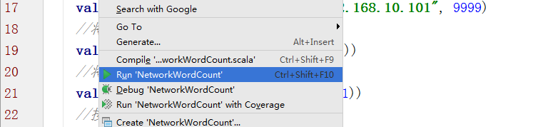

# Spark Streaming

## 1.课程目标
### 1.1.掌握Spark Streaming的原理
### 1.2.熟练使用Spark Streaming完成流式计算任务

* Spark Streaming是什么
* Spark Streaming特点
* SparkStreaming架构
* WordCount案例实操及解析
* Dstream创建
* 文件数据源
* RDD队列（了解）
* 自定义数据源
* Kafka数据源（重点）
* DStream转换、输出
* 无状态、有状态转化操作
* Window Operations

## doc
[苏宁基于Spark Streaming的实时日志分析系统实践](https://mp.weixin.qq.com/s/cqW94v4yWgekvCYC646hIw)

[Spark Streaming VS Flink](https://mp.weixin.qq.com/s/qamHUR8vDbxDOnLcUa4jLw)

[Spark 踩坑记—Spark Streaming+Kafka](https://mp.weixin.qq.com/s/QrIWCggauOM7BTNFs9Hx7A)

## 离线计算与实时计算的对比
1) 数据来源
   离线： HDFS 历史数据 数据量比较大
   实时： 消息队列(Kafka)，实时新增/修改记录过来的某一笔数据
   
2）处理过程
   离线： MapReduce： map + reduce
   实时： Spark(DStream/SS)
   
3) 处理速度
   离线： 慢
   实时： 快速

4）进程
   离线： 启动+销毁
   实时： 7*24

## 2.Spark Streaming介绍

### 2.1.Spark Streaming概述

### 2.1.1.什么是Spark Streaming


Spark Streaming类似于Apache Storm，用于流式数据的处理。根据其官方文档介绍，Spark Streaming有高吞吐量和容错能力强等特点。
Spark Streaming支持的数据输入源很多，例如：Kafka、Flume、Twitter、ZeroMQ和简单的TCP套接字等等。
数据输入后可以用Spark的高度抽象原语如：map、reduce、join、window等进行运算。
而结果也能保存在很多地方，如HDFS，数据库等。
另外Spark Streaming也能和MLlib（机器学习）以及Graphx完美融合。


### 2.1.2.为什么要学习Spark Streaming

1.易用


2.容错


3.易整合到Spark体系


### 2.1.3.Spark与Storm的对比	

1) 开发语言
Spark ：Scala	


Storm ：Clojure


2) 编程模型
Spark :DStream	


Storm :Spout/Bolt
	

3) 场景

Storm 场景:
1、纯实时--实时金融系统，金融交易和分析
2、事务机制和可靠性机制
3、如果还需要针对高峰低峰时间段，动态调整实时计算程序的并行度，以最大限度利用集群资源（通常是在小型公司，集群资源紧张的情况），也可以考虑用Storm
4、不需要在中间执行SQL交互式查询、复杂的transformation算子等，那么用Storm是比较好的选择

Spark 场景:
1、还包括了离线批处理、交互式查询等业务功能
2、涉及到高延迟批处理、交互式查询等功能


Spark Streaming与Flink的区别?
https://mp.weixin.qq.com/s/xc0cJhcwUaT9SHxX7vdXsg

## 3.DStream

### 3.1.什么是DStream
Discretized Stream是Spark Streaming的基础抽象，代表持续性的数据流和经过各种Spark原语操作后的结果数据流。

实现:
"微批次"架构,把流式计算当作一系列连续的小规模批处理
在内部实现上，DStream是一系列连续的RDD来表示。每个RDD含有一段时间间隔内的数据，如下图：


对数据的操作也是按照RDD为单位来进行的


计算过程由Spark engine来完成

### 3.2.DStream相关操作
DStream上的原语与RDD的类似，分为Transformations（转换）和Output Operations（输出）两种，此外转换操作中还有一些比较特殊的原语，如：updateStateByKey()、transform()以及各种Window相关的原语。

### 3.2.1.Transformations on DStreams
Transformation	Meaning
map(func)	Return a new DStream by passing each element of the source DStream through a function func.
flatMap(func)	Similar to map, but each input item can be mapped to 0 or more output items.
filter(func)	Return a new DStream by selecting only the records of the source DStream on which func returns true.
repartition(numPartitions)	Changes the level of parallelism in this DStream by creating more or fewer partitions.
union(otherStream)	Return a new DStream that contains the union of the elements in the source DStream and otherDStream.
count()	Return a new DStream of single-element RDDs by counting the number of elements in each RDD of the source DStream.
reduce(func)	Return a new DStream of single-element RDDs by aggregating the elements in each RDD of the source DStream using a function func (which takes two arguments and returns one). The function should be associative so that it can be computed in parallel.
countByValue()	When called on a DStream of elements of type K, return a new DStream of (K, Long) pairs where the value of each key is its frequency in each RDD of the source DStream.
reduceByKey(func, [numTasks])		When called on a DStream of (K, V) pairs, return a new DStream of (K, V) pairs where the values for each key are aggregated using the given reduce function. Note: By default, this uses Spark's default number of parallel tasks (2 for local mode, and in cluster mode the number is determined by the config property spark.default.parallelism) to do the grouping. You can pass an optional numTasks argument to set a different number of tasks.
join(otherStream, [numTasks])	When called on two DStreams of (K, V) and (K, W) pairs, return a new DStream of (K, (V, W)) pairs with all pairs of elements for each key.
cogroup(otherStream, [numTasks])	When called on a DStream of (K, V) and (K, W) pairs, return a new DStream of (K, Seq[V], Seq[W]) tuples.
transform(func)		Return a new DStream by applying a RDD-to-RDD function to every RDD of the source DStream. This can be used to do arbitrary RDD operations on the DStream.
updateStateByKey(func)	Return a new "state" DStream where the state for each key is updated by applying the given function on the previous state of the key and the new values for the key. This can be used to maintain arbitrary state data for each key.

特殊的Transformations

1.UpdateStateByKey Operation
UpdateStateByKey原语用于记录历史记录，上文中Word Count示例中就用到了该特性。若不用UpdateStateByKey来更新状态，那么每次数据进来后分析完成后，结果输出后将不在保存

2.Transform Operation
Transform原语允许DStream上执行任意的RDD-to-RDD函数。通过该函数可以方便的扩展Spark API。此外，MLlib（机器学习）以及Graphx也是通过本函数来进行结合的。

3.Window Operations
Window Operations有点类似于Storm中的State，可以设置窗口的大小和滑动窗口的间隔来动态的获取当前Steaming的允许状态


3.2.2.Output Operations on DStreams
Output Operations可以将DStream的数据输出到外部的数据库或文件系统，当某个Output Operations原语被调用时（与RDD的Action相同），streaming程序才会开始真正的计算过程。
Output Operation	Meaning
print()	Prints the first ten elements of every batch of data in a DStream on the driver node running the streaming application. This is useful for development and debugging. 
saveAsTextFiles(prefix, [suffix])	Save this DStream's contents as text files. The file name at each batch interval is generated based on prefix and suffix: "prefix-TIME_IN_MS[.suffix]".
saveAsObjectFiles(prefix, [suffix])	Save this DStream's contents as SequenceFiles of serialized Java objects. The file name at each batch interval is generated based on prefix and suffix: "prefix-TIME_IN_MS[.suffix]". 
saveAsHadoopFiles(prefix, [suffix])	Save this DStream's contents as Hadoop files. The file name at each batch interval is generated based on prefix and suffix: "prefix-TIME_IN_MS[.suffix]". 
foreachRDD(func)	The most generic output operator that applies a function, func, to each RDD generated from the stream. This function should push the data in each RDD to an external system, such as saving the RDD to files, or writing it over the network to a database. Note that the function func is executed in the driver process running the streaming application, and will usually have RDD actions in it that will force the computation of the streaming RDDs.

## 4.DStreams

### 4.1.简介
Spark Streaming的基础抽象，代表持续性的数据流和经过各种Spark原语操作后的结果数据流

DStream是一系列连续的RDD来表示,每个RDD含有一段时间间隔内的数据

### 4.2.DStreams输入

每个接收器都以 Spark 执行器程序中一个长期运行的任务的形式运行，因此会占据分配给应用的 CPU 核心,本地模式,不要使用local或者local[1]

#### 4.3.基本数据源

4.3.1.文件数据源
 兼容HDFS
 fileStream/textFileStream
    
  ssc.textFileStream(dataDirectory)

4.3.2.**自定义数据源**
 
 继承Receiver，并重写onStart(在Receiver启动的时候调用的方法)、onStop(在Receiver正常停止的情况下调用的方法)方法来自定义数据源采集
 涉及多线程,sock(获取ip,端口,交给输入流调用),输入流调用时： val lines=  ssc.receiverStream(new socketReceiver("hadoop100",9999))

4.3.3.RDD队列

```
  //创建RDD队列
  val rddQueue = new mutable.SynchronizedQueue[RDD[Int]]()

  // Create the QueueInputDStream and use it do some processing
  // 创建QueueInputDStream
  val inputStream = ssc.queueStream(rddQueue)
```

#### 4.4.高级数据源

4.4.1.kafka

spark- streaming-kafka_2.10 KafkaUtils

val topicLines = KafkaUtils.createStream(ssc, zkQuorum, group, topics) 

4.4.2.Flume-ng

两个接收器

推式接收器:以Avro数据池的方式工作,由Flume向其中推数据

拉式接收器:从自定义的中间数据池中拉取数据,由其他数据池中拉数据,而其他进程可以使用Flume把数据推进该中间数据池


flume ng + Spark Steam
```pom
<dependency>
    <groupId>org.apache.spark</groupId>
    <artifactId>spark-streaming-flume-sink_2.11</artifactId>
    <version>1.2.0</version>
</dependency>
```

配置

自定义 Flume 数据池添加到一个节点上之后，就需要配置 Flume 来把数据推送到这个数据池中

```properties
a1.sinks = spark
a1.sinks.spark.type = org.apache.spark.streaming.flume.sink.SparkSink
a1.sinks.spark.hostname = receiver-hostname
a1.sinks.spark.port = port-used-for-sync-not-spark-port
a1.sinks.spark.channel = memoryChannel
```
flume启动
>> bin/flume-ng agent -n a1 -c conf/ -f conf/flume-poll-spark.conf -Dflume.root.logger=INFO,console

// 利用sparkStreaming对接flume数据，实现单词计算------Poll拉模式


#### 4.5.DStreams转换

有状态转换:(根据之前的RDD或中间数据生成当前RDD)：updateStateBykey() 
        window系列的updateStateBykey():结果贯穿整个应用程序,需要做检查点的目录
             window系列，如reduceByKeyAndWindow 是一个时间范围的计算,处理一段时间内发送的业务,如：性能,比例 
                    包括:窗口大小：类似于1步
                         滑动步长：类似于1步的大小

无状态转换:map(),flatMap(),filit(),repartition()

#### 4.6.DStreams输出

print、saveAsTextFiles、saveAsHadoopFiles

## 5.实战

### 5.1.流处理的流程


初识实时流处理--->日志收集框架Flume--->消息队列Kafka--->实战环境搭建--->Spark Streaming入门--->

Spark Streaming进阶--->Spark Streaming集成Flume--->

整合Flume,Kafka,Spark Streaming打造通用的流处理平台基础。--->

Spark Streaming项目实战--->数据处理结果可视化

### 5.2.用Spark Streaming实现实时WordCount
架构图：


#### 5.2.1.安装并启动生成者

netCat:网络工具

1) 源码
[安装](https://blog.csdn.net/bsunp/article/details/56484356?locationNum=11&fps=1)
```
wget https://sourceforge.NET/projects/netcat/files/netcat/0.7.1/netcat-0.7.1.tar.gz/download
./configure
make && make install

nc -help成功
```

2) yum
yum install -y nc

启动一个服务端并监听9999端口
nc -lk 9999

#### 5.2.2.编写Spark Streaming程序
```
package cn.itcast.spark.streaming

import cn.itcast.spark.util.LoggerLevel
import org.apache.spark.SparkConf
import org.apache.spark.streaming.{Seconds, StreamingContext}

object NetworkWordCount {
  def main(args: Array[String]) {
    //设置日志级别
    LoggerLevel.setStreamingLogLevels()
    //创建SparkConf并设置为本地模式运行
    //注意local[2]代表开两个线程
    val conf = new SparkConf().setMaster("local[2]").setAppName("NetworkWordCount")
    //设置DStream批次时间间隔为2秒
    val ssc = new StreamingContext(conf, Seconds(2))
    //通过网络读取数据
    val lines = ssc.socketTextStream("hadoop000", 9999)
    //将读到的数据用空格切成单词
    val words = lines.flatMap(_.split(" "))
    //将单词和1组成一个pair
    val pairs = words.map(word => (word, 1))
    //按单词进行分组求相同单词出现的次数
    val wordCounts = pairs.reduceByKey(_ + _)
    //打印结果到控制台
    wordCounts.print()
    //开始计算
    ssc.start()
    //等待停止
    ssc.awaitTermination()
  }
}
```

#### 5.2.3.启动Spark Streaming程序：由于使用的是本地模式"local[2]"所以可以直接在本地运行该程序
注意：要指定并行度，如在本地运行设置setMaster("local[2]")，相当于启动两个线程，一个给receiver，一个给computer。如果是在集群中运行，必须要求集群中可用core数大于1


#### 5.2.4.在Linux端命令行中输入单词


#### 5.2.5.在IDEA控制台中查看结果

问题：结果每次在Linux段输入的单词次数都被正确的统计出来，但是结果不能累加！如果需要累加需要使用updateStateByKey(func)来更新状态，下面给出一个例子：
```
package cn.itcast.spark.streaming

import cn.itcast.spark.util.LoggerLevel
import org.apache.spark.{HashPartitioner, SparkConf}
import org.apache.spark.streaming.{StreamingContext, Seconds}

object NetworkUpdateStateWordCount {
  /**
    * String : 单词 hello
    * Seq[Int] ：单词在当前批次出现的次数
    * Option[Int] ： 历史结果
    */
  val updateFunc = (iter: Iterator[(String, Seq[Int], Option[Int])]) => {
    //iter.flatMap(it=>Some(it._2.sum + it._3.getOrElse(0)).map(x=>(it._1,x)))
    iter.flatMap{case(x,y,z)=>Some(y.sum + z.getOrElse(0)).map(m=>(x, m))}
  }

  def main(args: Array[String]) {
    LoggerLevel.setStreamingLogLevels()
    val conf = new SparkConf().setMaster("local[2]").setAppName("NetworkUpdateStateWordCount")
    val ssc = new StreamingContext(conf, Seconds(5))
    //做checkpoint 写入共享存储中
    ssc.checkpoint("c://aaa")
    val lines = ssc.socketTextStream("192.168.10.100", 9999)
    //reduceByKey 结果不累加
    //val result = lines.flatMap(_.split(" ")).map((_, 1)).reduceByKey(_+_)
    //updateStateByKey结果可以累加但是需要传入一个自定义的累加函数：updateFunc
    val results = lines.flatMap(_.split(" ")).map((_,1)).updateStateByKey(updateFunc, new HashPartitioner(ssc.sparkContext.defaultParallelism), true)
    results.print()
    ssc.start()
    ssc.awaitTermination()
  }
}
```

```scala
object createKafkaProducerPool{

  def apply(brokerList: String, topic: String):  GenericObjectPool[KafkaProducerProxy] = {
    val producerFactory = new BaseKafkaProducerFactory(brokerList, defaultTopic = Option(topic))
    val pooledProducerFactory = new PooledKafkaProducerAppFactory(producerFactory)
    val poolConfig = {
      val c = new GenericObjectPoolConfig
      val maxNumProducers = 10
      c.setMaxTotal(maxNumProducers)
      c.setMaxIdle(maxNumProducers)
      c
    }
    new GenericObjectPool[KafkaProducerProxy](pooledProducerFactory, poolConfig)
  }
}

object KafkaStreaming{


  def main(args: Array[String]) {

    val conf = new SparkConf().setMaster("local[4]").setAppName("NetworkWordCount")
    val ssc = new StreamingContext(conf, Seconds(1))

    //创建topic
    val brobrokers = "172.16.148.150:9092,172.16.148.151:9092,172.16.148.152:9092"
    val sourcetopic="source";
    val targettopic="target";

    //创建消费者组
    var group="con-consumer-group"
    //消费者配置
    val kafkaParam = Map(
      "bootstrap.servers" -> brobrokers,//用于初始化链接到集群的地址
      "key.deserializer" -> classOf[StringDeserializer],
      "value.deserializer" -> classOf[StringDeserializer],
      //用于标识这个消费者属于哪个消费团体
      "group.id" -> group,
      //如果没有初始化偏移量或者当前的偏移量不存在任何服务器上，可以使用这个配置属性
      //可以使用这个配置，latest自动重置偏移量为最新的偏移量
      "auto.offset.reset" -> "latest",
      //如果是true，则这个消费者的偏移量会在后台自动提交
      "enable.auto.commit" -> (false: java.lang.Boolean)
    );


    //ssc.sparkContext.broadcast(pool)

    //创建DStream，返回接收到的输入数据
    var stream=KafkaUtils.createDirectStream[String,String](ssc, LocationStrategies.PreferConsistent,ConsumerStrategies.Subscribe[String,String](Array(sourcetopic),kafkaParam))


    //每一个stream都是一个ConsumerRecord
    stream.map(s =>("id:" + s.key(),">>>>:"+s.value())).foreachRDD(rdd => {
      rdd.foreachPartition(partitionOfRecords => {
        // Get a producer from the shared pool
        val pool = createKafkaProducerPool(brobrokers, targettopic)
        val p = pool.borrowObject()

        partitionOfRecords.foreach {message => System.out.println(message._2);p.send(message._2,Option(targettopic))}

        // Returning the producer to the pool also shuts it down
        pool.returnObject(p)

      })
    })

    ssc.start()
    ssc.awaitTermination()

  }
}
```

### 5.3.Spark Streaming整合Kafka完成网站点击流实时统计



* 1.安装并配置zk
* 2.安装并配置Kafka
* 3.启动zk
* 4.启动Kafka
* 5.创建topic
bin/kafka-topics.sh --create --zookeeper node1.itcast.cn:2181,node2.itcast.cn:2181 \
--replication-factor 3 --partitions 3 --topic urlcount
* 6.编写Spark Streaming应用程序
```
package cn.itcast.spark.streaming

package cn.itcast.spark

import org.apache.spark.{HashPartitioner, SparkConf}
import org.apache.spark.storage.StorageLevel
import org.apache.spark.streaming.kafka.KafkaUtils
import org.apache.spark.streaming.{Seconds, StreamingContext}

object UrlCount {
  val updateFunc = (iterator: Iterator[(String, Seq[Int], Option[Int])]) => {
    iterator.flatMap{case(x,y,z)=> Some(y.sum + z.getOrElse(0)).map(n=>(x, n))}
  }

  def main(args: Array[String]) {
    //接收命令行中的参数
    val Array(zkQuorum, groupId, topics, numThreads, hdfs) = args
    //创建SparkConf并设置AppName
    val conf = new SparkConf().setAppName("UrlCount")
    //创建StreamingContext
    val ssc = new StreamingContext(conf, Seconds(2))
    //设置检查点
    ssc.checkpoint(hdfs)
    //设置topic信息
    val topicMap = topics.split(",").map((_, numThreads.toInt)).toMap
    //重Kafka中拉取数据创建DStream
    val lines = KafkaUtils.createStream(ssc, zkQuorum ,groupId, topicMap, StorageLevel.MEMORY_AND_DISK).map(_._2)
    //切分数据，截取用户点击的url
    val urls = lines.map(x=>(x.split(" ")(6), 1))
    //统计URL点击量
    val result = urls.updateStateByKey(updateFunc, new HashPartitioner(ssc.sparkContext.defaultParallelism), true)
    //将结果打印到控制台
    result.print()
    ssc.start()
    ssc.awaitTermination()
  }
}
```
### 5.4.慕课网日志

处理流程剖析

日志产生器

使用Flume采集日志

将Flume收集到的数据输出到Kafka

Spark Streaming消费Kafka的数据进行统计

Spark Streaming如何高效的读写数据到Hbase

本地测试和生产环境使用的拓展

Java开发Spark要点拓展
