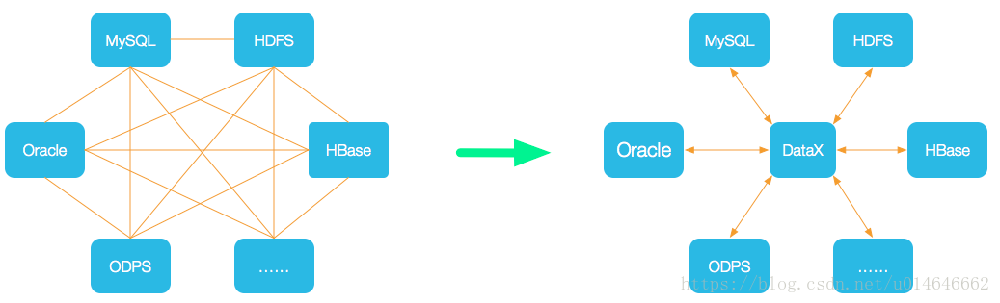

# `Datax`
## 大纲

* 什么是DataX
* DataX的设计
* 框架设计
* 运行原理
* DataX官方地址
* DataX前置要求
* DataX安装
* 案例实操：读取MySQL中的数据存放到HDFS
* 案例实操：读取`HDFS`数据写入MySQL
* DataX优化

##  第一章 概述

### 1.1  DataX3.0概览

 DataX 是一个异构数据源离线同步工具，致力于实现包括关系型数据库(MySQL、Oracle等)、HDFS、Hive、ODPS、HBase、FTP等各种异构数据源之间稳定高效的数据同步功能。

（这是一个单机多任务的ETL工具）

下载地址：http://datax-opensource.oss-cn-hangzhou.aliyuncs.com/datax.tar.gz



### 1.2 设计理念

为了解决异构数据源同步问题，DataX将复杂的网状的同步链路变成了星型数据链路，DataX作为中间传输载体负责连接各种数据源。当需要接入一个新的数据源的时候，只需要将此数据源对接到DataX，便能跟已有的数据源做到无缝数据同步。

#### 当前使用现状

DataX在阿里巴巴集团内被广泛使用，承担了所有大数据的离线同步业务，并已持续稳定运行了6年之久。目前每天完成同步8w多道作业，每日传输数据量超过300TB。

此前已经开源DataX1.0版本，此次介绍为阿里云开源全新版本DataX3.0，有了更多更强大的功能和更好的使用体验。Github主页地址：https://github.com/alibaba/DataX

### 1.3 框架设计


DataX本身作为离线数据同步框架，采用Framework + plugin架构构建。将数据源读取和写入抽象成为Reader/Writer插件，纳入到整个同步框架中。

Reader：Reader为数据采集模块，负责采集数据源的数据，将数据发送给Framework。
Writer： Writer为数据写入模块，负责不断向Framework取数据，并将数据写入到目的端。
Framework：Framework用于连接reader和writer，作为两者的数据传输通道，并处理缓冲，流控，并发，数据转换等核心技术问题。

### 1.4 运行原理

DataX 3.0 开源版本支持单机多线程模式完成同步作业运行，本小节按一个DataX作业生命周期的时序图，从整体架构设计非常简要说明DataX各个模块相互关系。


核心模块介绍：
1).  DataX完成单个数据同步的作业，我们称之为Job，DataX接受到一个Job之后，将启动一个进程来完成整个作业同步过程。`DataX Job`模块是单个作业的中枢管理节点，承担了数据清理、子任务切分(将单一作业计算转化为多个子Task)、`TaskGroup`管理等功能。
2). `DataXJob`启动后，会根据不同的源端切分策略，将Job切分成多个小的Task(子任务)，以便于并发执行。Task便是DataX作业的最小单元，每一个Task都会负责一部分数据的同步工作。
3). 切分多个Task之后，DataX Job会调用Scheduler模块，根据配置的并发数据量，将拆分成的Task重新组合，组装成TaskGroup(任务组)。每一个TaskGroup负责以一定的并发运行完毕分配好的所有Task，默认单个任务组的并发数量为5。
4). 每一个Task都由TaskGroup负责启动，Task启动后，会固定启动Reader—>Channel—>Writer的线程来完成任务同步工作。
5). DataX作业运行起来之后， Job监控并等待多个TaskGroup模块任务完成，等待所有TaskGroup任务完成后Job成功退出。否则，异常退出，进程退出值非0

#### DataX调度流程：

举例来说，用户提交了一个DataX作业，并且配置了20个并发，目的是将一个100张分表的mysql数据同步到odps里面。 DataX的调度决策思路是：

DataXJob根据分库分表切分成了100个Task。
根据20个并发，DataX计算共需要分配4个TaskGroup。
4个TaskGroup平分切分好的100个Task，每一个TaskGroup负责以5个并发共计运行25个Task。

### 1.5 六大核心优势

#### 1)  可靠的数据质量监控

* 完美解决数据传输个别类型失真问题
  DataX旧版对于部分数据类型(比如时间戳)传输一直存在毫秒阶段等数据失真情况，新版本DataX3.0已经做到支持所有的强数据类型，每一种插件都有自己的数据类型转换策略，让数据可以完整无损的传输到目的端。

* 提供作业全链路的流量、数据量运行时监控

DataX3.0运行过程中可以将作业本身状态、数据流量、数据速度、执行进度等信息进行全面的展示，让用户可以实时了解作业状态。并可在作业执行过程中智能判断源端和目的端的速度对比情况，给予用户更多性能排查信息。

* 提供脏数据探测

在大量数据的传输过程中，必定会由于各种原因导致很多数据传输报错(比如类型转换错误)，这种数据DataX认为就是脏数据。DataX目前可以实现脏数据精确过滤、识别、采集、展示，为用户提供多种的脏数据处理模式，让用户准确把控数据质量大关！

#### 2) 丰富的数据转换功能

DataX作为一个服务于大数据的ETL工具，除了提供数据快照搬迁功能之外，还提供了丰富数据转换的功能，让数据在传输过程中可以轻松完成数据脱敏，补全，过滤等数据转换功能，另外还提供了自动groovy函数，让用户自定义转换函数。详情请看DataX3的transformer详细介绍。

#### 3) 精准的速度控制

还在为同步过程对在线存储压力影响而担心吗？新版本DataX3.0提供了包括通道(并发)、记录流、字节流三种流控模式，可以随意控制你的作业速度，让你的作业在库可以承受的范围内达到最佳的同步速度。

```
"speed": {
   "channel": 8,    ----并发数限速（根据自己CPU合理控制并发数）
   "byte": 524288,  ----字节流限速（根据自己的磁盘和网络合理控制字节数）
   "record": 10000  ----记录流限速（根据数据合理空行数）
}
```

#### 4)  强劲的同步性能

DataX3.0每一种读插件都有一种或多种切分策略，都能将作业合理切分成多个Task并行执行，单机多线程执行模型可以让DataX速度随并发成线性增长。在源端和目的端性能都足够的情况下，单个作业一定可以打满网卡。另外，DataX团队对所有的已经接入的插件都做了极致的性能优化，并且做了完整的性能测试。性能测试相关详情可以参照每单个数据源的详细介绍：DataX数据源指南

#### 5) 健壮的容错机制

DataX作业是极易受外部因素的干扰，网络闪断、数据源不稳定等因素很容易让同步到一半的作业报错停止。因此稳定性是DataX的基本要求，在DataX 3.0的设计中，重点完善了框架和插件的稳定性。目前DataX3.0可以做到线程级别、进程级别(暂时未开放)、作业级别多层次局部/全局的重试，保证用户的作业稳定运行。

* 线程内部重试

DataX的核心插件都经过团队的全盘review，不同的网络交互方式都有不同的重试策略。

* 线程级别重试
  目前DataX已经可以实现TaskFailover，针对于中间失败的Task，DataX框架可以做到整个Task级别的重新调度。

#### 6)  极简的使用体验

下载即可用，支持linux和windows，只需要按照模板填相应的参数即可

## 第二章 快速入门

### 2.1 官方地址

下载地址：http://datax-opensource.oss-cn-hangzhou.aliyuncs.com/datax.tar.gz

源码地址：https://github.com/alibaba/DataX

### 2.2 前置要求

\- Linux

\- JDK(1.8以上，推荐1.8)

\- Python(推荐Python2.6.X)


### 2.3 安装

##### [win10 安装](https://blog.csdn.net/u014646662/article/details/82748055)

##### linux安装

1).  将下载好的`datax.tar.gz`上传到hadoop102的opt/software

2).  解压`datax.tar.gz`到/opt/module

```shell
tar -zxvf datax.tar.gz -C /opt/module/
```

3).  运行自检脚本

```shell
cd /opt/module/datax/bin/
python datax.py /opt/module/datax/job/job.json 
```

## 第三章 使用案例

### 3.0  DataX3.0插件体系

DataX目前已经有了比较全面的插件体系，主流的RDBMS数据库、NOSQL、大数据计算系统都已经接入，目前支持数据如下图，详情请点击：[DataX数据源参考指南](https://github.com/alibaba/DataX/wiki/DataX-all-data-channels)

| 类型               | 数据源                          | Reader(读) | Writer(写) |                             文档                             |
| ------------------ | ------------------------------- | :--------: | :--------: | :----------------------------------------------------------: |
| RDBMS 关系型数据库 | MySQL                           |     √      |     √      | [读](https://github.com/alibaba/DataX/blob/master/mysqlreader/doc/mysqlreader.md) 、[写](https://github.com/alibaba/DataX/blob/master/mysqlwriter/doc/mysqlwriter.md) |
|                    | Oracle                          |     √      |     √      | [读](https://github.com/alibaba/DataX/blob/master/oraclereader/doc/oraclereader.md) 、[写](https://github.com/alibaba/DataX/blob/master/oraclewriter/doc/oraclewriter.md) |
|                    | SQLServer                       |     √      |     √      | [读](https://github.com/alibaba/DataX/blob/master/sqlserverreader/doc/sqlserverreader.md) 、[写](https://github.com/alibaba/DataX/blob/master/sqlserverwriter/doc/sqlserverwriter.md) |
|                    | PostgreSQL                      |     √      |     √      | [读](https://github.com/alibaba/DataX/blob/master/postgresqlreader/doc/postgresqlreader.md) 、[写](https://github.com/alibaba/DataX/blob/master/postgresqlwriter/doc/postgresqlwriter.md) |
|                    | DRDS                            |     √      |     √      | [读](https://github.com/alibaba/DataX/blob/master/drdsreader/doc/drdsreader.md) 、[写](https://github.com/alibaba/DataX/blob/master/drdswriter/doc/drdswriter.md) |
|                    | 通用RDBMS(支持所有关系型数据库) |     √      |     √      | [读](https://github.com/alibaba/DataX/blob/master/rdbmsreader/doc/rdbmsreader.md) 、[写](https://github.com/alibaba/DataX/blob/master/rdbmswriter/doc/rdbmswriter.md) |
| 阿里云数仓数据存储 | ODPS                            |     √      |     √      | [读](https://github.com/alibaba/DataX/blob/master/odpsreader/doc/odpsreader.md) 、[写](https://github.com/alibaba/DataX/blob/master/odpswriter/doc/odpswriter.md) |
|                    | ADS                             |            |     √      | [写](https://github.com/alibaba/DataX/blob/master/adswriter/doc/adswriter.md) |
|                    | OSS                             |     √      |     √      | [读](https://github.com/alibaba/DataX/blob/master/ossreader/doc/ossreader.md) 、[写](https://github.com/alibaba/DataX/blob/master/osswriter/doc/osswriter.md) |
|                    | OCS                             |     √      |     √      | [读](https://github.com/alibaba/DataX/blob/master/ocsreader/doc/ocsreader.md) 、[写](https://github.com/alibaba/DataX/blob/master/ocswriter/doc/ocswriter.md) |
| NoSQL数据存储      | OTS                             |     √      |     √      | [读](https://github.com/alibaba/DataX/blob/master/otsreader/doc/otsreader.md) 、[写](https://github.com/alibaba/DataX/blob/master/otswriter/doc/otswriter.md) |
|                    | Hbase0.94                       |     √      |     √      | [读](https://github.com/alibaba/DataX/blob/master/hbase094xreader/doc/hbase094xreader.md) 、[写](https://github.com/alibaba/DataX/blob/master/hbase094xwriter/doc/hbase094xwriter.md) |
|                    | Hbase1.1                        |     √      |     √      | [读](https://github.com/alibaba/DataX/blob/master/hbase11xreader/doc/hbase11xreader.md) 、[写](https://github.com/alibaba/DataX/blob/master/hbase11xwriter/doc/hbase11xwriter.md) |
|                    | Phoenix4.x                      |     √      |     √      | [读](https://github.com/alibaba/DataX/blob/master/hbase11xsqlreader/doc/hbase11xsqlreader.md) 、[写](https://github.com/alibaba/DataX/blob/master/hbase11xsqlwriter/doc/hbase11xsqlwriter.md) |
|                    | Phoenix5.x                      |     √      |     √      | [读](https://github.com/alibaba/DataX/blob/master/hbase20xsqlreader/doc/hbase20xsqlreader.md) 、[写](https://github.com/alibaba/DataX/blob/master/hbase20xsqlwriter/doc/hbase20xsqlwriter.md) |
|                    | MongoDB                         |     √      |     √      | [读](https://github.com/alibaba/DataX/blob/master/mongoreader/doc/mongoreader.md) 、[写](https://github.com/alibaba/DataX/blob/master/mongowriter/doc/mongowriter.md) |
|                    | Hive                            |     √      |     √      | [读](https://github.com/alibaba/DataX/blob/master/hdfsreader/doc/hdfsreader.md) 、[写](https://github.com/alibaba/DataX/blob/master/hdfswriter/doc/hdfswriter.md) |
|                    | Cassandra                       |     √      |     √      | [读](https://github.com/alibaba/DataX/blob/master/cassandrareader/doc/cassandrareader.md) 、[写](https://github.com/alibaba/DataX/blob/master/cassandrawriter/doc/cassandrawriter.md) |
| 无结构化数据存储   | TxtFile                         |     √      |     √      | [读](https://github.com/alibaba/DataX/blob/master/txtfilereader/doc/txtfilereader.md) 、[写](https://github.com/alibaba/DataX/blob/master/txtfilewriter/doc/txtfilewriter.md) |
|                    | FTP                             |     √      |     √      | [读](https://github.com/alibaba/DataX/blob/master/ftpreader/doc/ftpreader.md) 、[写](https://github.com/alibaba/DataX/blob/master/ftpwriter/doc/ftpwriter.md) |
|                    | HDFS                            |     √      |     √      | [读](https://github.com/alibaba/DataX/blob/master/hdfsreader/doc/hdfsreader.md) 、[写](https://github.com/alibaba/DataX/blob/master/hdfswriter/doc/hdfswriter.md) |
|                    | Elasticsearch                   |            |     √      | [写](https://github.com/alibaba/DataX/blob/master/elasticsearchwriter/doc/elasticsearchwriter.md) |
| 时间序列数据库     | OpenTSDB                        |     √      |            | [读](https://github.com/alibaba/DataX/blob/master/opentsdbreader/doc/opentsdbreader.md) |
|                    | TSDB                            |            |     √      | [写](https://github.com/alibaba/DataX/blob/master/tsdbwriter/doc/tsdbhttpwriter.md) |

[DataX3.0 Oracle导入Oracle](https://blog.csdn.net/u014646662/article/details/82777966)

[DataX3.0 MySQL导入MySQL](https://blog.csdn.net/u014646662/article/details/82778067)

### 3.1 从stream流读取数据并打印到控制台

#####  1）查看配置模板 

```shell
python datax.py -r streamreader -w streamwriter
```


```json
{
    "job": {
        "content": [
            {
                "reader": {
                    "name": "streamreader", 
                    "parameter": {
                        "column": [], 
                        "sliceRecordCount": ""
                    }
                }, 
                "writer": {
                    "name": "streamwriter", 
                    "parameter": {
                        "encoding": "", 
                        "print": true
                    }
                }
            }
        ], 
        "setting": {
            "speed": {
                "channel": ""
            }
        }
    }
}
```

##### 2)  根据模板编写配置文件

```shell
vim stream2stream.json
```


```json
{
  "job": {
    "content": [
      {
        "reader": {
          "name": "streamreader",
          "parameter": {
            "sliceRecordCount": 10,
            "column": [
              {
                "type": "long",
                "value": "10"
              },
              {
                "type": "string",
                "value": "hello，你好，世界-DataX"
              }
            ]
          }
        },
        "writer": {
          "name": "streamwriter",
          "parameter": {
            "encoding": "UTF-8",
            "print": true
          }
        }
      }
    ],
    "setting": {
      "speed": {
        "channel": 5
       }
    }
  }
}
```

##### 3)  运行

```shell
/opt/module/datax/bin/datax.py /opt/module/datax/job/stream2stream.json
```

### 3.2 读取MYSQL中的数据存放到HDFS

#### 3.2.1 查看官方模板

```shell
python /opt/module/datax/bin/datax.py -r mysqlreader -w hdfswriter
```

```json
{
    "job": {
        "content": [
            {
                "reader": {
                    "name": "mysqlreader", 
                    "parameter": {
                        "column": [], 
                        "connection": [
                            {
                                "jdbcUrl": [], 
                                "table": []
                            }
                        ], 
                        "password": "", 
                        "username": "", 
                        "where": ""
                    }
                }, 
                "writer": {
                    "name": "hdfswriter", 
                    "parameter": {
                        "column": [], 
                        "compress": "", 
                        "defaultFS": "", 
                        "fieldDelimiter": "", 
                        "fileName": "", 
                        "fileType": "", 
                        "path": "", 
                        "writeMode": ""
                    }
                }
            }
        ], 
        "setting": {
            "speed": {
                "channel": ""
            }
        }
    }
}
```


#### 3.2.2 准备数据

##### 1) 创建student表

```shell
create database datax;

use datax;

create table student(id int,name varchar(20));
```


##### 2) 插入数据

```shell
insert into student values(1001,'zhangsan'),(1002,'lisi'),(1003,'wangwu');
```

#### 3.2.3 编写配置文件

```shell
vim /opt/modult/datax/job/mysql2hdfs.json 
```

```json
{
    "job": {
        "content": [
            {
                "reader": {
                    "name": "mysqlreader", 
                    "parameter": {
                        "column": [
                            "id",
                            "name"
                        ], 
                        "connection": [
                            {
                                "jdbcUrl": [
                                    "jdbc:mysql://hadoop101:3306/test"
                                ], 
                                "table": [
                                    "student"
                                ]
                            }
                        ], 
                        "username": "root", 
                        "password": "123456"
                    }
                }, 
                "writer": {
                    "name": "hdfswriter", 
                    "parameter": {
                        "column": [
                            {
                                "name": "id",
                                "type": "INT"
                            },
                            {
                                "name": "name",
                                "type": "STRING"
                            }
                        ],  
                        "defaultFS": "hdfs://hadoop102:8020", 
                        "fieldDelimiter": "\t", 
                        "fileName": "student.txt", 
                        "fileType": "text", 
                        "path": "/", 
                        "writeMode": "append"
                    }
                }
            }
        ], 
        "setting": {
            "speed": {
                "channel": "2"
            }
        }
    }
}
```

#### 3.2.4 执行任务

```shell
bin/datax/py job/mysql2hdfs.json
```

#### 3.2.5 查看hdfs

** 注意：HdfsWriter实际执行时会在该文件名后添加随机的后缀作为每个线程写入实际文件名**


### 3.3 读取HDFS数据写入MySQL

##### 1)   将上个案例上传的文件改名

```shell
hadoop fs -mv /student.txt* /student.txt
```

##### 2)  查看官方模板

```shell
python /opt/module/datax/bin/datax.py -r hdfsreader -w mysqlwriter
```

##### 3) 创建配置文件

```shell
{
    "job": {
        "content": [
            {
                "reader": {
                    "name": "hdfsreader", 
                    "parameter": {
                        "column": ["*"], 
                        "defaultFS": "hdfs://hadoop102:8020", 
                        "encoding": "UTF-8", 
                        "fieldDelimiter": "\t", 
                        "fileType": "text", 
                        "path": "/student.txt"
                    }
                }, 
                "writer": {
                    "name": "mysqlwriter", 
                    "parameter": {
                        "column": [
                            "id",
                            "name"
                        ], 
                        "connection": [
                            {
                                "jdbcUrl": "jdbc:mysql://hadoop102:3306/datax", 
                                "table": ["student2"]
                            }
                        ], 
                        "password": "000000", 
                        "username": "root", 
                        "writeMode": "insert"
                    }
                }
            }
        ], 
        "setting": {
            "speed": {
                "channel": "1"
            }
        }
    }
}
```

##### 4) 在MYSQL的datax数据库创建student2

```shell
use test;
create table stu1(id int,name varchar(20));
```

##### 5) 执行任务

```shell
bin/datax.py job/hdfs2mysql.json
```

6) 查看student2表

```shell
select * from student2;
```