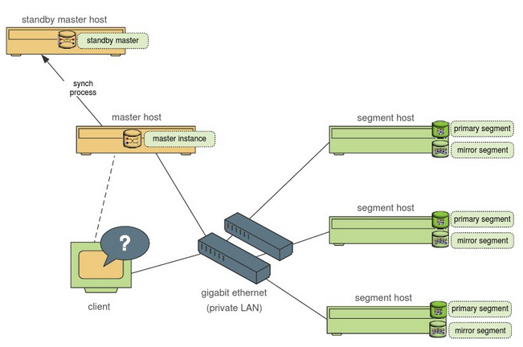

# greenplum

## doc
[官网](https://greenplum.org/)

[中文文档](https://gp-docs-cn.github.io/docs/common/gpdb-features.html)

[从Greenplum搬迁到云HBase X-Pack](https://mp.weixin.qq.com/s/DeTJFPCuXe8dsILcVEERKA)

Greenplum企业应用实战

- [Greenplum企业应用实战（笔记）：第一章 greenplum简介](https://www.jianshu.com/p/b5c85cadb362)
- [Greenplum企业应用实战（笔记）：第二章 greenplum 快速入门](https://www.jianshu.com/p/43de56ddcd7b)
- [Greenplum企业应用实战（笔记）：第三章 Greenplum 实战](https://www.jianshu.com/p/9be1439f5bd3)
- [Greenplum企业应用实战（笔记）：第四章 数据字典详解](https://www.jianshu.com/p/052009ed92a2)
- [Greenplum企业应用实战（笔记）：第五章 执行计划详解](https://www.jianshu.com/p/25ce3b0c930d)
- [Greenplum企业应用实战（笔记）：第六章 Greenplum 高级应用](https://www.jianshu.com/p/32701ff3ee2c)
- [Greenplum企业应用实战（笔记）：第七章 Greenplum 架构介绍](https://www.jianshu.com/p/105cb516a122)
- [Greenplum企业应用实战（笔记）：第八章 Greenplum 线上环境部署](https://www.jianshu.com/p/75e87b890a60)
- [Greenplum企业应用实战（笔记）：第九章 数据库管理](https://www.jianshu.com/p/105cb516a122)

## Overview
本质上讲，greenplum 是一个关系型数据库集群，是由数个独立的数据库服务组合成的逻辑数据库

数据库的计算中心(数据仓库中快速查询结果)

### 起源和发展
针对数据密集型计算中的海量数据处理这一高效的数据管理功能。比较典型的解决方案有Teradata、Greenplum、Hadoop Hive、Oracle Exadata、IBM Netteza等

基于PostgreSQL 8.2
数据字典增强(并行处理)
数据仓库和BI支持

* MPP Architecture(MPP架构)
    Greenplum’s massively parallel processing architecture provides automatic parallelization of all data and queries in a scale-out, shared nothing architecture.
    海量并行处理(什么都不共享,每个节点独立处理自己的数据)
* Petabyte-Scale Loading(PB级加载)
    High-performance loading uses MPP technology. Loading speeds scale with each additional node to greater than 10 terabytes per hour, per rack.
* Innovative Query Optimization(查询优化)
    The query optimizer available in Greenplum Database is the industry’s first cost-based query optimizer for big data workloads. It can scale interactive and batch mode analytics to large datasets in the petabytes without degrading query performance and throughput.
* Polymorphic Data Storage(动态的数据存储)
    Fully control the configuration for your table and partition storage, execution, and compression. Design your tables based on the way data is accessed. Users have the choice of row or column-oriented storage and processing for any table or partition
* Integrated In-Database Analytics(集成数据库分析)
    Provided by Apache MADlib, a library for scalable in-database analytics extending the SQL capabilities of Greenplum Database through user-defined functions.
* Federated Data Access(完善的数据库访问)
    Query external data sources with the Greenplum optimzer and query processing engine. Including Hadoop, Cloud Storage, ORC, AVRO, Parquet and other Polygot data stores

* 第一，完善的标准支持：GPDB完全支持ANSI SQL 2008标准和SQL OLAP 2003 扩展；从应用编程接口上讲，它支持ODBC和JDBC。完善的标准支持使得系统开发、维护和管理都大为方便。而现在的 NoSQL，NewSQL和Hadoop 对 SQL 的支持都不完善，不同的系统需要单独开发和管理，且移植性不好

* 第二，支持分布式事务，支持ACID。保证数据的强一致性。

* 第三，做为分布式数据库，拥有良好的线性扩展能力。在国内外用户生产环境中，具有上百个物理节点的GPDB集群都有很多案例。

* 第四，GPDB是企业级数据库产品，全球有上千个集群在不同客户的生产环境运行。这些集群为全球很多大的金融、政府、物流、零售等公司的关键业务提供服务。

* 第五，GPDB是Greenplum（现在的Pivotal）公司十多年研发投入的结果。GPDB基于PostgreSQL 8.2，PostgreSQL 8.2有大约80万行源代码，而GPDB现在有130万行源码。相比PostgreSQL 8.2，增加了约50万行的源代码。

* 第六，Greenplum有很多合作伙伴，GPDB有完善的生态系统，可以与很多企业级产品集成，譬如SAS，Cognos，Informatic，Tableau等；也可以很多种开源软件集成，譬如Pentaho,Talend 等

## Install

安装准备工作
    修改hosts（所有机器）
    修改系统内核配置（所有机器）
    关闭防火墙 (所有机器)
    创建用户和用户组（所有机器）
安装和分发
    联网安装必要的包 (所有机器)
        http://gpn.greenplum.com/download.php
    解压代码编译安装
    分发
初始化和创建数据库
    配置 .bash_profile 环境变量（所有机器）
    编写数据库启动参数文件
    初始化  
TPC-H测试      
http://www.cnblogs.com/arthurqin/p/5849354.html

## Use

Greenplum基本使用

首先根据教程安装好GP系统，参考了网络上的一篇博客教程：Greenplum 源码安装教程 —— 以 CentOS 平台为例http://www.cnblogs.com/arthurqin/p/5849354.html

GP安装好，并使用gpinitsystem 命令完成初始化之后，使用 psql -d postgres 可以开始使用GP。GP有一些基本命令如下:

GP服务启停

启动GP服务。当虚拟机关闭重新登录时需要此命令
>> gpstart

关闭GP服务
>> gpstop

快速关闭
>> gpstop -M fast

维护模式启动
>> gpstart -m

重启
>> gpstop -r

重新加载配置文件
>> gpstop -u

登录与退出GP客户端
登录:
>> psql databasename

>> psql -d databasename -h hostname -p port -U gpusername

退出: 
>> \q

查看系统库版本
 >> select version();
 
连接
>> psql -d gpdatabase -h master_host -p 5432 -U gpadmin
 
## 架构

https://www.cnblogs.com/skyme/p/5779885.html

greenplum的总体架构如下：

数据库由Master Severs和Segment Severs通过Interconnect互联组成
  
  
  Master主机负责：主节点
                  建立与客户端的连接和管理；SQL的解析并形成执行计划
                  执行计划向Segment的分发收集Segment的执行结果
                  Master不存储业务数据，只存储数据字典
  
  Segment主机负责：数据节点
                   业务数据的存储和存取   
                   用户查询SQL的执行

   Client一般只能和Master节点进行交互,Client将SQL发给Master,然后Master对SQL进行分析后,再将其分配给所有的Segmen进行操作,并且将结果返回给客户端
   
greenplum使用mpp架构

 基本体系架构
 

  