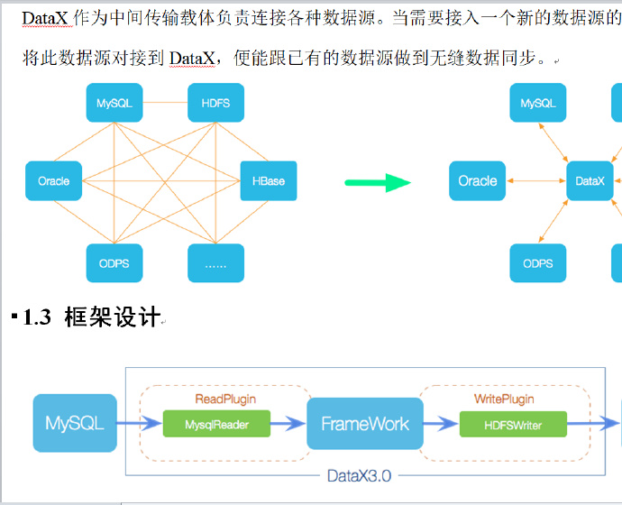
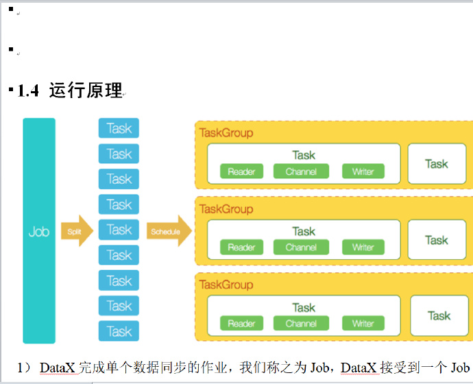
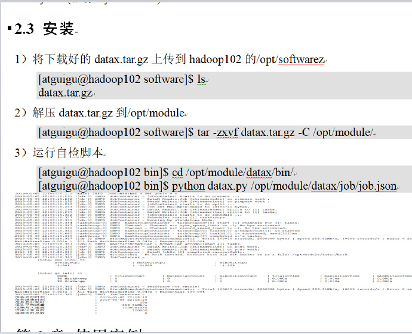
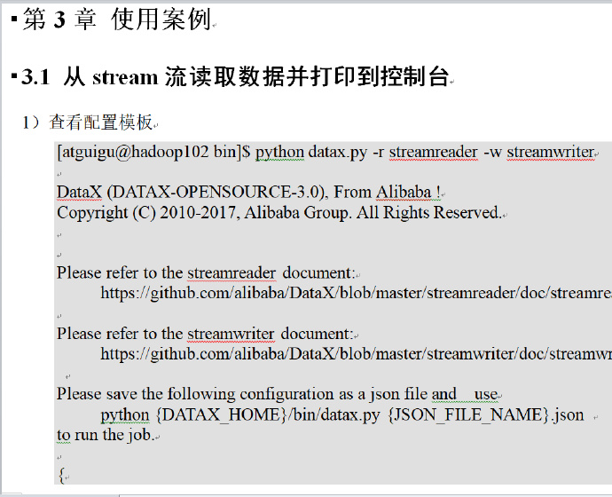
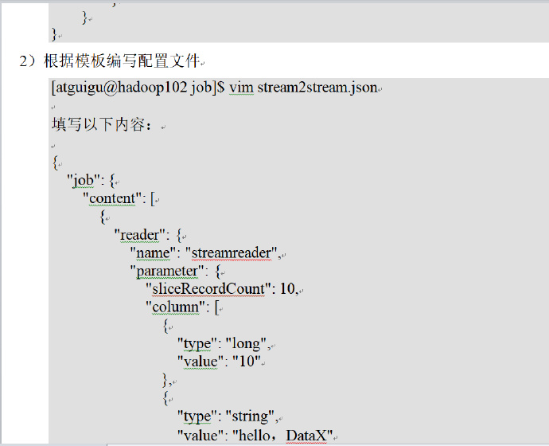
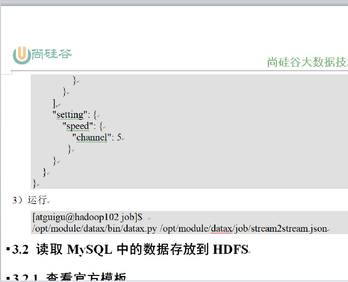
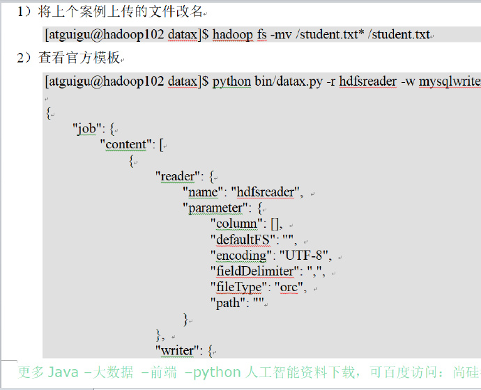

# DataX

## 大纲

* 什么是DataX
* DataX的设计
* 框架设计
* 运行原理
* DataX官方地址
* DataX前置要求
* DataX安装
* 案例实操：读取MySQL中的数据存放到HDFS
* 案例实操：读取HDFS数据写入MySQL
* DataX优化

# 尚硅谷大数据技术之DataX
第1章 概述

1.1 什么是DataX

      DataX 是阿里巴巴开源的一个异构数据源离线同步工具，致力于实现包括关系型数据库(MySQL、Oracle等)、HDFS、Hive、ODPS、HBase、FTP等各种异构数据源之间稳定高效的数据同步功能。

1.2 DataX的设计

为了解决异构数据源同步问题，DataX将复杂的网状的同步链路变成了星型数据链路，DataX作为中间传输载体负责连接各种数据源。当需要接入一个新的数据源的时候，只需要将此数据源对接到DataX，便能跟已有的数据源做到无缝数据同步。
DataX本身作为离线数据同步框架，采用Framework + plugin架构构建。将数据源读取和写入抽象成为Reader/Writer插件，纳入到整个同步框架中。

Reader：数据采集模块，负责采集数据源的数据，将数据发送给Framework。

Writer：数据写入模块，负责不断向Framework取数据，并将数据写入到目的端。

Framework：用于连接reader和writer，作为两者的数据传输通道，并处理缓冲，流控，并发，数据转换等核心技术问题。

1.3 框架的设计

1.4 运行原理

1） DataX完成单个数据同步的作业，我们称之为Job，DataX接受到一个Job之后，将启动一个进程来完成整个作业同步过程。DataX Job模块是单个作业的中枢管理节点，承担了数据清理、子任务切分(将单一作业计算转化为多个子Task)、TaskGroup管理等功能。

2） DataXJob启动后，会根据不同的源端切分策略，将Job切分成多个小的Task(子任务)，以便于并发执行。Task便是DataX作业的最小单元，每一个Task都会负责一部分数据的同步工作。

3） 切分多个Task之后，DataX Job会调用Scheduler模块，根据配置的并发数据量，将拆分成的Task重新组合，组装成TaskGroup(任务组)。每一个TaskGroup负责以一定的并发运行完毕分配好的所有Task，默认单个任务组的并发数量为5。

4） 每一个Task都由TaskGroup负责启动，Task启动后，会固定启动Reader—>Channel—>Writer的线程来完成任务同步工作。

5） DataX作业运行起来之后， Job监控并等待多个TaskGroup模块任务完成，等待所有TaskGroup任务完成后Job成功退出。否则，异常退出，进程退出值非0

第2章 快速入门

2.1 官方地址

下载地址：http://datax-opensource.oss-cn-hangzhou.aliyuncs.com/datax.tar.gz

源码地址：https://github.com/alibaba/DataX

2.2 前置要求

- Linux

- JDK(1.8以上，推荐1.8)

- Python(推荐Python2.6.X)

2.3 安装

第3章 使用案例

3.1 从storm流读取数据并打印到控制台

1) 查看配置模板

2) 根据模板编写配置文件

3.2 读取MySQL中数据存放到HDFS

3.2.1 查看官方模板

3.3 读取HDFS数据写入MySQL
