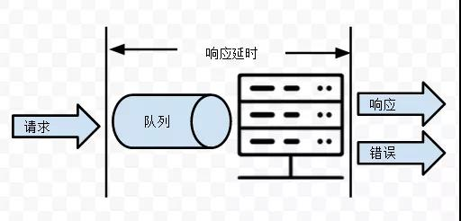
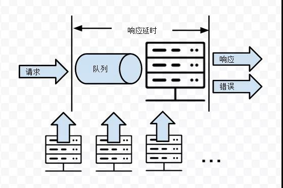
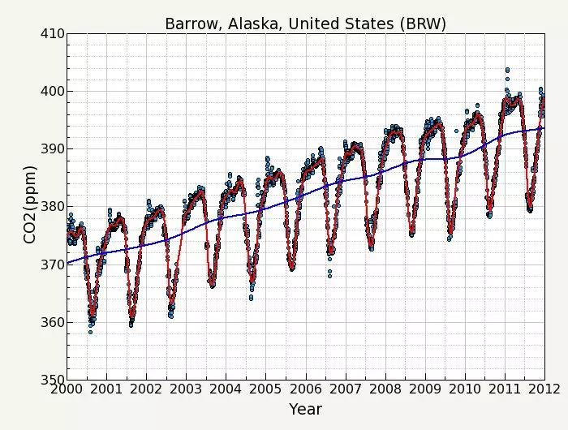
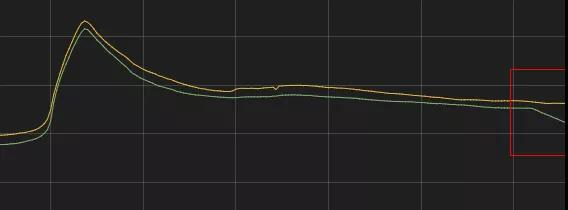
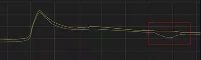

## 如何优雅的设计一个告警系统

## **0. 目录：**

- 告警的本质
- 告警对象
- 监控的指标和策略
- 理论与现实
- 异常检测
- 基于曲线的平滑性检测
- 基于绝对值的时间周期性
- 基于振幅的时间周期性
- 基于曲线回升的异常判断
- 核心要点总结

## 1. 告警的本质

没有多少系统的告警是设计得当的。良好的告警设计是一项非常困难的工作。

如何知道你收到的告警是糟糕的？多少次你收到了告警之后，立即就关掉了的？是不是成天被这些没有什么卵用的东西给淹没？

最常见的告警设置：cpu使用率超过90%，然后告警。这种设置在大部分场合下是没有办法提供高质量的告警的。

高质量的告警应该是这样的：每次收到之后你可以立即评估影响的范围，并且每一个告警需要你做出分级响应。所谓每个告警都应该是，actionable的。

告警的实质可以用下图表明：

服务器的设计应该是以这样的无人值守为目的的。假设所有的运维全部放假了，服务也能7*24自动运转。

告警的实质就是“**把人当服务用**”。在一些事情还没有办法做到程序化执行的时候，用告警通知人的方式去干预系统达到修正的目的。

一次告警就像一次服务调用一样。如果告警了，但是收到告警的人并不需要做任何处理，那么这就是一种DDoS攻击，攻击的是运维的幸福生活。

很多时候，告警通知人去干的事情是真的可以被自动化掉的。比如服务器挂了，换一台上来。

在小一点的系统里，可能就是停机一会，人工来处理换一台冷备的机器上去。

大一点的系统，因为服务器多了，天天都挂可不行，必须是热备的，系统自动切换到备机。

再大一点的系统，因为切换实在太频繁了，故障机的退库，备机的保有都变成了一种管理负担，那么可以和其他的运维流程打通变成完全自动化的系统。

只是因为业务处理不同阶段，选择不同的实现策略而已。业务量小，拿血肉当机器用，有的时候更经济而已。当然对于那个被当成机器人来用的哥们来说，生活确实有点不公平。

## 2. 告警对象

告警对象可以分为两种：

- 业务规则监控
- 系统可靠性监控

对于业务规则监控可以举一个游戏的例子。

比如DNF的游戏角色在一定装备的情况下，单次打击的伤害输出应该是有一个上限，如果超过了就说明有作弊的情况。

又比如斗地主游戏里一个人的连胜场次是有一定上限的，每天的胜率是有一定上限，如果超出平均值太多就可能是作弊。

业务规则监控的不是硬件，也不是软件是否工作正常。而是软件是否按照业务规则实现的，是否有漏洞。也可以理解为对“正确性”的监控。

系统可靠性监控是最常见的监控形式，比如发现是不是服务器挂掉了，服务是不是过载了等等。

对于大部分后台服务，系统可以抽象建模成这个样子：

对于这样的系统可以采集什么指标？

- 请求数，请求到达速率
- 正常响应数，正常响应占比
- 错误响应数，错误响应占比
- 响应延时
- 队列长度，排队时间

实际的情况是，几乎任何系统都不是孤立运行的。而是这样的：

一个DB会依赖于底层的cpu，内存，磁盘等资源。一个Http服务会依赖于底层的DB服务。一个应用会依赖于数个底层的RPC服务。

于是又多了几个指标：

- 资源A的调用量（比如CPU使用率）
- 资源B的调用量（比如内存分配和释放）
- 资源C的调用量（比如网络发送包量）
- ...

这种层次结构，一般来说简单来说可以分为四层：

- **产品策略和营销**：它们决定了根本的请求到达的速率
- **应用层**（更粗俗一点可以叫web层）：最上层的胶水
- **服务层**：db，各种RPC服务，以及层层嵌套的服务
- **硬件层**：cpu，内存，磁盘，网络

因为这样的一个依赖层次。上一层对下一层的资源消耗量变成了下一层的请求数。

比如Http服务消耗了多少DB的资源，就对应了DB服务需要处理多少请求数。DB繁忙与否取决于Http服务请求，Http服务请求繁忙与否取决于多少人打开客户端，多少人打开客户端又取决于产品策略和营销活动。

这种层次结构决定了单纯跟踪一个指标，比如绝对请求数，很难说明这一层的服务是否出现了故障。

有这么多层次，每层又有很多指标可以采集。那么应该采集什么指标，用什么告警策略去告警呢？

最前面已经提到了告警必须是actionable的，但是实际情况下只有这种纲领性要求仍然是不好操作的。至少可以提几点不应该做的事情：

- 不应该用采集的难度决定你使用什么指标去告警。很多情况下cpu使用率可能是最好采集的，但是未必是最值得告警的。

  

- 不要给运维他们想要的告警，而是要做“真正”想要的告警。大部分情况下，人们告诉你的是一个解决方案。运维告诉你它需要对db进程的cpu使用率超过x%的时候告警，它给你的是一个他认为最优的解决方案。但是他真正想要的是知道db服务是否有异常，cpu使用率超过x%未必是最好的告诉你服务是否出现异常的指标。

盲目地采集那些容易获取的指标，并随意地设定阈值告警是大部分糟糕的告警质量的根源。

## 3. 监控的指标和策略

那到底应该采集什么指标呢？我认为大部分的系统可靠性监控不外乎三个目标：

- is the work getting done？系统是否在持续完成其设定的工作

  

- is the user having good experience？用户体验是否好

  

- where is the problem/bottleneck？问题或者瓶颈在哪里

其中最核心最关键的是第一个问题，is the work getting done。对于数据库来说，我们可以采集：

- cpu 使用率

  

- 网络带宽大小

  

- db请求数

  

- db响应数

  

- db错误响应数

  

- db请求延迟

显然要回答一个db是否完成了其指定的工作，更应该关注的指标是这两个：

- db请求数的绝对量

  

- db正确响应相对请求数的占比

这两个指标相对于采集什么cpu使用率更能说明问题。不仅仅是db，各个层次的服务都可以用请求量和正确响应占比来反映其工作状况。

比如http请求数（对比http正确响应数），比如app打开次数（对比服务端记录的在线人数）等等。

为什么cpu使用率不能说明问题？大部分时候，我们并不关心cpu本身，而关心使用cpu为资源的服务。所以cpu使用率只是一种资源的请求数而已。

与请求数相关的一个概念是saturation（上限），当上限达到的时候，处理开始排队，延迟开始变长，错误率开始升高。

那么cpu使用率是不是能够说明上限呢？cpu使用率的上限以100%记，那么90%开始告警不是很合理吗？毕竟cpu 100%了几乎可以等同于db无法正常处理请求了。

这种利用底层资源调用量，评估其是否达到上限的做法有两个根本缺陷：

- 你无法知道上层服务可以把底层资源利用到什么程度

  

- 底层资源的 saturation 未必可以容易度量

具体来说，db是不是可以真的100%利用cpu是未知的。假如请求里锁，或者sleep，那么也许cpu永远也无法达到100%，90%可能就是极限了。

而且现代的cpu是多核的，如果请求处理只能利用单核，处理在多个核之间跳跃，对于一个核来说永远也不会一直保持100%。

对于cpu可能其上限真的有一个100%的值。但是对于很多非硬件的服务，比如你是一个登陆服务，依赖于一个db。那么这个db每秒可以处理的不同sql组合数是很难度量的，绝非和磁盘一样有一个mb/s的极限绝对值可以做为对比。

而且度量底层资源的使用还有一个缺陷是你无法枚举出所有依赖的资源的。所以与其这么绕弯子地通过底层资源来间接监控上层服务是否正常，还不如直接测量work是不是getting done呢。

对于第二个问题，is the user having good experience？可以采集的指标为

- 平均排队时间，平均总响应延迟

  

- 99/95/90 percentile的排队时间，99/95/90 percentile的响应延迟

这里的用户不一定是指人或者玩家，可能是上一层的服务调用方，另外一个系统。

第三个问题就是所谓的故障定位。要是人工来做的话，最常见的做法是收到了告警，然后登陆CRT，开始敲各种命令查找原因。

对于系统来说，最合适的做法不是出了问题再去执行一堆命令，而是：

1. 每个层次都对自己做告警

   

2. 顶层服务出了告警触发自动定位程序

   

3. 按照服务的依赖关系和大致的时间范围，定位到告警之间的关联，从而找到出问题或者瓶颈的地方

当然实际情况是很复杂的。很多原因和结果是互为因果的。两个告警是两个现象，还是一个原因一个现象实际上很难说得清楚。

从告警算法的角度来讲，对成功请求率，或者平均响应延迟做告警是非常容易的。静态阈值大家看不起，觉得简单。但是大部分告警用静态阈值就可以解决问题。

## 4. 理论与现实

那告警要不要高难度的算法？

我的观点是采集到了正确的指标，是不需要复杂算法的，就是静态阈值都可以搞得定。但是至少有三种场合需要算法：

- 无法直接采集到错误数：需要对错误日志的自动分类

  

- 无法直接采集到请求成功率：需要对请求数或响应数的绝对值做异常检测

  

- 只有总数，无法采集到其中的每个细分构成项的占比：需要对参与的factor进行算法拟合

其实这三项都是一个主题的，当你无法直接获取到告警所需的指标的时候，事情会变得复杂很多。

有一个比喻是：最近NASA宣布的地球孪生兄弟Kepler 452b。如果我们的探测器可以跑到1400光年之外，发现他将是非常容易的事情。

正是因为直接获得数据非常困难，所以科学家才需要根据行星阻挡恒星时引起的亮度变化（所谓掩星法）来发现这些遥远的星球。

采集所需的指标的困难可能是几方面的因素。一种原因是采集本身是非常消耗资源的事情。

比如获取每个mysql查询所消耗的cpu。跟踪每个请求处理过程是不可能的。这个时候就需要算法的帮助了，可以仔细看一下vividcortex的视频：

- http://www.youtube.com/watch?v=szAfGjwLO8k

更多情况是采集指标困难是D/O分离造成的沟通问题，运维需要的指标需要开发去埋点，而开发埋点的地方又需要运维去做告警。很多时候退而求其次就会造成，有什么指标就用什么指标的状况。

比如虽然没有请求响应的错误数，但是错误基本上都会有错误日志记录，根据错误日志滚动的快慢可以大致知道是不是出了问题。

这就引入了一个非常困难的日志分类问题，什么日志代表了正常，什么日志代表了异常，异常又非了哪些类型？

这个方面算法做得好的是summo logic公司：

- https://www.sumologic.com/ 

为什么这种opsdev（嘲讽devops那）公司如此热衷于算法？

对于他们来说好处是显而易见的，客户需要做的改动越少，接入成本越低，客户面就越广。

但是拿机器算法去挖掘海量日志真的是回答：is the work getting done？的最佳手段？

显然不是。这就是大炮打蚊子。日志的存在是用于解决问题，而不是有了海量日志了，如何用好“它们”变成了问题本身。

第三类情况是没有办法采集到请求成功率，只能对绝对的处理成功的量。只有这类数据要告警，就无法做简单的静态阈值了。

对于延迟，一般可以定一个业务上可以接受的延迟上限。对于成功率，也可以定一个可接受的成功率上限。但是对于绝对的处理量，是没有办法简单地比较一个静态阈值就可以判断是正常还是异常的。

在讨论如何实现之前，再强调两点：

- 处理成功的量不是度量is work getting done的最佳指标。费事费力去搞算法，不如直接把成功率指标给采集了

  

- 处理成功的量，还取决于请求数。而请求数根本上是取决于上层服务。

  

你是一个dba，发现db的每秒处理的请求数陡降了。这说明是db故障了？还是app故障了？

都有可能……最最上层是产品和营销。

你发现一个业务的注册量相对前几天变少了，这个是不是说明注册服务出问题了？

也许是产品太烂了，游戏根本没有人来玩。也可能是营销手段的营销，不送金币了，玩家没积极性了。

## 5. 异常检测

只有请求数，没有参考的上限值（saturation），也没有成功率，没有失败率，怎么检测异常？

上图的黄线是昨天的值，绿线是今天的值，大部分服务监控的曲线图都长这样。可以得出四个思路：

- **曲线平滑**：故障一般是对近期趋势的一个破坏，视觉上来说就是不平滑

  

- **绝对值的时间周期性**：两条曲线几乎重合

  

- **波动的时间周期性**：假设两个曲线不重合，在相同时间点的波动趋势和振幅也是类似的

  

- **有一个长度可观的坑**：当曲线开始回升到历史范围的时候，一般可以确认这个时间段是真的故障了

从这四种直觉展开，可以得出各种或复杂或简单的算法。下面要讲的算法都是非常简单的，无需很高深的数学知识。

## 6. 基于曲线的平滑性检测

这种检测的根据是在一个最近的时间窗口，比如1个小时。曲线会遵循某种趋势，而新的数据点打破了这种趋势，使得曲线不光滑了。

也就是说，这种检测利用的是时间序列的temporal dependency，T对于T-1有很强的趋势依赖性。

业务逻辑上来说，8:00 有很多人登陆，8:01 也有很多人来登陆的概率是很高的，因为吸引人来登陆的因素是有很强的惯性的。

但是7.1很多人来登陆，8.1也有很多人来登陆的惯性就要差很多。

基于近期趋势做告警，就需要对曲线的趋势进行拟合。

拟合有两种方式，moving average 或者 regression。这两种拟合方式有不同的bias（倾向）。

这就是一种moving average的算法图，叫做exponentially weighted moving average。它的计算非常简单

x是实际值，s是ewma计算出来的平均值。也就是下一点的平均值是由上一点的平均值，加上当前点的实际值修正而来。

这个修正的比例，就取决月这个alpha的decay factor的大小。视觉上来说就是ewma曲线是否紧跟实际曲线，也就是平滑程度。

有了平均值之后可以计算方差，方差乘以一定的倍数可以得出对于振幅的容忍范围。比较实际的值是否超出了这个范围就可以知道是否可以告警了。

超出了上界，可能是突然用户量突然激增了。超出了下届，可能是营销活动结束了，用户快速离开，也可能是光纤断了，玩家掉线了。

想要了解更多关于ewma的算法细节：关注Baron Schwartz：

- http://www.slideshare.net/vividcortex/statistical-anomaly-detection

moving average认为曲线是趋向于历史的，如果曲线的势头是上升，那么它认为下一个点应该是开始下降的。

regression认为曲线是趋向于未来的，如果曲线的势头是上升，那么它认为下一个点应该是保持这个上升势头。

还有更复杂的模型是综合了moving average和regression的。无论是哪种算法，用过去10分钟预测下10分钟是不可能精确的。如果这种预测可以精确，那么股神早就诞生了。

使用moving average，可能会掩盖故障产生的下降（因为其bias是下降）

如果使用regression，那么又有可能把没有上升得那么快当成故障了（因为其bias是上升）。

这种基于近期趋势计算方差的算法还有一个缺陷是当前面几个点振动很大的时候，方差值会被搞大。后面的故障就被掩盖了，使得连续的故障点无法被检测到。

其实也就是算法对于什么是正常是没有概念的，它认为过去的历史就是正常。如果过去几分钟处于故障中，那么故障的曲线就是正常。

实际使用中发现这种基于曲线平滑度的算法的优点有

- 依赖的数据少，只需要近期的历史，不依赖于周期性

  

- 非常敏感，历史如果波动很小，方差就很小，容忍的波动范围也会非常小

  

缺点也是显著的：

- 过于敏感，容易误报。因为方差会随着异常点的引入而变大，所以很难使用连续三点才告警这样的策略

  

- 业务曲线可能自身有规律性的陡增和陡降

最佳的使用方式是不用一根曲线做告警。结合几条相关的曲线，如果同时出现平滑度破坏的情况，而且与业务规律的趋势相背离（比如在线人数降低，登陆请求数增高）则可以认定为业务出现故障。

## 7. 基于绝对值的时间周期性

上图中不同的颜色代表了不同日期的曲线。

很多监控曲线都有这样以一天为周期的周期性（早上4点最低，晚上11点最高之类的）。一种利用时间周期性的最简单的算法：

min(14 days history) * 0.6

对历史14天的曲线取最小值。怎么个取最小值的方法？

对于12:05分，有14天对应的点，取最小值。对于12:06分，有14天对应的点，取最小值。这样可以得出一条一天的曲线。

然后对这个曲线整体乘以0.6。如果几天的曲线低于这条参考线则告警。

这其实是一种静态阈值告警的升级版，动态阈值告警。

过去静态阈值是一个根据历史经验拍脑袋的产物。用这个算法，其实是把同时间点的历史值做为依据，计算出一个最不可能的下界。同时阈值不是唯一的一个，而是每个时间点有一个。如果1分钟一个点，一天中就有1440个下界阈值。

实际使用中0.6当然还是要酌情调整的。而且一个严重的问题是如果14天历史中有停机发布或者故障，那么最小值会受到影响。

也就是说不能把历史当成正常，而是要把历史剔除掉异常值之后再进行计算。一个务实的近似的做法是取第二小的值。

为了让告警更加精确，可以累积计算实际曲线和参考曲线的差值之和。也就是相对于参考曲线下跌的面积。这个面积超过一定的值则告警。

对于深度下跌，则累积几个点就可以告警。对于浅度下跌，那么多累几个点也可以告警出来。

翻译成人话就是，一下在跌了很多，则很有可能是故障了。或者连续好久都偏离正常值，那么也很有可能是出问题了。

优点：

- 计算简单

- 可以确保发现大的故障，出了告警一定是大问题，可以直接打电话

  

缺点：

- 依赖周期性的历史数据，计算量大，而且无法对新接入的曲线告警
- 非常不敏感，小波动无法发现

## 8. 基于振幅的时间周期性

有些时候曲线是有周期性，但是两个周期的曲线相叠加是不重合的。

比如上图这样的，曲线整体的趋势是网上的。两个周期的曲线一叠加，一个会比另外一个高出一头。对于这种情况，利用绝对值告警就会有问题。

比如今天是10.1日，放假第一天。过去14天的历史曲线必然会比今天的曲线低很多。那么今天出了一个小故障，曲线下跌了，相对于过去14天的曲线仍然是高很多的。这样的故障如何能够检测得出来？

一个直觉的说法是，两个曲线虽然不一样高，但是“长得差不多”。那么怎么利用这种“长得差不多”呢？那就是振幅了。

与其用x(t)的值，不如用x(t) - x(t-1)的值，也就是把绝对值变成变化速度。可以直接利用这个速度值，也可以是 x(t) - x(t-1) 再除以 x(t-1)，也就是一个速度相对于绝对值的比率。

比如t时刻的在线900人，t-1时刻的在线是1000人，那么可以计算出掉线人数是10%。这个掉线比率在历史同时刻是高还是低？那么就和前面一样处理了。

实际使用中有两个技巧：可以是x(t) - x(t-1），也可以是x(t) - x(t-5）等值。跨度越大，越可以检测出一些缓慢下降的情况。

另外一个技巧是可以计算x(t) -x(t-2)，以及x(t+1) - x(t-1)，如果两个值都异常则认为是真的异常，可以避免一个点的数据缺陷问题。

优点：

- 比绝对值要敏感

  

- 利用了时间周期性，规避了业务曲线自身的周期性陡降

缺点：

- 要求原曲线是光滑的

  

- 周期性陡降的时间点必须重合，否则误警

  

- 按百分比计算容易在低峰时期误警

  

- 陡降不一定代表故障，由上层服务波动引起的冲高再回落的情况时有发生

这种异常告警算法是比较优秀的。缺点也很多。所以可以进行一些修补凑合用。

为了避免低峰时期，基于振幅百分比容易误警，可以加入绝对振幅的下限。

业务上来说，就是小波动如果相对比率大，但是绝对影响范围小也是没关系的。对于冲高回落的问题，可以判断一下冲高的情况，对于冲高之后屏蔽一段时间。

## 9. 基于曲线回升的异常判断

当我们看见图2的时候比图1更确认是故障了。为什么？

因为图2中有一个明显的回升。算法其实和人眼一样。如果多等几个时间点，发现曲线回升了可以更很准确地判断“曾经”有一个故障。

但是这种基于回升的异常检测是没有多少“告警”意义上的机制的。

告警的作用就是让人参与干预，去帮助曲线回升。如果曲线已经开始回升，再告警不是事后诸葛了吗？

这种检测的意义在于机器复制告警的确认。

当我们需要统计误警率，漏警率的时候，用另外一种视角的算法重新跑一遍可以统计出很多原算法的问题。

同时也可以用半自动化的方式建立一个历史故障的样本库。这个样本库可以变成更复杂的机器学习算法的训练集。