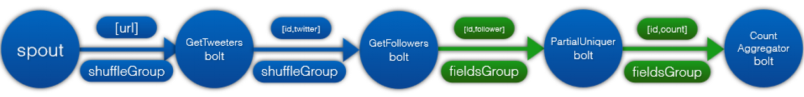
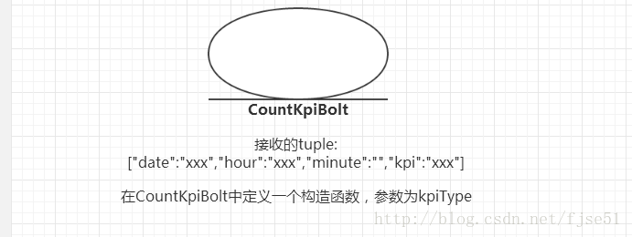

# hadoop项目: 日志分析项目总结

## 简历描述：

## 项目的数据流图：

## 项目整体情况及实现细节：

## **项目架构：**

Flume+Hadoop+Hbase+Hive+Kafka+Sqoop+Storm+Mysql

为什么要采用这样的架构？

## 数据处理流程

### 1) **数据的来源：**

web端埋点(实现方式：js sdk);业务系统(实现方式：java sdk);

app端埋点(实现方式js sdk);已经存在的历史数据通过Sqoop导入HDFS（实现方式：Sqoop import 到HDFS）

### 2) **数据的收集：**

通过flume集群(多层架构，负载均衡，故障迁移)收集到HDFS

我们使用flume的Execsource方式组织数据，也就是tail-F[file]，实时进行日志读取传输，达到准实时日志同步

多层架构实现方式：

负载均衡，故障迁移实现方式：Sink组和Sink处理器(load-balance Sink处理器（andom方式,round-robin方式）；failover Sink处理器(从Sink组中以优先级的方式选择Sink))

### 3) **数据的存储：**

源数据（未清洗过的数据）存在HDFS；

清洗过的数据存在Hive(原因：使用的Hive进行的数据清洗)；

脱敏过的数据存在Hbase(方便后期的数据出售或者实时的查询)

### 4) **数据的清洗：**

使用Hive的方式进行的数据清洗，清洗后的数据存储在Hive中，然后使用自定义UDF(实现方式：继承UDF，重写evaluate方法，打jar包，上传目标机器，hive >add jar,创建永久函数即可),然后脱敏数据,

存储到Hbase（实现方式：Hive和Hbase的整合：Hive和Hbase jar包互传，hive指定Hbase的Zookeeper，建立表之间的映射关系）

### 5) **数据的分析：**

离线的数据分析：使用Hive进行数据分析（实现方式：根据业务编写HQL分析），然后通过Sqoop导出到Mysql(实现方式：sqoop --options-file sqoop1(一些参数配置))

在线的数据分析：使用Kafka(实现方式：数据通过Kafka Sink到Kafka Topic，Flume相当于Kafka的Producer；Storm相当于Kafka的Consumer)+Storm(实现方式：构建Topology(Spolt+Bolt)的有向无环图分析数据)的方式实现，分析后的数据直接存储到Mysql(实现方式：通过Storm Bolt建立JDBC连接直接存储到Mysql)

### 6) **数据的查询：**

Hbase脱敏数据的查询(Hbase 查询api：scan，get，过滤器)，整合[Phoenix](http://www.baidu.com/link?url=m8qi88ap2ikFad6z0Dc_So0N_OUxOtcWMSeQQU6T6rnlSJK3vxylj0b_jzvbHjKi)实现sql的查询

大数据平台和关系型数据库的数据转换：Sqoop导入到HDFS/Hive/Hbase(实现方式：import(实现方式(MR的map阶段实现)));Sqoop导出到关系型数据库(实现方式：export(MR的map阶段实现))

### 7) **数据平台的可视化：**

 Hadoop集群管理平台的可视化：Hue

Hadoop集群控制工具Web可视化工具：Hue

[高可用Hadoop平台－Hue In Hadoop](http://www.cnblogs.com/smartloli/p/4527168.html)：

https://www.cnblogs.com/smartloli/p/4527168.html

Hadoop集群监控工具：ganglia

Hadoop集群的监控工具：[高可用Hadoop平台－Ganglia安装部署](http://www.cnblogs.com/smartloli/p/4519914.html)

http://www.cnblogs.com/smartloli/p/4519914.html

分析后的数据的可视化：mysql+Web项目

## **关于问集群的规模的问题：**

我们开发使用的是测试集群(10台测试集群)，关于具体的集群的规模我不太清除，属于运维人员的工作范畴

任务调度平台：

任务调度平台：真实企业中使用的任务的调度平台进行任务的调度

企业中有很多的大数据的组共同使用一套集群，都在集群上面运行

## **关于作业任务调度的问题：**常用的调度工具：TaskNet

我们公司java组自己实现的一个任务调度系统，只给了我们相应的接口，有相应的web界面，提交任务的时候只需要配置好相应的配置，前置依赖，是否重试，重试时间等即可提交任务运行了。具体的实现不在我的工作范围内，我不清楚。

常用的调度工具：`crontab`、`azkaban`、`rundeck`、`xxl_job`

`azkaban`主要被用于`hadoop`作业或其他类型的数据仓库的调度

**关于数据量的问题的回答：**

每天的数据量大概有500G左右的数据

网站的日均pv在40w，uv在30万左右

## **你在项目中都干了什么？你项目都负责哪一块？**

我在这个项目中主要负责

数据的收集(实现方法：使用Flume分层架构：负载均衡和故障迁移;配置服务器所在的Flume的Agent：采用HDFS Sink(注意其他的一些配置，如日期格式，临时文件的时间，压缩，文件存储格式等))，

部分的清洗(实现方法：离线的ip解析和浏览器解析(采用`java`的第三方工具，然后自己封装了一层)等)，脱敏(自定义UDF函数)并批量的存入`Hbase`中(整合MR和`MapReduce`)

还参与了部分功能模块的分析(活跃用户，浏览器深度(浏览深度hive sql分析(用户角度+会话角度))等：使用`HiveSql`),然后将分析后的数据导入关系型数据库(实现：使用`Sqoop`的导出export  --hive -export)

**遇到什么问题，怎么解决的？**

在sink时根据时间对日志分割成不同的目录，但是实际过程中存在一些延迟，导致sink写入hdfs时的时间和日志文件中记录的时间存在一些差异；并且不能保留原有的日志文件名

使用Flume的拦截器实现对HDFS Sink的日期格式的替换

参考博客：http://blog.csdn.net/ty_laurel/article/details/54585726

遇到的问题：修改过后测试很符合需求，隔夜后发现报错

解决问题：研究`RegexExtractorInterceptor`拦截器的源代码，发现其中只是对匹配到指定格式时做了相应的处理，但是对于未匹配到的日志行时不做任何处理，因而修改源代码，在未匹配到指定字串时，添加默认的时间戳即可，但是不能为空，因为`hdfsSink`分目录时必须要从事件header中获取到`timestamp`的，否则就会报错。

## **你在项目中使用的技术，解决了什么问题？**

使用分层的Flume实现高容错的，高可靠的数据的收集：Flume Sink组和Sink执行器，使用Flume解决了Flume到HDFS的去日期格式化延迟的问题

使用MR整合`HBase`批量的将HDFS的数据导入到`Hbase`中

使用Hive进行了一些模块的数据的分析：`HiveSQL`

使用Sqoop将分析后的数据导入到关系型数据库，供做Web前端的做展示

## **有不少公司会问项目组有多少人,,,人员的分工是如何的,,,数据量,,,还有集群的配置....？**

我们大数据项目组有10个，有一个大数据领导，2-3个做数据挖掘分析的，2-3专门做`ETL`的，剩下的做数据算法建模的，有些时候也不会分得很细，都会互相帮忙解决问题，毕竟把项目做完是我们一致的目标。

数据量在300-500G左右，关于集群的管理和配置的问题，有专门的运维团队负责。

我们开发只有10台测试集群。

## **对自己每个项目做讲解，项目中的疑难点？**

### 项目的讲解：项目介绍+架构+数据流图+功能模块+使用技术分析

### 项目的疑难点：性能？？

### **执行MapReduce时间？**

**在测试集群上：**

一般一个作业10分钟到-几个小时不等

一般一个作业也就几十分钟。。运行几天的很少

### **有多少个****MR：**

**在集群上测试的：**

30-50个左右，还有其他部分的作业，像推荐的作业撒的。

一般公司很多个作业。。

你可以你们部门的,其他你不清楚就别说，比如数据清洗的（这里面就有很多作业了，去掉不完整数据，数据格式转换，数据字段连接，字段抽取等等），相应你简历上写的项目,很多模板都有作业。。你细化一下比如推荐的作业，统计汇总的作业，用户定位的作业

### **你的集群中的定时的任务是怎么做的？**

一般的linux会使用`crontab`来做,但是我们公司java组自己实现的一个任务调度系统,只给了我们相应的接口,有相应的web界面，提交任务的时候只需要配置好相应的配置,前置依赖,是否重试，重试时间等即可提交任务运行了。
具体的实现不在我的工作范围内，我不清楚。

### **有没有关心过运行时候的状态，**

MapReduce运行状态,hadoop有监控页面：Hue

### **遇到bug怎么解决，上线之后的bug怎么解决，**

一般在测试阶段就那部分线上数据测试过了。。

如果在线上还有问题

一般kill掉作业。根据具体的情况看是否需要重跑

### **Storm实时流量分析**：实时日志分析

**实时数据经过Storm ETL，主要是将不同维度组合作为key，计算metrics以后为value存在redis中**

分析模块；在线用户；用户区域；用户装备订单；等等

网站平台的ip pv uv 等等流量分析

好大夫在线网中某人发布某个URL的受众人数统计：

实现：

## **你在项目中的优化的方案？**

### 1) 提高性能的集群参数的调优：

#### ①HDFS参数调优:

#### ②Hbase参数调优:

​	读写表的调优，RowKey的设计，列族的调优等等

#### ③MapReduce参数调优:

​	Shuffle参数的调优，并发线程参数的调优等

#### ④Hive参数调优：

​	优化方式一：本地模式，

​	优化方式二：并行计算

#### ⑤代码层面的调优：

* 解耦，进一步的封装，注意一些java类的使用，使用线程安全的HtablePoll，HiveSQL的编写

* join

* 聚合，自动的数据倾斜的优化

* 控制Hive中的map和reduce的数量

* JVM的重用

#### ⑥MapReduce调优：

​    Mapper调优:数据量尽量减少：conbiner，压缩，优化方式三：严格模式，优化方式四：排序

​	Reduce调优:设置Reducer个数

​	Runner调优:job参数的调优

## Storm实时分析部分做了些什么？

基于用户的流量统计pv，uv，url访问次数，浏览器或者操作系统情况等

### 怎么做的？

​	构建Topology实现

### 做了什么优化？

多个负责统计的CountXXXBolt，现在设计一个通用的CountKipBolt，做了进一步的封装

