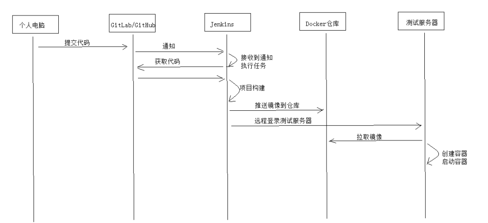

持续集成（Continuous integration）简称CI，持续集成的思想是每天要多次将代码合并到主干，并进行集成、测
试，这样就可以提早发现错误，进行修正。持久集成也属于DevOps

## 持续集成的好处:

1、自动化集成部署，提高了集成效率。

2、更快的修复问题。

3、更快的进行交付。

4、提高了产品质量


## 持续集成流程


## 步骤
1. 安装docker,搭建私有仓库

2. 安装 Jenkins

3. 安装GitLab

4. 编写Pom.xml
docker-maven-plugin插件，其作用是构建docker镜像并将镜像推送到
Docker私有仓库

```xml
<build>
    <finalName>${project.artifactId}‐${project.version}</finalName>
    <plugins>
        <plugin>
            <groupId>org.springframework.boot</groupId>
            <artifactId>spring‐boot‐maven‐plugin</artifactId>
        </plugin>
        <plugin>
            <groupId>com.spotify</groupId>
            <artifactId>docker‐maven‐plugin</artifactId>
            <version>1.0.0</version>
            <!--docker镜像相关的配置信息-->
            <configuration>
                <!--镜像名，这里用工程名-->
                <imageName>${project.artifactId}‐${project.version}</imageName>
                <!--Dockerfile文件所在目录-->
                <dockerDirectory>${project.basedir}/src/main/resources</dockerDirectory>
                <!--TAG,这里用工程版本号-->
                <imageTags>
                    <imageTag>${project.version}</imageTag>
                </imageTags>
                <registryUrl>192.168.101.64:5000</registryUrl>
                <pushImage>true</pushImage>
                <imageName>192.168.101.64:5000/${project.artifactId}:${project.version}</imageName>
                <!--构建镜像的配置信息-->
                <resources>
                    <resource>
                        <targetPath>/</targetPath>
                        <directory>${project.build.directory}</directory>
                        <include>${project.artifactId}‐${project.version}.jar</include>
                    </resource>
                </resources>
            </configuration>
        </plugin>
    </plugins>
</build>
```

5. 创建持续集成任务
5.1) 创建构建任务

5.2) 创建构建任务

5.3) maven构建配置

5.4) 执行任务
任务界面->立即执行

5.5) 自动构建
使用Gitlab提供的webhook功能可以实现开发人员将代码push到Git仓库自动进行构建。

1、设置webhook


2、在idea中修改项目代码，push到GitLab
配置指定分支

3、Jenkins任务收到GitLab通知自动执行构建