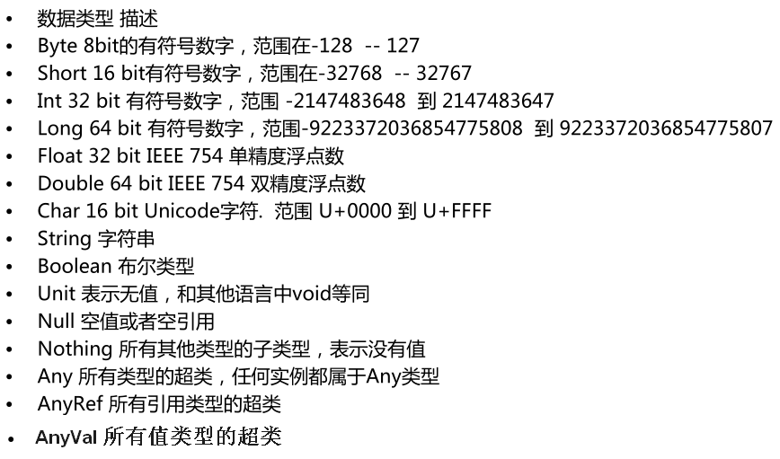
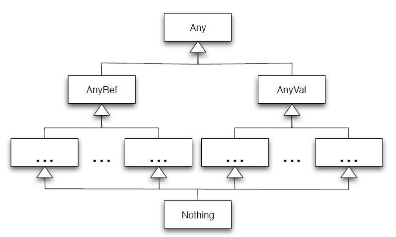
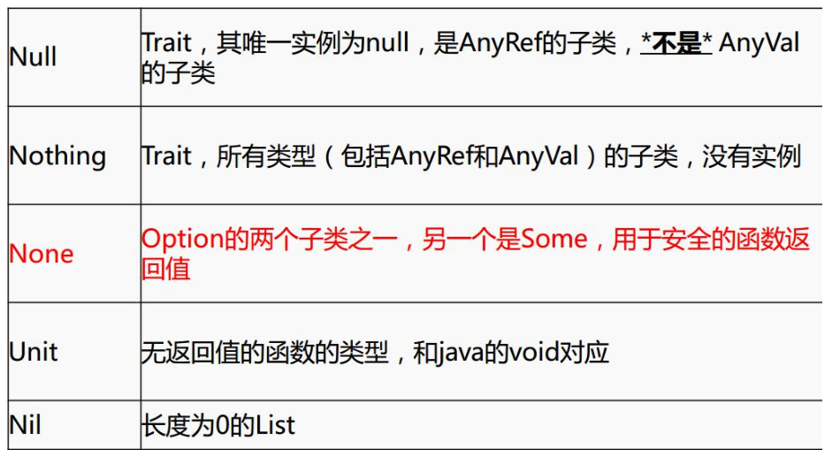

# Scala

## 1、doc

[挑逗 Java 程序员的那些 Scala 绝技](https://mp.weixin.qq.com/s/gTCGSa6UkxpdaeO2qzWovw)

## 2、简介
  [官网](https://www.scala-lang.org/)             

* 1). Java和scala可以混编(JVM的高层次语言)
* 2). 高阶函数
* 3). 模式匹配（类似java switch）
* 4). 特质，特征(类似java中interfaces 和 abstract结合)
* 5). 并发和分布式（Actor）
* 6). 类型推测(自动推测类型)
  
    

Scala combines object-oriented and functional programming in one concise, high-level language. 
Scala's static types help avoid bugs in complex applications, and its JVM and JavaScript runtimes let you build high-performance systems with easy access to huge ecosystems of libraries

Scala是一个面向对象和函数式编程的语言,是一个高级别的语言
Scala的静态类型能够帮助我们在复杂的应用程序避免掉许多bug,在jvm和javascript的运行环境中是高性能的系统,容易的访问生态系统中已有的jar包 


### 特征

* SEAMLESS JAVA INTEROP:Scala runs on the JVM, so Java and Scala stacks can be freely mixed for totally seamless integration

* TYPE INFERENCE:So the type system doesn’t feel so static. Don’t work for the type system. Let the type system work for you!

* CONCURRENCY & DISTRIBUTION:Use data-parallel operations on collections, use actors for concurrency and distribution, or futures for asynchronous programming

* TRAITS: Combine the flexibility of Java-style interfaces with the power of classes. Think principled multiple-inheritance

* PATTERN MATCHING:Think “switch” on steroids. Match against class hierarchies, sequences, and more.

* HIGHER-ORDER FUNCTIONS:Functions are first-class objects. Compose them with guaranteed type safety. Use them anywhere, pass them to anything.


## 3、学习Scala的意义
1) 钱
2) 做东西:Spark Kafka Flink(生态系统)
           优雅
           开发速度
           生态系统

##  4、Scala对比Java
### 定义变量和函数
```
// 变量
var x:Int=6
var x=6 // 类型推断
var y="scala"

// 函数
def square(x:Int):Int =x*x;
def square(x:Int)={x*x}
def annunce(text:String) {
    println(text);
}   
```

```scala
// 变量
int x=6;
final String y="scala";
int square(int x) {
    return x*x;
}

// 函数
void announce(String text) {
    Sysstem.out.println(text);
}

// 定义
def 方法名(参数名:参数类型):返回类型={
    // 括号内的叫做方法体
    
    // 方法体内的最后一行为返回值,不需要使用return
}
```

## 5、scala基础

### **1.** **数据类型**








### **2.** **变量和常量的声明**

* 定义变量或者常量的时候，也可以写上返回的类型，一般省略，如：val a:Int = 10

* 常量不可再赋值

  ```scala
      /**
       * 定义变量和常量
       * 变量 :用 var 定义 ，可修改 
       * 常量 :用 val 定义，不可修改
       */
      var name = "zhangsan"
      println(name)
      name ="lisi"
      println(name)
      val gender = "m"
  //    gender = "m"//错误，不能给常量再赋值
  ```

  

### **3.** **类和对象**

* 创建类

  ```scala
  class Person{
    val name = "zhangsan"
    val age = 18
    def sayName() = {
      "my name is "+ name
    }
  }
  ```

  * 创建对象

    ```scala
    object Lesson_Class {
        // 类是对象的抽象，而对象是类的具体实例。类是抽象的，不占用内存，而对象是具体的，占用存储空间。
        // 类是用于创建对象的蓝图，它是一个定义包括在特定类型的对象中的方法和变量的软件模板
       def main(args: Array[String]): Unit = {
        //  new 关键字来创建类的对象
        val person = new Person()
        println(person.age);
        println(person.sayName())
      }
    }
    ```

    * 对象中的apply方法

      object中不可以传参，当创建一个object时，如果传入参数，那么会自动寻找object中的相应参数个数的apply方法

      ```scala
      /**
        * object 单例对象中不可以传参，
        * 如果在创建Object时传入参数，那么会自动根据参数的个数去Object中寻找相应的apply方法
        */
      object Lesson_ObjectWithParam {
        def apply(s:String) = {
          println("name is "+s)
        }
        def apply(s:String,age:Int) = {
          println("name is "+s+",age = "+age)
        }
        def main(args: Array[String]): Unit = {
          Lesson_ObjectWithParam("zhangsang")
          Lesson_ObjectWithParam("lisi",18)
        }
      }
      ```

      * 伴生类和伴生对象

        ```scala
        class Person(xname :String , xage :Int){
          var name = Person.name
          val age = xage
          var gender = "m"
          def this(name:String,age:Int,g:String){
            this(name,age)
            gender = g
          }
          
          def sayName() = {
            "my name is "+ name
          }
        
        }
        
        object Person {
          val name = "zhangsanfeng"
          
          def main(args: Array[String]): Unit = {
            val person = new Person("wagnwu",10,"f")
            println(person.age);
            println(person.sayName())
            println(person.gender)
          }
        }
        ```

        注意点：

        * 建议类名首字母大写 ，方法首字母小写，类和方法命名建议符合驼峰命名法。

        * scala 中的object是单例对象，相当于java中的工具类，可以看成是定义静态的方法的类。object不可以传参数。另：Trait不可以传参数

        * scala中的class类默认可以传参数，默认的传参数就是默认的构造函数。

        重写构造函数的时候，必须要调用默认的构造函数。

        * class 类属性自带getter ，setter方法。

        * 使用object时，不用new,使用class时要new ,并且new的时候，class中除了方法不执行，其他都执行。

        * 如果在同一个文件中，object对象和class类的名称相同，则这个对象就是这个类的伴生对象，这个类就是这个对象的伴生类。可以互相访问私有变量。

### 循环

1  to 10
1.to(10)

## 6、隐式转换和隐式参数

### 隐式转换
```scala
package cn.itcast.impli

import java.io.File
import scala.io.Source


//隐式的增强File类的方法
class RichFile(val from: File) {
  def read = Source.fromFile(from.getPath).mkString
}

object RichFile {
  //隐式转换方法
  implicit def file2RichFile(from: File) = new RichFile(from)

}

object MainApp{
  def main(args: Array[String]): Unit = {
    //导入隐式转换
    import RichFile._
    //import RichFile.file2RichFile
    println(new File("c://words.txt").read)

  }
}
```