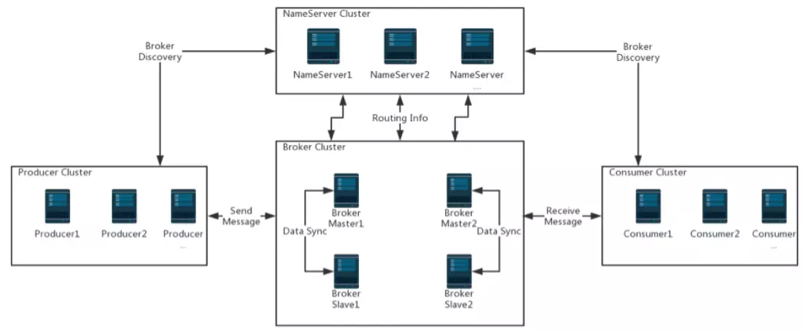
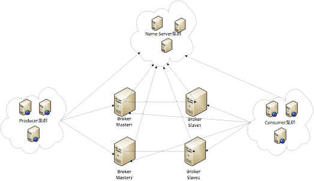
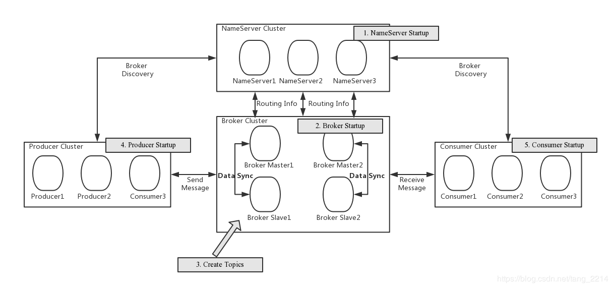

## 1. MQ介绍

### 1.2 MQ的优点和缺点
优点: 解耦、削锋、数据分发

缺点: 
* 系统可用性减低
系统引入的外部依赖多,系统稳定性越差.一旦MQ宕机,就会对业务造成影响/
如何保证MQ的高可用?
* 系统复杂度提高
MQ的加入大大增加了系统的复杂度,以前系统间是同步的远程条用,现在是通过MQ进行异步调用.
如何保证消息没有被重复消费?怎么处理消息丢失情况?怎么保证消息传递的顺序性?
* 一致性问题
A系统处理完业务,通过MQ给B、C、D三个系统发消息数据,如果B系统、C系统处理成功,D系统处理失败.
如果保证消息数据处理的一致性?

### 1.3 各种MQ产品的比较


|特性|ActiveMQ|RabbitMQ|RocketMQ|Kafka|
|:---|:---:|---:|----|----|
|开发语言|java|erlang|java|scala|
|单机吞吐量|万级|万级|10万级|10万级|
|时效性|ms级别|us级|ms级|ms级以内|
|可用性|高(主从架构)|高(主从架构)|非常高(分布式架构)|非常高(分布式架构)|
|功能特性|成熟的产品,在很多公司得到应用;有较多的文档;各种协议支持较好|基于erlang开发,所以并发能力很强,性能极其好,延时很低;管理界面较丰富;会erlang少,二次开发麻烦|MQ功能比较完备,扩展性佳|只支持主要的MQ功能,像一些消息查询,消息回溯等功能没有提供,毕竟是为大数据准备的,在大数据领域应用广|


## 2. RocketMQ快速入门

### 2.5 关闭RocketMQ
```shell
# 1. 关闭NameServer
sh bin/mqshutdown namesrv
# 2. 关闭Broker
sh bin/mqshutdown broker
```

##  3. RocketMQ集群搭建

### 3.1 各角色介绍
* Producer: 消息的发送者;举例: 发信者
* Consumer: 消息接受者;  举例: 收信者
* Broker: 暂存和传输消息;举例: 邮局
* NameServer: 管理和Broker;举例: 各个邮局的管理机构
* Topic: 区分消息的种类;一个发送者可以发送消息给一个或者多个Topic;一个消息想接收者可以订阅一个或多个Topic消息
* Message Queue: 相当于是Topic的分区;用于并行发送和接收消息 



### 3.2 集群搭建方式

#### 3.2.1 集群特点
* NameServer是一个几乎无状态节点,可集群部署,节点之间无任何信息同步.
* Broker部署相对复杂,Broker分为Master与Slave,一个Master可以对应多个Slave,但是一个Slave只能对应一个Master,Master与Slave的对应关系通过制定相同的BrokerName,不同的BrokerId来定义,BrokerId为0表示Master,非0表示Slave.Master也可以部署多个.每个Broker与NameServer集群中的所有节点建立长连接,定时注册Topic信息到所有NameServer.
* Producer与NameServer集群中的其中一个节点(随机选择)建立长连接,定期从NameServer取Topic路由信息,并向提供Topic信息的Master、Slave建立长连接,且定时向Master、Slave发送心跳.Consumer既可以从Master订阅消息,也可以从Slave订阅消息,订阅规则由Broker配置决定.

#### 3.2.2 集群模式
1)   单Master模式
这种方式风险较大,一旦Broker重启或则宕机时,会导致整个服务不可用.不建议线上环境使用,可以用于本地测试.


2)  多Master模式
一个集群无Slave,全是Master,例如2个Master或则3个Master,这种模式的优缺点如下:

* 优点: 配置简单,单个Master宕机或重启维护对应用无影响,在磁盘配置为RAID10时,即使机器宕机不可恢复情况下,由于RAID10磁盘非常可靠,消息也不会丢(异步刷盘丢失少量消息,同步刷盘一条不丢),性能最高
* 缺点: 单台机器宕机期间,这台机器上未被消费的消息在机器恢复之前不可订阅,消息实时性会受到影响.

3) 多Master多Slave模式(异步)
每个Master配置一个Slave,有多个Master-Slave,HA采用异步复制方式,主备有短暂消息延迟(毫秒级),这种模式的优缺点如下:
* 优点: 即使磁盘损坏,消息丢失的非常少,且消息实时性不会受影响,同时Master宕机后,消费者仍然可以从Slave消费,而且此过程对应用透明,不需要人工干预,性能同多Master模式几乎一样
* 缺点: Master宕机,磁盘损坏情况一下会丢失少量消息

4) 多Master多Slave模式(同步)
每个Master配置一个Slave,有对Master-Slave,HA采用同步双写方式,即只有主备都写成功,这个模式的优缺点如下:
* 优点: 数据与服务都无单点故障,Master宕机情况下,消息无延迟,服务可用性与数据可用性都非常高
* 缺点: 性能比异步复制模式略低(大约低10%左右),发送单个消息的RT会略高,且目前版本在主节点宕机后,备机不能自动切换为主机

### 3.3 双主双从集群搭建

#### 3.3.1 总体架构
消息高可用采用2m-2s(同步双写)方式





* NameServer：整个消息系统的状态服务器，没有使用 ZK 是因为用不到 ZK 那么多的功能，例如选举、同步等。NameServer 本身是无状态的，可以部署多个，相互之间没有数据交互。它主要用于管理 Broker 集群信息（提供心跳检查，检查是否有 Broker 下线） 和 Topic 路由信息（用于客户端查询）。
* BrokerServer：存储消息，提供消息的存储、推送、查询，集群部署可保证高性能、高可用。Broker 一主可以对应多从，主从之间会同步数据，同步方式分同步和异步，保存数据到磁盘文件也分为同步刷盘和异步刷盘。Broker 维护了 Topic 订阅信息，方便客户端做负载。
* Producer：消息生产者，通过负载选择合适的 Broker 发送消息，支持失败重试和故障规避。
* Consumer：消息消费者，订阅某一 Topic 的消息，支持 Push 和 Pull 两种模式

#### 3.3.2 集群工作流程
[RocketMQ架构设计及工作流程](https://blog.csdn.net/tang_2214/article/details/97965404)

* 1. 首先启动 NameServer，NameServer起来后监听端口,等待 Broker、Producer、Consumer 来连接,相当于一个路由控制中心。
* 2. 启动 BrokerServer，跟所有NameServer保持长连接,每隔 30s 定时向所有的 NameServer 发送心跳包，心跳包中包含当前Broker信息(IP+端口等)以及存储所有Topic信息。注册成功后,NameServer集群中就会有Topic跟Broker的映射关系.
* 3. 收发消息前,会创建Topic,创建Topic时需要制定该Topic要存储在哪些Broker上,也可以在发送消息时自动创建Topic.
* 4. Producer发送消息,启动时先跟NameServer集群中某一台建立长连接,并从NameServer中获取当前发送的Topic存在哪些Broker上,轮询从队列列表中选择一个队列,然后与队列所在的Broker建立长连接从而向Broker发消息.
* 5. Consumer 跟 Producer 类似,根其中一台NameServer建立长连接,获取当前订阅Topic存在哪些Broker上,然后直接跟Broker建立连接通道,开始消费消息

#### 3.3.3 服务器环境
| 序号 |      IP      |                     角色 | 架构模式        |
| :--- | :----------: | -----------------------: | :-------------- |
| 1    | 192.168.0.9  | nameserver、brokerserver | Master1、Slave2 |
| 2    | 192.168.0.10 | nameserver、brokerserver | Master2、Slave1 |

#### 3.3.4 Host添加消息
> vim /etc/hosts

配置如下: 
```properties
# nameserver
192.168.0.9 rocketmq-nameserver1
192.168.0.10 rocketmq-nameserver2
# broker
192.168.0.9 rocketmq-master1
192.168.0.10 rocketmq-slave2
192.168.0.9 rocketmq-master1
192.168.0.10 rocketmq-slave2
```

配置完成后,重启网卡
```shell
systemctl restart network
```

#### 3.3.5 防火墙配置
宿主机需要远程访问虚拟机的rocketmq服务和web服务,需要开放相关的端口号,简单粗暴的方式是直接关闭防火墙

```shell
# 关闭防火墙
systemctl stop firewalld.service
# 查看防火墙的状态
firewall-cmd --state
# 禁止firewall开机启动
systemctl disable firewalld.service
```

或者为了安全,只开放特定的端口号,RocketMQ默认使用三个端口: 9876、10911、11011.如果防火墙没有关闭的话,那么防火墙就必须开放这些端口:
* `nameserver` 默认使用9876端口
* `master` 默认使用10911端口
* `slave` 默认使用11011端口

执行以下命令:
```shell
# 开放name server默认端口
firewalld-cmd --remove-port=9876/tcp --permanent
# 开放master默认端口
firewalld-cmd --remove-port=10911/tcp --permanent
# 开放slave默认端口(当前集群模式可不开启)
firewalld-cmd --remove-port=11011/tcp --permanent
# 重启防火墙
firewalld-cmd --reload
```

#### 3.3.6 环境变量配置
```shell
vim /etc/profile
```

在profile文件的末尾加入如下命令
```shell
# set rocketmq
export ROCKEMQ_HOME=/app/rocketmq/rocketmq-all-4.5.1-bin-release
export PATH=$ROCKEMQ_HOME/bin:$PATH
```

输入:wq!保存并退出,并使得配置立刻生效:
```shell
source /etc/profile
```

#### 3.3.7 创建消息存储路径
```shell
mkdir /app/rocketmq/store
mkdir /app/rocketmq/store/commitlog
mkdir /app/rocketmq/store/consumequeue
mkdir /app/rocketmq/rocketmq/store/index
```

#### 3.3.8 broker配置文件

* `2m-2s-async` 双主双从异步
* `2m-2s-sync` 双主双从同步
* `2m-noslave` 双主

1)  master1
服务器: 192.168.0.9

```shell
vim /app/rocketmq/rocketmq-all-4.5.1-bin-release/conf/2m-2s-sync/broker-a.properties
```

修改 配置如下:
```properties
# 所属集群名字
brokerClusterName=rocketmq-cluster
# broker名字,注意此处不同的配置文件填写的不一样
brokerName=broker-a
# 0 表示 Master, >0 表示 Slave
brokerId=0
# nameServer地址,分号分割
namesrvAddr=rocketmq-nameserver1:9876;rocketmq-nameserver2:9876
# 在发送消息时, 自动创建服务器不存在的topic,默认创建的队列数
defaltTopicQueueNums=4
# 是否允许 Broker 自动创建Topic, 建议线下开启, 线上关闭
autoCreateTopicEnable=true
# 是否允许 Broker 自动创建订阅组, 建议线下开启,线上关闭
autoCreateSubscriptionGroup=true
# Broker 对外服务的监听端口
listentPort=10911
# 删除文件时间点, 默认凌晨4点
deleteWhen=04
fileReservedTime=48
# 文件保留时间, 默认 48 小时
fileReservedTime=120
# commitLog每个文件的大小默认1G
mapedFileSizeCommitLog=1073741824
# ConsumeQueue每个文件默认存20W条,根据业务情况调整
mapedFileSizeConsumeQueue=300000
# destroyMapedFileIntervalForcibly=120000
# redeleteHangedFileInterval=120000
# 检测物理文件磁盘空间
diskMaxUsedSpaceRatio=88
# 存储路径
storePathRootDir=/app/rocketmq/store
# commitLog 存储路径
stroePathCommitLog=/app/rocketmq/store/commitlog
# 消费队列存储记录
storePathConsumeQueue=/app/rocketmq/store/consumequeue
# 消息索引存储路径
storePathIndex=/app/rocketmq/store/index
# checkpoint 文件存储路径
storeCheckpoint=/app/rocketmq/store/checkpoint
# abort 文件存储路径
abortFile=/app/rocketmq/abort
# 限制的消息大小
maxMessageSize=65536
# flushCommitLogLeastPages=4
# flushConsumeQueueLeastPages=2
# flushCommitLogThroughInterval=10000
# flushConsumeQueueThroughInterval=60000
# Broker 的角色
# - ASYNC_MASTER 异步复制Master
# - SYNC_MASTER  同步双写Master
# - SLVAE
brokerRole=SYNC_MASTER

# 刷盘方式
# - ASYNC_FLUSH 异步刷盘
# - SYNC_FLUSH 同步刷盘
flushDiskType=ASYNC_FLUSH

# checkTransactionMessageEnable=false
# 发消息线程池数量
# sendMessageThreadPoolNums=128
# 拉取线程池数量
# pullMessageThreadPoolNums=128
```

2) Slave1
```shell
vim /app/rocketmq/rocketmq-all-4.5.1-bin-release/conf/2m-2s-sync/broker-b.properties
```

不同点:

* brokerName
* brokerRole

```properties
# 所属集群名字
brokerClusterName=rocketmq-cluster
# broker名字,注意此处不同的配置文件填写的不一样
brokerName=broker-a
# 0 表示 Master, >0 表示 Slave
brokerId=0
# nameServer地址,分号分割
namesrvAddr=rocketmq-nameserver1:9876;rocketmq-nameserver2:9876
# 在发送消息时, 自动创建服务器不存在的topic,默认创建的队列数
defaltTopicQueueNums=4
# 是否允许 Broker 自动创建Topic, 建议线下开启, 线上关闭
autoCreateTopicEnable=true
# 是否允许 Broker 自动创建订阅组, 建议线下开启,线上关闭
autoCreateSubscriptionGroup=true
# Broker 对外服务的监听端口
listentPort=10911
# 删除文件时间点, 默认凌晨4点
deleteWhen=04
fileReservedTime=48
# 文件保留时间, 默认 48 小时
fileReservedTime=120
# commitLog每个文件的大小默认1G
mapedFileSizeCommitLog=1073741824
# ConsumeQueue每个文件默认存20W条,根据业务情况调整
mapedFileSizeConsumeQueue=300000
# destroyMapedFileIntervalForcibly=120000
# redeleteHangedFileInterval=120000
# 检测物理文件磁盘空间
diskMaxUsedSpaceRatio=88
# 存储路径
storePathRootDir=/app/rocketmq/store
# commitLog 存储路径
stroePathCommitLog=/app/rocketmq/store/commitlog
# 消费队列存储记录
storePathConsumeQueue=/app/rocketmq/store/consumequeue
# 消息索引存储路径
storePathIndex=/app/rocketmq/store/index
# checkpoint 文件存储路径
storeCheckpoint=/app/rocketmq/store/checkpoint
# abort 文件存储路径
abortFile=/app/rocketmq/abort
# 限制的消息大小
maxMessageSize=65536
# flushCommitLogLeastPages=4
# flushConsumeQueueLeastPages=2
# flushCommitLogThroughInterval=10000
# flushConsumeQueueThroughInterval=60000
# Broker 的角色
# - ASYNC_MASTER 异步复制Master
# - SYNC_MASTER  同步双写Master
# - SLVAE
brokerRole=SLAVE

# 刷盘方式
# - ASYNC_FLUSH 异步刷盘
# - SYNC_FLUSH 同步刷盘
flushDiskType=ASYNC_FLUSH

# checkTransactionMessageEnable=false
# 发消息线程池数量
# sendMessageThreadPoolNums=128
# 拉取线程池数量
# pullMessageThreadPoolNums=128
```
3)  master2

4)  slave2

#### 3.3.9 修改启动脚本文件

1) runbroker.sh
```shell
vim /app/rocketmq/rocketmq-all-4.5.1-bin-release/bin/runbroker.sh
```

需要根据内存大小进行适当的对JVM参数进行调整
```shell
#=================
# 开发环境配置 JVM Configuration
JAVA_OPT="{JAVA_OPT}" -server -Xms256m -Xmx256m -Xmn128m"
```

2) runserver.sh
```shell
vim /app/rocketmq/rocketmq-all-4.5.1-bin-release/bin/runserver.sh
```

```shell
JAVA_OPT="{JAVA_OPT}" -server -Xms256m -Xmx256m -Xmn128m -XX:metaspaceSize=128m -XX:masMetaspaceSize=320m"
```

#### 3.3.10 服务启动
1) 启动NameServer集群
分别在node01和node02启动NameServer

```shell
cd /app/rocketmq/rocketmq-all-4.5.1-bin-release/bin
nohup sh mqnamesrv &
```

2) 启动Broker集群
* 在node01上启动master1和slave2
master1:
```shell
cd /app/rocketmq/rocketmq-all-4.5.1-bin-release/bin
nohup sh mqbroker -c /app/rocketmq/rocketmq-all-4.5.1-bin-release/bin/conf/2m-noslave/broker-b-s.properties &
```

slave2:
```shell
cd /app/rocketmq/rocketmq-all-4.5.1-bin-release/bin
nohup sh mqbroker -c /app/rocketmq/rocketmq-all-4.5.1-bin-release/bin/conf/2m-noslave/broker-b-s.properties &
```

* 在node02上启动master2和slave2
master2
```shell
cd /app/rocketmq/rocketmq-all-4.5.1-bin-release/bin
nohup sh mqbroker -c /app/rocketmq/rocketmq-all-4.5.1-bin-release/bin/conf/2m-noslave/broker-b-s.properties &
```

#### 3.3.11 查看进程状态
启动后通过JPS查看启动进程


#### 3.3.12 查看日志
```shell
# 查看nameServer日志
tail -500f ~/logs/rocketmqlogs/namesrv.log
# 查看broker日志
tail -500f ~/logs/rocketmqlogs/broker.log
```

### 3.4 myadmin管理工具

### 3.5 集群监控平台搭建

##  4. 消息发送样例