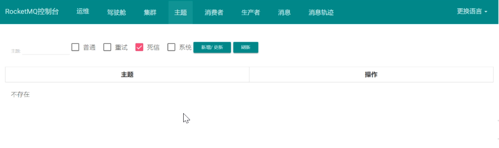
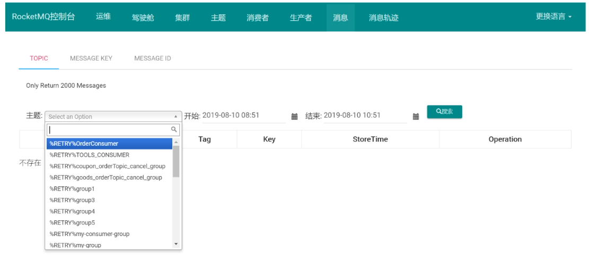

## 高级功能
### 3.1. 消息的存储

### 3.2. 高可用机制

### 3.3. 负载均衡

(1)    Producer负载均衡

(2)    Consumer负载均衡

###  3.4. 消息重试

### 3.5.死信队列

当一条消息初次消费失败,消息队列RocketMQ会自动进行消息重试l达到最大重试次数后,若消费依然失败,则表明消费者在正常情况下无法正确地消费该消息,此时,消息队列RocketMQ不会立刻将消息丢弃,而是将发送到该消费者对应的特殊队列中.

在消息队列RocketMQ中,这种情况下无法被消费的消息称为私信消息(Dead-Letter Message),存储死信消息的特数据队列称为死信队列(Dead-Letter Queue)

#### 3.5.1 死信特性

死信消息具有以下特性

* 不会再被消息者正常消费
* 有效期与正常消息相同,均为3天,3天后会被自动删除.因此,请在死信消息产生后的三天内及时处理

死信队列具有以下特性:

* 一个死信队列对应一个Group Id,而不是对应单个消费者实例
* 如果一个Group Id未产生死信消息,消费队列`RocketMQ`不会为其创建相应的死信队列
* 一个死信队列包含了对应Group Id产生的所有死信消息,不论该消息属于哪个Topic.

#### 3.5.2 查看死信信息

1. 在控制台查询死信队列的主题信息

2. 在消息界面根据主题查询死信队列

3.选择重新发送消息

一条消息进入死信队列,意味着某些因素导致消费者无法正常消费该消息,因此,通常需要您对其进行特殊处理.排查可疑原因并解决问题后,可在消息队列RocketMQ控制台重新发送该消息,让消费者重新消费一次

### 6.消息幂等性