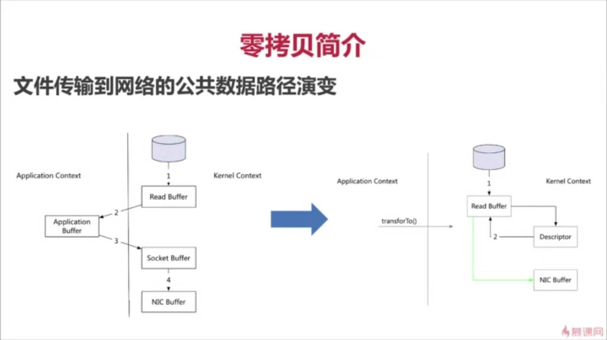

# Kafka

## 目录结构
* [kafka概述](#一、Kafka概述)
  * [doc](#1.0.doc)
  * [Kafka是什么](#1.1.Kafka是什么)
  * [Kafka内部实现原理](#1.2.Kafka内部实现原理)
  * [为什么需要消息队列](#1.3.为什么需要消息队列)
  * [Kafka架构](#1.4.Kafka架构)
* [kafka集群部署](#二、Kafka集群部署)
  * [环境准备](#2.1环境准备)
  * [Kafka集群部署 ](#2.2.Kafka集群部署 )
  * [Kafka命令行操作](#2.3.Kafka命令行操作)
  * [Kafka配置信息](#2.4.Kafka配置信息)
* [kafka工作流程分析](#三、Kafka工作流程分析)
  * [Kafka生产过程分析](#3.1.Kafka生产过程分析)
  * [broker 保存消息](#3.2.broker保存消息)
  * [Kafka消费过程分析](#3.3.Kafka消费过程分析)
* [kafka API实战](#四、Kafka API实战)
  * [环境准备](#4.1.环境准备)
  * [Kafka生产者Java API](#4.2.Kafka生产者Java API)
  * [Kafka消费者Java API](#4.3.Kafka消费者Java API)
* [kafka producer拦截器](#五、Kafka producer拦截器(interceptor))
  * [拦截器原理](#5.1.拦截器原理)
  * [拦截器案例](#5.2.拦截器案例)
* [kafka stream](#六、kafka Streams)
  * [概述](#6.1.概述)
  * [Kafka Stream案例](#6.2.Kafka Stream案例)

### Kafka（一）
* Kafka概述
* 定义
* 消息队列（Message Queue）
* Kafka基础架构
* Kafka快速入门
* 安装部署
* Kafka命令行操作
* Kafka架构深入
* Kafka工作流程及文件存储机

### Kafka（二）
* Kafka 高效读写数据
* Zookeeper在Kafka中的作用
* Kafka API
* Producer API
* Consumer API
* 自定义Interceptor
* Flume对接Kafka
* Kafka监控
* Kafka Monitor、Manager

## 一、Kafka概述

### 1.0.doc

- [史上最全、最详细的 kafka 学习笔记！](https://mp.weixin.qq.com/s/Vfo7fOoCi3jf0EhT4k3mMA)

- [Kafka全面进入2.x时代](https://mp.weixin.qq.com/s/25A8zmoPdPcoW3u1WOGEgA)

- [kafka系列文章-朱小厮](https://mp.weixin.qq.com/mp/homepage?__biz=MzU0MzQ5MDA0Mw==&hid=1&sn=9fb863ee0a215bf1a668ed727df61875)

- [SpringKafka文档地址](https://docs.spring.io/spring-kafka/reference/htmlsingle)

- [kafka文档地址](http://kafka.apache.org/documentation)

- [Spring-Kafka（六）—— @KafkaListener的花式操作](https://www.jianshu.com/p/a64defb44a23)

- [Kafka, RabbitMQ, ZeroMQ, RocketMQ, ActiveMQ 之间的差异](https://mp.weixin.qq.com/s/aUHEncqzES0VkcVnZjaJKw)

- [消息中间件Kafka与RabbitMQ谁更胜一筹？](https://mp.weixin.qq.com/s/7agqX9qQA48gFE1_tVId6w)

- [了解kafka的基本概念和使用](https://mp.weixin.qq.com/s/VnzjVhM2yBtfpDn4ddXv2Q)

- [轻松理解Kafka中的延时操作](https://mp.weixin.qq.com/s/c8SsvfdPYHIY6hVlNjZDqg)

- [大规模使用 Apache Kafka 的20个最佳实践](https://mp.weixin.qq.com/s/28aFEjKC9_sPufUyx8_lcg)

- [快手万亿级别Kafka集群应用实践与技术演进之路](https://mp.weixin.qq.com/s/X-Nn6fJX4Kgqh9H8_1TQhQ)

- [2019年50个Kafka面试题](https://mp.weixin.qq.com/s/HYD_KyolHj7TtxjDUfIQxg)

- [慕课网 Kafka流处理平台](https://www.imooc.com/learn/1043)

- [为了追求极致的性能，Kafka掌控了这11项要领](https://mp.weixin.qq.com/s/JyQaohyDPndFJDrw4AOWww)

#### 书
[《深入理解Kafka:核心设计与实践原理》笔误及改进记录](https://blog.csdn.net/u013256816/article/details/87834419)

### 1.1.Kafka是什么

在流式计算中，Kafka一般用来缓存数据，Storm通过消费Kafka的数据进行计算。

1）Apache Kafka是一个开源消息系统，由Scala写成。是由Apache软件基金会开发的一个开源消息系统项目。

2）Kafka最初是由LinkedIn开发，并于2011年初开源。2012年10月从Apache Incubator毕业。该项目的目标是为处理实时数据提供一个统一、高通量、低等待的平台。

3）Kafka是一个分布式消息队列。Kafka对消息保存时根据Topic进行归类，发送消息者称为Producer，消息接受者称为Consumer，此外kafka集群有多个kafka实例组成，每个实例(server)成为broker。

4）无论是kafka集群，还是producer和consumer都依赖于zookeeper集群保存一些meta信息，来保证系统可用性。

### 1.2.Kafka内部实现原理

 
（1）点对点模式（一对一，消费者主动拉取数据，消息收到后消息清除）
点对点模型通常是一个基于拉取或者轮询的消息传送模型，这种模型从队列中请求信息，而不是将消息推送到客户端。这个模型的特点是发送到队列的消息被一个且只有一个接收者接收处理，即使有多个消息监听者也是如此。

（2）发布/订阅模式（一对多，数据生产后，推送给所有订阅者）
发布订阅模型则是一个基于推送的消息传送模型。发布订阅模型可以有多种不同的订阅者，临时订阅者只在主动监听主题时才接收消息，而持久订阅者则监听主题的所有消息，即使当前订阅者不可用，处于离线状态。

### 1.3.为什么需要消息队列
1）解耦：
　　允许你独立的扩展或修改两边的处理过程，只要确保它们遵守同样的接口约束。

2）冗余：
消息队列把数据进行持久化直到它们已经被完全处理，通过这一方式规避了数据丢失风险。许多消息队列所采用的"插入-获取-删除"范式中，在把一个消息从队列中删除之前，需要你的处理系统明确的指出该消息已经被处理完毕，从而确保你的数据被安全的保存直到你使用完毕。

3）扩展性：
因为消息队列解耦了你的处理过程，所以增大消息入队和处理的频率是很容易的，只要另外增加处理过程即可。

4）灵活性 & 峰值处理能力：
在访问量剧增的情况下，应用仍然需要继续发挥作用，但是这样的突发流量并不常见。如果为以能处理这类峰值访问为标准来投入资源随时待命无疑是巨大的浪费。使用消息队列能够使关键组件顶住突发的访问压力，而不会因为突发的超负荷的请求而完全崩溃。

5）可恢复性：
系统的一部分组件失效时，不会影响到整个系统。消息队列降低了进程间的耦合度，所以即使一个处理消息的进程挂掉，加入队列中的消息仍然可以在系统恢复后被处理。

6）顺序保证：
在大多使用场景下，数据处理的顺序都很重要。大部分消息队列本来就是排序的，并且能保证数据会按照特定的顺序来处理。（Kafka保证一个Partition内的消息的有序性）

7）缓冲：
有助于控制和优化数据流经过系统的速度，解决生产消息和消费消息的处理速度不一致的情况。

8）异步通信：
很多时候，用户不想也不需要立即处理消息。消息队列提供了异步处理机制，允许用户把一个消息放入队列，但并不立即处理它。想向队列中放入多少消息就放多少，然后在需要的时候再去处理它们。

### 1.4.Kafka架构

 
 
* 1）Producer ：消息生产者，就是向kafka broker发消息的客户端。

* 2）Consumer ：消息消费者，向kafka broker取消息的客户端

* 3）Topic ：主题，通过对消息指定主题可以将消息分类，消费者可以只关注自己需要的Topic中的消息;可理解为一个队列。

* 4）Consumer Group （CG）：消费者组，可以并行消费Topic中的partition的消息.
        是kafka用来实现一个topic消息的广播（发给所有的consumer）和单播（发给任意一个consumer）的手段。
        一个topic可以有多个CG。topic的消息会复制（不是真的复制，是概念上的）到所有的CG，但每个partion只会把消息发给该CG中的一个consumer。
        如果需要实现广播，只要每个consumer有一个独立的CG就可以了。
        要实现单播只要所有的consumer在同一个CG。
        用CG还可以将consumer进行自由的分组而不需要多次发送消息到不同的topic。

* 5）Broker ：缓存代理,Kafka集群中的一台或多台服务器统称broker.一个broker可以容纳多个topic。

* 6）Partition：Topic物理上的分组，一个topic可以分为多个partion,每个partion是一个有序的队列。
     partion中每条消息都会被分配一个有序的Id(offset),为了实现扩展性，一个非常大的topic可以分布到多个broker（即服务器）上，
     kafka只保证按一个partition中的顺序将消息发给consumer，不保证一个topic的整体（多个partition间）的顺序。

* 7）Offset：kafka的存储文件都是按照offset.kafka来命名，用offset做名字的好处是方便查找。例如你想找位于2049的位置，只要找到2048.kafka的文件即可。当然the first offset就是00000000000.kafka

* 8) Message:消息，是通信的基本单位，每个producer可以向一个topic（主题）发布一些消息

## 二、Kafka集群部署

### 2.1.环境准备

#### 2.1.1 集群规划

hadoop102					hadoop103				hadoop104

zk							zk						zk

kafka						kafka					kafka

#### 2.1.2 jar包下载
http://kafka.apache.org/downloads.html


 
#### 2.1.3 虚拟机准备
1）准备3台虚拟机

2）配置ip地址
    
3）配置主机名称
 
4）3台主机分别关闭防火墙
```
[root@hadoop102 atguigu]# chkconfig iptables off
[root@hadoop103 atguigu]# chkconfig iptables off
[root@hadoop104 atguigu]# chkconfig iptables off
```

#### 2.1.4 安装jdk
	 
#### 2.1.5 安装Zookeeper

##### 0）集群规划
在hadoop102、hadoop103和hadoop104三个节点上部署Zookeeper。

##### 1）解压安装
（1）解压zookeeper安装包到/opt/module/目录下
	
	[atguigu@hadoop102 software]$ tar -zxvf zookeeper-3.4.10.tar.gz -C /opt/module/

（2）在/opt/module/zookeeper-3.4.10/这个目录下创建zkData
	
	mkdir -p zkData

（3）重命名/opt/module/zookeeper-3.4.10/conf这个目录下的zoo_sample.cfg为zoo.cfg
	mv zoo_sample.cfg zoo.cfg

##### 2）配置zoo.cfg文件
（1）具体配置
```	
dataDir=/opt/module/zookeeper-3.4.10/zkData
增加如下配置

#######################cluster##########################
server.2=hadoop102:2888:3888
server.3=hadoop103:2888:3888
server.4=hadoop104:2888:3888
```

（2）配置参数解读

Server.A=B:C:D。

A是一个数字，表示这个是第几号服务器；

B是这个服务器的ip地址；

C是这个服务器与集群中的Leader服务器交换信息的端口；

D是万一集群中的Leader服务器挂了，需要一个端口来重新进行选举，选出一个新的Leader，而这个端口就是用来执行选举时服务器相互通信的端口。

集群模式下配置一个文件myid，这个文件在dataDir目录下，这个文件里面有一个数据就是A的值，Zookeeper启动时读取此文件，拿到里面的数据与zoo.cfg里面的配置信息比较从而判断到底是哪个server。

##### 3）集群操作
（1）在/opt/module/zookeeper-3.4.10/zkData目录下创建一个myid的文件

	touch myid
   添加myid文件，注意一定要在linux里面创建，在notepad++里面很可能乱码

（2）编辑myid文件

	vi myid
	
	在文件中添加与server对应的编号：如2
	
（3）拷贝配置好的zookeeper到其他机器上

	scp -r zookeeper-3.4.10/ root@hadoop103.atguigu.com:/opt/app/
	
	scp -r zookeeper-3.4.10/ root@hadoop104.atguigu.com:/opt/app/
	
	并分别修改myid文件中内容为3、4
	
（4）分别启动zookeeper

[root@hadoop102 zookeeper-3.4.10]# bin/zkServer.sh start

[root@hadoop103 zookeeper-3.4.10]# bin/zkServer.sh start

[root@hadoop104 zookeeper-3.4.10]# bin/zkServer.sh start

（5）查看状态

[root@hadoop102 zookeeper-3.4.10]# bin/zkServer.sh status

JMX enabled by default

Using config: /opt/module/zookeeper-3.4.10/bin/../conf/zoo.cfg

Mode: follower

[root@hadoop103 zookeeper-3.4.10]# bin/zkServer.sh status

JMX enabled by default

Using config: /opt/module/zookeeper-3.4.10/bin/../conf/zoo.cfg

Mode: leader

[root@hadoop104 zookeeper-3.4.5]# bin/zkServer.sh status

JMX enabled by default

Using config: /opt/module/zookeeper-3.4.10/bin/../conf/zoo.cfg

Mode: follower

### 2.2.Kafka集群部署 

#### 1）解压安装包

[atguigu@hadoop102 software]$ tar -zxvf kafka_2.11-0.11.0.0.tgz -C /opt/module/

#### 2）修改解压后的文件名称

[atguigu@hadoop102 module]$ mv kafka_2.11-0.11.0.0/ kafka

#### 3）在/opt/module/kafka目录下创建logs文件夹

[atguigu@hadoop102 kafka]$ mkdir logs

#### 4）修改配置文件

[atguigu@hadoop102 kafka]$ cd config/

[atguigu@hadoop102 config]$ vi server.properties

输入以下内容：
```
#broker的全局唯一编号，不能重复
broker.id=0
#删除topic功能使能
delete.topic.enable=true
#处理网络请求的线程数量
num.network.threads=3
#用来处理磁盘IO的现成数量
num.io.threads=8
#发送套接字的缓冲区大小
socket.send.buffer.bytes=102400
#接收套接字的缓冲区大小
socket.receive.buffer.bytes=102400
#请求套接字的缓冲区大小
socket.request.max.bytes=104857600
#kafka运行日志存放的路径
log.dirs=/opt/module/kafka/logs
#topic在当前broker上的分区个数
num.partitions=1
#用来恢复和清理data下数据的线程数量
num.recovery.threads.per.data.dir=1
#segment文件保留的最长时间，超时将被删除
log.retention.hours=168
#配置连接Zookeeper集群地址
zookeeper.connect=hadoop102:2181,hadoop103:2181,hadoop104:2181
```


#### 5）配置环境变量

[root@hadoop102 module]# vi /etc/profile
```
#KAFKA_HOME
export KAFKA_HOME=/opt/module/kafka
export PATH=$PATH:$KAFKA_HOME/bin
```
[root@hadoop102 module]# source /etc/profile

#### 6）分发安装包

[root@hadoop102 etc]# xsync profile

[atguigu@hadoop102 module]$ xsync kafka/

#### 7）分别在hadoop103和hadoop104上修改配置文件/opt/module/kafka/config/server.properties中的broker.id=1、broker.id=2
	注：broker.id不得重复

#### 8）启动集群

依次在hadoop102、hadoop103、hadoop104节点上启动kafka

[atguigu@hadoop102 kafka]$ bin/kafka-server-start.sh config/server.properties &

[atguigu@hadoop103 kafka]$ bin/kafka-server-start.sh config/server.properties &

[atguigu@hadoop104 kafka]$ bin/kafka-server-start.sh config/server.properties &

### 2.3.Kafka命令行操作

#### 0) 启动kafka

bin/kafka-server-start.sh config/server.properties

bin/kafka-server-start.sh config/server.properties &

kafka-server-start.sh config/server.properties 1>/dev/null 2>&1 &

#### 1）查看当前服务器中的所有topic
[atguigu@hadoop102 kafka]$ bin/kafka-topics.sh --list --zookeeper 127.0.0.1:2181

#### 2）创建topic
[atguigu@hadoop102 kafka]$ bin/kafka-topics.sh --create --zookeeper 127.0.0.1:2181 --replication-factor 3 --partitions 1 --topic first

选项说明：

--topic 定义topic名

--replication-factor  定义副本数

--partitions  定义分区数


#### 3）	删除topic

[atguigu@hadoop102 kafka]$ bin/kafka-topics.sh --delete --zookeeper 127.0.0.1:2181 --topic first

需要server.properties中设置delete.topic.enable=true否则只是标记删除或者直接重启。

#### 4）发送消息


bin/kafka-console-producer.sh --broker-list=localhost:9093 --topic personfile-event-flow

[atguigu@hadoop102 kafka]$ bin/kafka-console-producer.sh --broker-list 127.0.0.1:9092 --topic first

>hello world
>atguigu  atguigu

#### 5）消费消息
bin/kafka-console-consumer.sh --bootstrap-server localhost:2181  --topic personfile-event-flow --from-beginning
[atguigu@hadoop103 kafka]$ bin/kafka-console-consumer.sh --zookeeper 127.0.0.1:2181 --from-beginning --topic first

#### 6）查看某个Topic的详情

[atguigu@hadoop102 kafka]$ bin/kafka-topics.sh --topic first --describe --zookeeper 127.0.0.1:2181
>> bin/kafka-console-consumer.sh --zookeeper 192.168.11.199:2181 --from-beginning --topic engine-person1

### 2.4.Kafka配置信息

#### 2.4.1 Broker配置信息
属性	                    默认值	                        描述

broker.id		            必填参数            broker的唯一标识

log.dirs	              /tmp/kafka-logs	    Kafka数据存放的目录。可以指定多个目录，中间用逗号分隔，当新partition被创建的时会被存放到当前存放partition最少的目录。

port	                    9092	            BrokerServer接受客户端连接的端口号

zookeeper.connect	        null	            Zookeeper的连接串，格式为：hostname1:port1,hostname2:port2,hostname3:port3。可以填一个或多个，为了提高可靠性，建议都填上。注意，此配置允许我们指定一个zookeeper路径来存放此kafka集群的所有数据，为了与其他应用集群区分开，建议在此配置中指定本集群存放目录，格式为：hostname1:port1,hostname2:port2,hostname3:port3/chroot/path 。需要注意的是，消费者的参数要和此参数一致。

message.max.bytes	        1000000	            服务器可以接收到的最大的消息大小。注意此参数要和consumer的maximum.message.size大小一致，否则会因为生产者生产的消息太大导致消费者无法消费。

num.io.threads	              8	                服务器用来执行读写请求的IO线程数，此参数的数量至少要等于服务器上磁盘的数量。

queued.max.requests	         500	            I/O线程可以处理请求的队列大小，若实际请求数超过此大小，网络线程将停止接收新的请求。

socket.send.buffer.bytes	                    100 * 1024	The SO_SNDBUFF buffer the server prefers for socket connections.

socket.receive.buffer.bytes	 100 * 1024	        The SO_RCVBUFF buffer the server prefers for socket connections.

socket.request.max.bytes	 100 * 1024 * 1024	服务器允许请求的最大值， 用来防止内存溢出，其值应该小于 Java heap size.

num.partitions	1	    默认partition数量，如果topic在创建时没有指定partition数量，默认使用此值，建议改为5

log.segment.bytes	    1024 * 1024 * 1024	    Segment文件的大小，超过此值将会自动新建一个segment，此值可以被topic级别的参数覆盖。

log.roll.{ms,hours}	    24 * 7 hours	        新建segment文件的时间，此值可以被topic级别的参数覆盖。

log.retention.{ms,minutes,hours}	7 days	    Kafka segment log的保存周期，保存周期超过此时间日志就会被删除。此参数可以被topic级别参数覆盖。数据量大时，建议减小此值。

log.retention.bytes	-1	        每个partition的最大容量，若数据量超过此值，partition数据将会被删除。注意这个参数控制的是每个partition而不是topic。此参数可以被log级别参数覆盖。

log.retention.check.interval.ms	5 minutes	    删除策略的检查周期

auto.create.topics.enable	    true	        自动创建topic参数，建议此值设置为false，严格控制topic管理，防止生产者错写topic。

default.replication.factor	    1	            默认副本数量，建议改为2。

replica.lag.time.max.ms	        10000	        在此窗口时间内没有收到follower的fetch请求，leader会将其从ISR(in-sync replicas)中移除。

replica.lag.max.messages	    4000	        如果replica节点落后leader节点此值大小的消息数量，leader节点就会将其从ISR中移除。

replica.socket.timeout.ms	30 * 1000	        replica向leader发送请求的超时时间。

replica.socket.receive.buffer.bytes	64 * 1024	The socket receive buffer for network requests to the leader for replicating data.

replica.fetch.max.bytes	    1024 * 1024	        The number of byes of messages to attempt to fetch for each partition in the fetch requests the replicas send to the leader.

replica.fetch.wait.max.ms	        500	        The maximum amount of time to wait time for data to arrive on the leader in the fetch requests sent by the replicas to the leader.

num.replica.fetchers	            1	        Number of threads used to replicate messages from leaders. Increasing this value can increase the degree of I/O parallelism in the follower broker.

fetch.purgatory.purge.interval.requests	1000	The purge interval (in number of requests) of the fetch request purgatory.

zookeeper.session.timeout.ms	6000	        ZooKeeper session 超时时间。如果在此时间内server没有向zookeeper发送心跳，zookeeper就会认为此节点已挂掉。 此值太低导致节点容易被标记死亡；若太高，.会导致太迟发现节点死亡。

zookeeper.connection.timeout.ms	6000	        客户端连接zookeeper的超时时间。

zookeeper.sync.time.ms	        2000	        H ZK follower落后 ZK leader的时间。

controlled.shutdown.enable	    true	        允许broker shutdown。如果启用，broker在关闭自己之前会把它上面的所有leaders转移到其它brokers上，建议启用，增加集群稳定性。

auto.leader.rebalance.enable	true	        If this is enabled the controller will automatically try to balance leadership for partitions among the brokers by periodically returning leadership to the “preferred” replica for each partition if it is available.

leader.imbalance.per.broker.percentage	   10	The percentage of leader imbalance allowed per broker. The controller will rebalance leadership if this ratio goes above the configured value per broker.

leader.imbalance.check.interval.seconds	   300	The frequency with which to check for leader imbalance.

offset.metadata.max.bytes	        4096	    The maximum amount of metadata to allow clients to save with their offsets.

connections.max.idle.ms	            600000	    Idle connections timeout: the server socket processor threads close the connections that idle more than this.

num.recovery.threads.per.data.dir	 1	        The number of threads per data directory to be used for log recovery at startup and flushing at shutdown.

unclean.leader.election.enable	    true	    Indicates whether to enable replicas not in the ISR set to be elected as leader as a last resort, even though doing so may result in data loss.

delete.topic.enable	                false	    启用deletetopic参数，建议设置为true。

offsets.topic.num.partitions	    50	        The number of partitions for the offset commit topic. Since changing this after deployment is currently unsupported, we recommend using a higher setting for production (e.g., 100-200).

offsets.topic.retention.minutes	    1440	    Offsets that are older than this age will be marked for deletion. The actual purge will occur when the log cleaner compacts the offsets topic.

offsets.retention.check.interval.ms	600000	    The frequency at which the offset manager checks for stale offsets.

offsets.topic.replication.factor	3	        The replication factor for the offset commit topic. A higher setting (e.g., three or four) is recommended in order to ensure higher availability. If the offsets topic is created when fewer brokers than the replication factor then the offsets topic will be created with fewer replicas.

offsets.topic.segment.bytes	    104857600	    Segment size for the offsets topic. Since it uses a compacted topic, this should be kept relatively low in order to facilitate faster log compaction and loads.

offsets.load.buffer.size	    5242880	        An offset load occurs when a broker becomes the offset manager for a set of consumer groups (i.e., when it becomes a leader for an offsets topic partition). This setting corresponds to the batch size (in bytes) to use when reading from the offsets segments when loading offsets into the offset manager’s cache.

offsets.commit.required.acks	-1	            The number of acknowledgements that are required before the offset commit can be accepted. This is similar to the producer’s acknowledgement setting. In general, the default should not be overridden.

offsets.commit.timeout.ms	    5000	        The offset commit will be delayed until this timeout or the required number of replicas have received the offset commit. This is similar to the producer request timeout.

#### 2.4.2 Producer配置信息

属性	默认值	描述

metadata.broker.list		启动时producer查询brokers的列表，可以是集群中所有brokers的一个子集。注意，这个参数只是用来获取topic的元信息用，producer会从元信息中挑选合适的broker并与之建立socket连接。格式是：host1:port1,host2:port2。

request.required.acks	0	参见3.2节介绍

request.timeout.ms	10000	Broker等待ack的超时时间，若等待时间超过此值，会返回客户端错误信息。

producer.type	sync	同步异步模式。async表示异步，sync表示同步。如果设置成异步模式，可以允许生产者以batch的形式push数据，这样会极大的提高broker性能，推荐设置为异步。

serializer.class	kafka.serializer.DefaultEncoder	序列号类，.默认序列化成 byte[] 。

key.serializer.class		Key的序列化类，默认同上。

partitioner.class	kafka.producer.DefaultPartitioner	Partition类，默认对key进行hash。

compression.codec	none	指定producer消息的压缩格式，可选参数为： “none”, “gzip” and “snappy”。关于压缩参见4.1节

compressed.topics	null	启用压缩的topic名称。若上面参数选择了一个压缩格式，那么压缩仅对本参数指定的topic有效，若本参数为空，则对所有topic有效。

message.send.max.retries	3	Producer发送失败时重试次数。若网络出现问题，可能会导致不断重试。

retry.backoff.ms	100	Before each retry, the producer refreshes the metadata of relevant topics to see if a new leader has been elected. Since leader election takes a bit of time, this property specifies the amount of time that the producer waits before refreshing the metadata.

topic.metadata.refresh.interval.ms	600 * 1000	The producer generally refreshes the topic metadata from brokers when there is a failure (partition missing, leader not available…). It will also poll regularly (default: every 10min so 600000ms). If you set this to a negative value, metadata will only get refreshed on failure. If you set this to zero, the metadata will get refreshed after each message sent (not recommended). Important note: the refresh happen only AFTER the message is sent, so if the producer never sends a message the metadata is never refreshed

queue.buffering.max.ms	5000	启用异步模式时，producer缓存消息的时间。比如我们设置成1000时，它会缓存1秒的数据再一次发送出去，这样可以极大的增加broker吞吐量，但也会造成时效性的降低。

queue.buffering.max.messages	10000	采用异步模式时producer buffer 队列里最大缓存的消息数量，如果超过这个数值，producer就会阻塞或者丢掉消息。

queue.enqueue.timeout.ms	-1	当达到上面参数值时producer阻塞等待的时间。如果值设置为0，buffer队列满时producer不会阻塞，消息直接被丢掉。若值设置为-1，producer会被阻塞，不会丢消息。

batch.num.messages	200	采用异步模式时，一个batch缓存的消息数量。达到这个数量值时producer才会发送消息。

send.buffer.bytes	100 * 1024	Socket write buffer size

client.id	"" 	The client id is a user-specified string sent in each request to help trace calls. It should logically identify the application making the request.

#### 2.4.3 Consumer配置信息

属性	默认值	描述

group.id		Consumer的组ID，相同goup.id的consumer属于同一个组。

zookeeper.connect		Consumer的zookeeper连接串，要和broker的配置一致。

consumer.id	null	如果不设置会自动生成。

socket.timeout.ms	30 * 1000	网络请求的socket超时时间。实际超时时间由max.fetch.wait + socket.timeout.ms 确定。

socket.receive.buffer.bytes	64 * 1024	The socket receive buffer for network requests.

fetch.message.max.bytes	1024 * 1024	查询topic-partition时允许的最大消息大小。consumer会为每个partition缓存此大小的消息到内存，因此，这个参数可以控制consumer的内存使用量。这个值应该至少比server允许的最大消息大小大，以免producer发送的消息大于consumer允许的消息。

num.consumer.fetchers	1	The number fetcher threads used to fetch data.

auto.commit.enable	true	如果此值设置为true，consumer会周期性的把当前消费的offset值保存到zookeeper。当consumer失败重启之后将会使用此值作为新开始消费的值。

auto.commit.interval.ms	60 * 1000	Consumer提交offset值到zookeeper的周期。

queued.max.message.chunks	2	用来被consumer消费的message chunks 数量， 每个chunk可以缓存fetch.message.max.bytes大小的数据量。

auto.commit.interval.ms	60 * 1000	Consumer提交offset值到zookeeper的周期。

queued.max.message.chunks	2	用来被consumer消费的message chunks 数量， 每个chunk可以缓存fetch.message.max.bytes大小的数据量。

fetch.min.bytes	1	The minimum amount of data the server should return for a fetch request. If insufficient data is available the request will wait for that much data to accumulate before answering the request.

fetch.wait.max.ms	100	The maximum amount of time the server will block before answering the fetch request if there isn’t sufficient data to immediately satisfy fetch.min.bytes.

rebalance.backoff.ms	2000	Backoff time between retries during rebalance.

refresh.leader.backoff.ms	200	Backoff time to wait before trying to determine the leader of a partition that has just lost its leader.

auto.offset.reset	largest	What to do when there is no initial offset in ZooKeeper or if an offset is out of range ;smallest : automatically reset the offset to the smallest offset; largest : automatically reset the offset to the largest offset;anything else: throw exception to the consumer

consumer.timeout.ms	-1	若在指定时间内没有消息消费，consumer将会抛出异常。

exclude.internal.topics	true	Whether messages from internal topics (such as offsets) should be exposed to the consumer.

zookeeper.session.timeout.ms	6000	ZooKeeper session timeout. If the consumer fails to heartbeat to ZooKeeper for this period of time it is considered dead and a rebalance will occur.

zookeeper.connection.timeout.ms	6000	The max time that the client waits while establishing a connection to zookeeper.

zookeeper.sync.time.ms	2000	How far a ZK follower can be behind a ZK leader

## 三、Kafka工作流程分析


 
### 3.1.Kafka生产过程分析

#### 3.1.1 写入方式
producer采用推（push）模式将消息发布到broker，每条消息都被追加（append）到分区（patition）中，属于顺序写磁盘（顺序写磁盘效率比随机写内存要高，保障kafka吞吐率）。

#### 3.1.2 分区（Partition）
消息发送时都被发送到一个topic，其本质就是一个目录，而topic是由一些Partition Logs(分区日志)组成，其组织结构如下图所示：

 
 
我们可以看到，每个Partition中的消息都是有序的，生产的消息被不断追加到Partition log上，其中的每一个消息都被赋予了一个唯一的offset值。

1）分区的原因

（1）方便在集群中扩展，每个Partition可以通过调整以适应它所在的机器，而一个topic又可以有多个Partition组成，因此整个集群就可以适应任意大小的数据了；

（2）可以提高并发，因为可以以Partition为单位读写了。

2）分区的原则

（1）指定了patition，则直接使用；

（2）未指定patition但指定key，通过对key的value进行hash出一个patition

（3）patition和key都未指定，使用轮询选出一个patition。

DefaultPartitioner类
```
public int partition(String topic, Object key, byte[] keyBytes, Object value, byte[] valueBytes, Cluster cluster) {
        List<PartitionInfo> partitions = cluster.partitionsForTopic(topic);
        int numPartitions = partitions.size();
        if (keyBytes == null) {
            int nextValue = nextValue(topic);
            List<PartitionInfo> availablePartitions = cluster.availablePartitionsForTopic(topic);
            if (availablePartitions.size() > 0) {
                int part = Utils.toPositive(nextValue) % availablePartitions.size();
                return availablePartitions.get(part).partition();
            } else {
                // no partitions are available, give a non-available partition
                return Utils.toPositive(nextValue) % numPartitions;
            }
        } else {
            // hash the keyBytes to choose a partition
            return Utils.toPositive(Utils.murmur2(keyBytes)) % numPartitions;
        }
    }
```

#### 3.1.3 副本（Replication）

同一个partition可能会有多个replication（对应 server.properties 配置中的 default.replication.factor=N）。没有replication的情况下，一旦broker 宕机，其上所有 patition 的数据都不可被消费，同时producer也不能再将数据存于其上的patition。引入replication之后，同一个partition可能会有多个replication，而这时需要在这些replication之间选出一个leader，producer和consumer只与这个leader交互，其它replication作为follower从leader 中复制数据。

#### 3.1.4 写入流程

 producer写入消息流程如下：

 
 
1）producer先从zookeeper的 "/brokers/.../state"节点找到该partition的leader

2）producer将消息发送给该leader

3）leader将消息写入本地log

4）followers从leader pull消息，写入本地log后向leader发送ACK

5）leader收到所有ISR中的replication的ACK后，增加HW（high watermark，最后commit 的offset）并向producer发送ACK

### 3.2.broker保存消息

#### 3.2.1 存储方式
物理上把topic分成一个或多个patition（对应 server.properties 中的num.partitions=3配置），每个patition物理上对应一个文件夹（该文件夹存储该patition的所有消息和索引文件），如下：
>> [atguigu@hadoop102 logs]$ ll
drwxrwxr-x. 2 atguigu atguigu  4096 8月   6 14:37 first-0
drwxrwxr-x. 2 atguigu atguigu  4096 8月   6 14:35 first-1
drwxrwxr-x. 2 atguigu atguigu  4096 8月   6 14:37 first-2

>>[atguigu@hadoop102 logs]$ cd first-0

>>[atguigu@hadoop102 first-0]$ ll
-rw-rw-r--. 1 atguigu atguigu 10485760 8月   6 14:33 00000000000000000000.index
-rw-rw-r--. 1 atguigu atguigu      219 8月   6 15:07 00000000000000000000.log
-rw-rw-r--. 1 atguigu atguigu 10485756 8月   6 14:33 00000000000000000000.timeindex
-rw-rw-r--. 1 atguigu atguigu        8 8月   6 14:37 leader-epoch-checkpoint

#### 3.2.2 存储策略

无论消息是否被消费，kafka都会保留所有消息。有两种策略可以删除旧数据：
1）基于时间：log.retention.hours=168
2）基于大小：log.retention.bytes=1073741824
需要注意的是，因为Kafka读取特定消息的时间复杂度为O(1)，即与文件大小无关，所以这里删除过期文件与提高 Kafka 性能无关。

#### 3.2.3 Zookeeper存储结构

 
 
注意：producer不在zk中注册，消费者在zk中注册。

### 3.3.Kafka消费过程分析

kafka提供了两套consumer API：高级Consumer API和低级API。

### 3.3.1 高级API

#### 1）高级API优点

高级API 写起来简单

不需要去自行去管理offset，系统通过zookeeper自行管理

不需要管理分区，副本等情况，系统自动管理

消费者断线会自动根据上一次记录在zookeeper中的offset去接着获取数据（默认设置1分钟更新一下zookeeper中存的的offset）

可以使用group来区分对同一个topic 的不同程序访问分离开来（不同的group记录不同的offset，这样不同程序读取同一个topic才不会因为offset互相影响）

#### 2）高级API缺点

不能自行控制offset（对于某些特殊需求来说）

不能细化控制如分区、副本、zk等

### 3.3.2 低级API

#### 1）低级 API 优点

能够开发者自己控制offset，想从哪里读取就从哪里读取。

自行控制连接分区，对分区自定义进行负载均衡

对zookeeper的依赖性降低（如：offset不一定非要靠zk存储，自行存储offset即可，比如存在文件或者内存中）

#### 2）低级API缺点

太过复杂，需要自行控制offset，连接哪个分区，找到分区leader 等。

### 3.3.3 消费者组

 
 
消费者是以consumer group消费者组的方式工作，由一个或者多个消费者组成一个组，共同消费一个topic。每个分区在同一时间只能由group中的一个消费者读取，但是多个group可以同时消费这个partition。在图中，有一个由三个消费者组成的group，有一个消费者读取主题中的两个分区，另外两个分别读取一个分区。某个消费者读取某个分区，也可以叫做某个消费者是某个分区的拥有者。
在这种情况下，消费者可以通过水平扩展的方式同时读取大量的消息。另外，如果一个消费者失败了，那么其他的group成员会自动负载均衡读取之前失败的消费者读取的分区。

### 3.3.4 消费方式
consumer采用pull（拉）模式从broker中读取数据。
push（推）模式很难适应消费速率不同的消费者，因为消息发送速率是由broker决定的。它的目标是尽可能以最快速度传递消息，但是这样很容易造成consumer来不及处理消息，典型的表现就是拒绝服务以及网络拥塞。而pull模式则可以根据consumer的消费能力以适当的速率消费消息。
对于Kafka而言，pull模式更合适，它可简化broker的设计，consumer可自主控制消费消息的速率，同时consumer可以自己控制消费方式——即可批量消费也可逐条消费，同时还能选择不同的提交方式从而实现不同的传输语义。

### 3.3.5 消费者组案例

1）需求：测试同一个消费者组中的消费者，同一时刻只能有一个消费者消费。

2）案例实操

	（1）在hadoop102、hadoop103上修改/opt/module/kafka/config/consumer.properties配置文件中的group.id属性为任意组名。
[atguigu@hadoop103 config]$ vi consumer.properties
	group.id=atguigu
	
	（2）在hadoop102、hadoop103上分别启动消费者
[atguigu@hadoop102 kafka]$ bin/kafka-console-consumer.sh --zookeeper hadoop102:2181 --topic first --consumer.config config/consumer.properties

[atguigu@hadoop103 kafka]$ bin/kafka-console-consumer.sh --zookeeper hadoop102:2181 --topic first --consumer.config config/consumer.properties
	
	（3）在hadoop104上启动生产者
[atguigu@hadoop104 kafka]$ bin/kafka-console-producer.sh --broker-list hadoop102:9092 --topic first
>hello world
	
	（4）查看hadoop102和hadoop103的接收者。
		同一时刻只有一个消费者接收到消息。

## 四、Kafka API实战

### 4.1.环境准备

1）在eclipse中创建一个java工程

2）在工程的根目录创建一个lib文件夹

3）解压kafka安装包，将安装包libs目录下的jar包拷贝到工程的lib目录下，并build path。

4）启动zk和kafka集群，在kafka集群中打开一个消费者

[atguigu@hadoop102 kafka]$ bin/kafka-console-consumer.sh --zookeeper hadoop102:2181 --topic first

### 4.2.Kafka生产者Java API

#### 4.2.1 创建生产者（过时的API）
```java
package com.atguigu.kafka;
import java.util.Properties;
import kafka.javaapi.producer.Producer;
import kafka.producer.KeyedMessage;
import kafka.producer.ProducerConfig;

public class OldProducer {

	@SuppressWarnings("deprecation")
	public static void main(String[] args) {
		
		Properties properties = new Properties();
		properties.put("metadata.broker.list", "hadoop102:9092");
		properties.put("request.required.acks", "1");
		properties.put("serializer.class", "kafka.serializer.StringEncoder");
		
		Producer<Integer, String> producer = new Producer<Integer,String>(new ProducerConfig(properties));
		
		KeyedMessage<Integer, String> message = new KeyedMessage<Integer, String>("first", "hello world");
		producer.send(message );
	}
}
```

4.2.2 创建生产者（新API）
```java
package com.atguigu.kafka;
import java.util.Properties;
import org.apache.kafka.clients.producer.KafkaProducer;
import org.apache.kafka.clients.producer.Producer;
import org.apache.kafka.clients.producer.ProducerRecord;

public class NewProducer {

	public static void main(String[] args) {
		
		Properties props = new Properties();
		// Kafka服务端的主机名和端口号
		props.put("bootstrap.servers", "hadoop103:9092");
		// 等待所有副本节点的应答
		props.put("acks", "all");
		// 消息发送最大尝试次数
		props.put("retries", 0);
		// 一批消息处理大小
		props.put("batch.size", 16384);
		// 请求延时
		props.put("linger.ms", 1);
		// 发送缓存区内存大小
		props.put("buffer.memory", 33554432);
		// key序列化
		props.put("key.serializer", "org.apache.kafka.common.serialization.StringSerializer");
		// value序列化
		props.put("value.serializer", "org.apache.kafka.common.serialization.StringSerializer");

		Producer<String, String> producer = new KafkaProducer<>(props);
		for (int i = 0; i < 50; i++) {
			producer.send(new ProducerRecord<String, String>("first", Integer.toString(i), "hello world-" + i));
		}

		producer.close();
	}
}
```

4.2.3 创建生产者带回调函数（新API）
```java
package com.atguigu.kafka;
import java.util.Properties;
import org.apache.kafka.clients.producer.Callback;
import org.apache.kafka.clients.producer.KafkaProducer;
import org.apache.kafka.clients.producer.ProducerRecord;
import org.apache.kafka.clients.producer.RecordMetadata;

public class CallBackProducer {

	public static void main(String[] args) {

        Properties props = new Properties();
		// Kafka服务端的主机名和端口号
		props.put("bootstrap.servers", "hadoop103:9092");
		// 等待所有副本节点的应答
		props.put("acks", "all");
		// 消息发送最大尝试次数
		props.put("retries", 0);
		// 一批消息处理大小
		props.put("batch.size", 16384);
		// 增加服务端请求延时
		props.put("linger.ms", 1);
        // 发送缓存区内存大小
		props.put("buffer.memory", 33554432);
		// key序列化
		props.put("key.serializer", "org.apache.kafka.common.serialization.StringSerializer");
		// value序列化
		props.put("value.serializer", "org.apache.kafka.common.serialization.StringSerializer");

		KafkaProducer<String, String> kafkaProducer = new KafkaProducer<>(props);

		for (int i = 0; i < 50; i++) {

			kafkaProducer.send(new ProducerRecord<String, String>("first", "hello" + i), new Callback() {

				@Override
				public void onCompletion(RecordMetadata metadata, Exception exception) {

					if (metadata != null) {

						System.err.println(metadata.partition() + "---" + metadata.offset());
					}
				}
			});
		}

		kafkaProducer.close();
	}
}
```

4.2.3 自定义分区生产者
0）需求：将所有数据存储到topic的第0号分区上

1）定义一个类实现Partitioner接口，重写里面的方法（过时API）
```java
package com.atguigu.kafka;
import java.util.Map;
import kafka.producer.Partitioner;

public class CustomPartitioner implements Partitioner {

	public CustomPartitioner() {
		super();
	}

	@Override
	public int partition(Object key, int numPartitions) {
		// 控制分区
		return 0;
	}
}
```

2）自定义分区（新API）
```java
package com.atguigu.kafka;
import java.util.Map;
import org.apache.kafka.clients.producer.Partitioner;
import org.apache.kafka.common.Cluster;

public class CustomPartitioner implements Partitioner {

	@Override
	public void configure(Map<String, ?> configs) {
		
	}

	@Override
	public int partition(String topic, Object key, byte[] keyBytes, Object value, byte[] valueBytes, Cluster cluster) {
        // 控制分区
		return 0;
	}

	@Override
	public void close() {
		
	}
}
```

3）在代码中调用
```
package com.atguigu.kafka;
import java.util.Properties;
import org.apache.kafka.clients.producer.KafkaProducer;
import org.apache.kafka.clients.producer.Producer;
import org.apache.kafka.clients.producer.ProducerRecord;

public class PartitionerProducer {

	public static void main(String[] args) {
		
		Properties props = new Properties();
		// Kafka服务端的主机名和端口号
		props.put("bootstrap.servers", "hadoop103:9092");
		// 等待所有副本节点的应答
		props.put("acks", "all");
		// 消息发送最大尝试次数
		props.put("retries", 0);
		// 一批消息处理大小
		props.put("batch.size", 16384);
		// 增加服务端请求延时
		props.put("linger.ms", 1);
		// 发送缓存区内存大小
		props.put("buffer.memory", 33554432);
		// key序列化
		props.put("key.serializer", "org.apache.kafka.common.serialization.StringSerializer");
		// value序列化
		props.put("value.serializer", "org.apache.kafka.common.serialization.StringSerializer");
		// 自定义分区
		props.put("partitioner.class", "com.atguigu.kafka.CustomPartitioner");

		Producer<String, String> producer = new KafkaProducer<>(props);
		producer.send(new ProducerRecord<String, String>("first", "1", "atguigu"));

		producer.close();
	}
}
```

4）测试
	（1）在hadoop102上监控/opt/module/kafka/logs/目录下first主题3个分区的log日志动态变化情况
[atguigu@hadoop102 first-0]$ tail -f 00000000000000000000.log
[atguigu@hadoop102 first-1]$ tail -f 00000000000000000000.log
[atguigu@hadoop102 first-2]$ tail -f 00000000000000000000.log
	（2）发现数据都存储到指定的分区了。

### 4.3.Kafka消费者Java API
0）在控制台创建发送者
[atguigu@hadoop104 kafka]$ bin/kafka-console-producer.sh --broker-list hadoop102:9092 --topic first
>hello world

1）创建消费者（过时API）
```
package com.atguigu.kafka.consume;
import java.util.HashMap;
import java.util.List;
import java.util.Map;
import java.util.Properties;
import kafka.consumer.Consumer;
import kafka.consumer.ConsumerConfig;
import kafka.consumer.ConsumerIterator;
import kafka.consumer.KafkaStream;
import kafka.javaapi.consumer.ConsumerConnector;

public class CustomConsumer {

	@SuppressWarnings("deprecation")
	public static void main(String[] args) {
		Properties properties = new Properties();
		
		properties.put("zookeeper.connect", "hadoop102:2181");
		properties.put("group.id", "g1");
		properties.put("zookeeper.session.timeout.ms", "500");
		properties.put("zookeeper.sync.time.ms", "250");
		properties.put("auto.commit.interval.ms", "1000");
		
		// 创建消费者连接器
		ConsumerConnector consumer = Consumer.createJavaConsumerConnector(new ConsumerConfig(properties));
		
		HashMap<String, Integer> topicCount = new HashMap<>();
		topicCount.put("first", 1);
		
		Map<String, List<KafkaStream<byte[], byte[]>>> consumerMap = consumer.createMessageStreams(topicCount);
		
		KafkaStream<byte[], byte[]> stream = consumerMap.get("first").get(0);
		
		ConsumerIterator<byte[], byte[]> it = stream.iterator();
		
		while (it.hasNext()) {
			System.out.println(new String(it.next().message()));
		}
	}
}
```

2）官方提供案例（自动维护消费情况）（新API）
```java
package com.atguigu.kafka.consume;
import java.util.Arrays;
import java.util.Properties;
import org.apache.kafka.clients.consumer.ConsumerRecord;
import org.apache.kafka.clients.consumer.ConsumerRecords;
import org.apache.kafka.clients.consumer.KafkaConsumer;

public class CustomNewConsumer {

	public static void main(String[] args) {

		Properties props = new Properties();
		// 定义kakfa 服务的地址，不需要将所有broker指定上 
		props.put("bootstrap.servers", "hadoop102:9092");
		// 制定consumer group 
		props.put("group.id", "test");
		// 是否自动确认offset 
		props.put("enable.auto.commit", "true");
		// 自动确认offset的时间间隔 
		props.put("auto.commit.interval.ms", "1000");
		// key的序列化类
		props.put("key.deserializer", "org.apache.kafka.common.serialization.StringDeserializer");
		// value的序列化类 
		props.put("value.deserializer", "org.apache.kafka.common.serialization.StringDeserializer");
		// 定义consumer 
		KafkaConsumer<String, String> consumer = new KafkaConsumer<>(props);
		
		// 消费者订阅的topic, 可同时订阅多个 
		consumer.subscribe(Arrays.asList("first", "second","third"));

		while (true) {
			// 读取数据，读取超时时间为100ms 
			ConsumerRecords<String, String> records = consumer.poll(100);
			
			for (ConsumerRecord<String, String> record : records)
				System.out.printf("offset = %d, key = %s, value = %s%n", record.offset(), record.key(), record.value());
		}
	}
}
```

## 五、Kafka producer拦截器(interceptor)

### 5.1.拦截器原理
Producer拦截器(interceptor)是在Kafka 0.10版本被引入的，主要用于实现clients端的定制化控制逻辑。
对于producer而言，interceptor使得用户在消息发送前以及producer回调逻辑前有机会对消息做一些定制化需求，比如修改消息等。同时，producer允许用户指定多个interceptor按序作用于同一条消息从而形成一个拦截链(interceptor chain)。Intercetpor的实现接口是org.apache.kafka.clients.producer.ProducerInterceptor，其定义的方法包括：

（1）configure(configs)
获取配置信息和初始化数据时调用。

（2）onSend(ProducerRecord)：
该方法封装进KafkaProducer.send方法中，即它运行在用户主线程中。Producer确保在消息被序列化以计算分区前调用该方法。用户可以在该方法中对消息做任何操作，但最好保证不要修改消息所属的topic和分区，否则会影响目标分区的计算

（3）onAcknowledgement(RecordMetadata, Exception)：
该方法会在消息被应答之前或消息发送失败时调用，并且通常都是在producer回调逻辑触发之前。onAcknowledgement运行在producer的IO线程中，因此不要在该方法中放入很重的逻辑，否则会拖慢producer的消息发送效率

（4）close：
关闭interceptor，主要用于执行一些资源清理工作
如前所述，interceptor可能被运行在多个线程中，因此在具体实现时用户需要自行确保线程安全。另外倘若指定了多个interceptor，则producer将按照指定顺序调用它们，并仅仅是捕获每个interceptor可能抛出的异常记录到错误日志中而非在向上传递。这在使用过程中要特别留意。

### 5.2.拦截器案例
1）需求：
实现一个简单的双interceptor组成的拦截链。第一个interceptor会在消息发送前将时间戳信息加到消息value的最前部；第二个interceptor会在消息发送后更新成功发送消息数或失败发送消息数。

 
 
2）案例实操
（1）增加时间戳拦截器
```java
package com.atguigu.kafka.interceptor;
import java.util.Map;
import org.apache.kafka.clients.producer.ProducerInterceptor;
import org.apache.kafka.clients.producer.ProducerRecord;
import org.apache.kafka.clients.producer.RecordMetadata;

public class TimeInterceptor implements ProducerInterceptor<String, String> {

	@Override
	public void configure(Map<String, ?> configs) {

	}

	@Override
	public ProducerRecord<String, String> onSend(ProducerRecord<String, String> record) {
		// 创建一个新的record，把时间戳写入消息体的最前部
		return new ProducerRecord(record.topic(), record.partition(), record.timestamp(), record.key(),
				System.currentTimeMillis() + "," + record.value().toString());
	}

	@Override
	public void onAcknowledgement(RecordMetadata metadata, Exception exception) {

	}

	@Override
	public void close() {

	}
}
```
（2）统计发送消息成功和发送失败消息数，并在producer关闭时打印这两个计数器
```java
package com.atguigu.kafka.interceptor;
import java.util.Map;
import org.apache.kafka.clients.producer.ProducerInterceptor;
import org.apache.kafka.clients.producer.ProducerRecord;
import org.apache.kafka.clients.producer.RecordMetadata;

public class CounterInterceptor implements ProducerInterceptor<String, String>{
    private int errorCounter = 0;
    private int successCounter = 0;

	@Override
	public void configure(Map<String, ?> configs) {
		
	}

	@Override
	public ProducerRecord<String, String> onSend(ProducerRecord<String, String> record) {
		 return record;
	}

	@Override
	public void onAcknowledgement(RecordMetadata metadata, Exception exception) {
		// 统计成功和失败的次数
        if (exception == null) {
            successCounter++;
        } else {
            errorCounter++;
        }
	}

	@Override
	public void close() {
        // 保存结果
        System.out.println("Successful sent: " + successCounter);
        System.out.println("Failed sent: " + errorCounter);
	}
}
```
（3）producer主程序
```java
package com.atguigu.kafka.interceptor;
import java.util.ArrayList;
import java.util.List;
import java.util.Properties;
import org.apache.kafka.clients.producer.KafkaProducer;
import org.apache.kafka.clients.producer.Producer;
import org.apache.kafka.clients.producer.ProducerConfig;
import org.apache.kafka.clients.producer.ProducerRecord;

public class InterceptorProducer {

	public static void main(String[] args) throws Exception {
		// 1 设置配置信息
		Properties props = new Properties();
		props.put("bootstrap.servers", "hadoop102:9092");
		props.put("acks", "all");
		props.put("retries", 0);
		props.put("batch.size", 16384);
		props.put("linger.ms", 1);
		props.put("buffer.memory", 33554432);
		props.put("key.serializer", "org.apache.kafka.common.serialization.StringSerializer");
		props.put("value.serializer", "org.apache.kafka.common.serialization.StringSerializer");
		
		// 2 构建拦截链
		List<String> interceptors = new ArrayList<>();
		interceptors.add("com.atguigu.kafka.interceptor.TimeInterceptor"); 	interceptors.add("com.atguigu.kafka.interceptor.CounterInterceptor"); 
		props.put(ProducerConfig.INTERCEPTOR_CLASSES_CONFIG, interceptors);
		 
		String topic = "first";
		Producer<String, String> producer = new KafkaProducer<>(props);
		
		// 3 发送消息
		for (int i = 0; i < 10; i++) {
			
		    ProducerRecord<String, String> record = new ProducerRecord<>(topic, "message" + i);
		    producer.send(record);
		}
		 
		// 4 一定要关闭producer，这样才会调用interceptor的close方法
		producer.close();
	}
}
```
3）测试

（1）在kafka上启动消费者，然后运行客户端java程序。

[atguigu@hadoop102 kafka]$ bin/kafka-console-consumer.sh --zookeeper hadoop102:2181 --from-beginning --topic first
```
1501904047034,message0
1501904047225,message1
1501904047230,message2
1501904047234,message3
1501904047236,message4
1501904047240,message5
1501904047243,message6
1501904047246,message7
1501904047249,message8
1501904047252,message9
```

（2）观察java平台控制台输出数据如下：
>>Successful sent: 10
  Failed sent: 0

## 六、kafka Streams

### 6.1.概述

#### 6.1.1 Kafka Streams 
Kafka Streams。Apache Kafka开源项目的一个组成部分。是一个功能强大，易于使用的库。用于在Kafka上构建高可分布式、拓展性，容错的应用程序。

##### 6.1.2 Kafka Streams特点

1）功能强大 
    高扩展性，弹性，容错 

2）轻量级 
    无需专门的集群 
    一个库，而不是框架
    
3）完全集成 
    100%的Kafka 0.10.0版本兼容
    易于集成到现有的应用程序 

4）实时性
    毫秒级延迟 
    并非微批处理 
    窗口允许乱序数据 
    允许迟到数据

##### 6.1.3 为什么要有Kafka Stream
当前已经有非常多的流式处理系统，最知名且应用最多的开源流式处理系统有Spark Streaming和Apache Storm。Apache Storm发展多年，应用广泛，提供记录级别的处理能力，当前也支持SQL on Stream。而Spark Streaming基于Apache Spark，可以非常方便与图计算，SQL处理等集成，功能强大，对于熟悉其它Spark应用开发的用户而言使用门槛低。另外，目前主流的Hadoop发行版，如Cloudera和Hortonworks，都集成了Apache Storm和Apache Spark，使得部署更容易。
既然Apache Spark与Apache Storm拥用如此多的优势，那为何还需要Kafka Stream呢？笔者认为主要有如下原因。

第一，Spark和Storm都是流式处理框架，而Kafka Stream提供的是一个基于Kafka的流式处理类库。框架要求开发者按照特定的方式去开发逻辑部分，供框架调用。开发者很难了解框架的具体运行方式，从而使得调试成本高，并且使用受限。而Kafka Stream作为流式处理类库，直接提供具体的类给开发者调用，整个应用的运行方式主要由开发者控制，方便使用和调试。
 
 
 
第二，虽然Cloudera与Hortonworks方便了Storm和Spark的部署，但是这些框架的部署仍然相对复杂。而Kafka Stream作为类库，可以非常方便的嵌入应用程序中，它对应用的打包和部署基本没有任何要求。

第三，就流式处理系统而言，基本都支持Kafka作为数据源。例如Storm具有专门的kafka-spout，而Spark也提供专门的spark-streaming-kafka模块。事实上，Kafka基本上是主流的流式处理系统的标准数据源。换言之，大部分流式系统中都已部署了Kafka，此时使用Kafka Stream的成本非常低。

第四，使用Storm或Spark Streaming时，需要为框架本身的进程预留资源，如Storm的supervisor和Spark on YARN的node manager。即使对于应用实例而言，框架本身也会占用部分资源，如Spark Streaming需要为shuffle和storage预留内存。但是Kafka作为类库不占用系统资源。

第五，由于Kafka本身提供数据持久化，因此Kafka Stream提供滚动部署和滚动升级以及重新计算的能力。

第六，由于Kafka Consumer Rebalance机制，Kafka Stream可以在线动态调整并行度。

### 6.2.Kafka Stream案例

#### 6.2.1 eclipse打包插件安装 
1）将net.sf.fjep.fatjar_0.0.32.jar拷贝到eclipse安装目录中的plugins目录下，然后重启eclipse即可。
2）插件使用方法

 

 

 
 
#### 6.2.2 数据清洗案例 
0）需求：
	实时处理单词带有”>>>”前缀的内容。例如输入”atguigu>>>ximenqing”，最终处理成“ximenqing”
 
 
 
1）创建主类
```java
package com.atguigu.kafka.stream;
import java.util.Properties;
import org.apache.kafka.streams.KafkaStreams;
import org.apache.kafka.streams.StreamsConfig;
import org.apache.kafka.streams.processor.Processor;
import org.apache.kafka.streams.processor.ProcessorSupplier;
import org.apache.kafka.streams.processor.TopologyBuilder;

public class Application {

	public static void main(String[] args) {

		// 定义输入的topic
        String from = "first";
        // 定义输出的topic
        String to = "second";

        // 设置参数
        Properties settings = new Properties();
        settings.put(StreamsConfig.APPLICATION_ID_CONFIG, "logFilter");
        settings.put(StreamsConfig.BOOTSTRAP_SERVERS_CONFIG, "hadoop102:9092");

        StreamsConfig config = new StreamsConfig(settings);

        // 构建拓扑
        TopologyBuilder builder = new TopologyBuilder();

        builder.addSource("SOURCE", from)
               .addProcessor("PROCESS", new ProcessorSupplier<byte[], byte[]>() {

					@Override
					public Processor<byte[], byte[]> get() {
						// 具体分析处理
						return new LogProcessor();
					}
				}, "SOURCE")
                .addSink("SINK", to, "PROCESS");

        // 创建kafka stream
        KafkaStreams streams = new KafkaStreams(builder, config);
        streams.start();
	}
}
```

2）具体业务处理
```java
package com.atguigu.kafka.stream;
import org.apache.kafka.streams.processor.Processor;
import org.apache.kafka.streams.processor.ProcessorContext;

public class LogProcessor implements Processor<byte[], byte[]> {
	
	private ProcessorContext context;
	
	@Override
	public void init(ProcessorContext context) {
		this.context = context;
	}

	@Override
	public void process(byte[] key, byte[] value) {
		String input = new String(value);
		
		// 如果包含“>>>”则只保留该标记后面的内容
		if (input.contains(">>>")) {
			input = input.split(">>>")[1].trim();
			// 输出到下一个topic
			context.forward("logProcessor".getBytes(), input.getBytes());
		}else{
			context.forward("logProcessor".getBytes(), input.getBytes());
		}
	}

	@Override
	public void punctuate(long timestamp) {
		
	}

	@Override
	public void close() {
		
	}
}
```
3）将程序用eclipse插件打成jar包

4）将jar包拷贝hadoop102上运行

```
[atguigu@hadoop102 kafka]$ java -jar kafka0508_fat.jar com.atguigu.kafka.stream.Application
```

5）在hadoop104上启动生产者
```
[atguigu@hadoop104 kafka]$ bin/kafka-console-producer.sh --broker-list hadoop102:9092 --topic first
>hello>>>world
>h>>>atguigu
>hahaha
```
6）在hadoop103山启动消费者
```
[atguigu@hadoop103 kafka]$ bin/kafka-console-consumer.sh --zookeeper hadoop102:2181 --from-beginning --topic second
world
atguigu
hahaha
```

### 6.3.Spring-cloud-stream+kafka
https://blog.csdn.net/my_momo_csdn/article/details/81983553

#### 6.3.1 消费者

```xml
<dependency>
    <groupId>org.springframework.cloud</groupId>
    <artifactId>spring-cloud-starter-stream-kafka</artifactId>
    <version>1.2.1.RELEASE</version>
</dependency>
```

消费者配置
```
#kafka对应的地址
spring.cloud.stream.kafka.binder.brokers = 192.168.xx.xxx:9092
#kafka的zookeeper对应的地址
spring.cloud.stream.kafka.binder.zkNodes = 192.168.xx.xxx:2181
#监听kafka的topic
spring.cloud.stream.bindings.xxxxxx.destination = topic-test
#消费者分组
spring.cloud.stream.bindings.xxxxxx.group = test-group
#接收原始消息
spring.cloud.stream.bindings.xxxxxx.consumer.headerMode = raw

# 其中“xxxxxx”是自定义字段，需要和第三步中消费者代码的String INPUT = "xxxxxx";保持一致；
```

```java
public interface MqSinkI {

    String INPUT = "xxxxxx";

    /**
     * 消费者接口
     *
     * @return org.springframework.messaging.SubscribableChannel 接口对象
     */
    @Input(MqSinkI.INPUT)
    SubscribableChannel input();

}
@EnableBinding(value = {MqSinkI.class})
public class MqSinkReceiver {

    @Autowired
    MqListener mqListener;

    @StreamListener(MqSinkI.INPUT)
    public void messageListen(JSONObject jsonParam) {
        System.out.println("收到信息:" + jsonParam.toString());
        //处理请求的类，对消息进行处理
        mqListener.listen(jsonParam);
    }
}

@Component
public class MqListener {

    public void listen(JSONObject jsonParam) {
        System.out.println("收到：" + jsonParam);
    }
}
```

#### 6.3.2 生产者

kafka生产者配置

```
#kafka对应的地址
spring.cloud.stream.kafka.binder.brokers=192.168.11.199:9092
#kafka的zookeeper对应的地址
spring.cloud.stream.kafka.binder.zkNodes=192.168.11.199:2181
spring.cloud.stream.bindings.oooooooo.destination=topic-test
spring.cloud.stream.bindings.oooooooo.content-type=application/json
```


```java
public interface MySource {

    String OUTPUT = "oooooooo";

    String OUTPUT1 = "myOutputTest1";


    @Output(MySource.OUTPUT)
    MessageChannel output();
}


@EnableBinding(MySource.class)
public class SendService {

    @Autowired
    private MySource mySource;


    public void sendMessage(String msg) {
        try {
            mySource.output().send(MessageBuilder.withPayload(msg).build());
        } catch (Exception e) {
            e.printStackTrace();
        }
    }
}

@RestController
public class ProducerController {

    @Autowired
    private SendService service;

    @RequestMapping(value = "/kafka")
    public void send() {
        while (true) {
            //发送消息到指定topic
            JSONObject obj = new JSONObject();
            obj.put("time", (new Date()).toString());
            System.out.println("生产者发送：" + obj.toString());
            service.sendMessage(obj.toString());
            try {
                Thread.sleep(5 * 1000);
            } catch (InterruptedException e) {
            }
        }
    }
}
```

### kakfa异常
1).
```
org.apache.kafka.clients.consumer.CommitFailedException: Commit cannot be completed since the group has already rebalanced and assigned the partitions to another member. This means that the time between subsequent calls to poll() was longer than the configured max.poll.interval.ms, which typically implies that the poll loop is spending too much time message processing. You can address this either by increasing the session timeout or by reducing the maximum size of batches returned in poll() with max.poll.records

一次拉取数据太多,导致超时
# consumer每次调用poll()时取到的records的最大数
spring.kafka.consumer.max-poll-records= 500
# 最大的poll数据间隔
max.poll.interval.ms = 300000
```
[kafka consumer配置详解](https://www.cnblogs.com/rainwang/p/7493742.html)
[Spring Kafka中关于Kafka的配置参数](https://blog.csdn.net/fenglibing/article/details/82117166)

```
#在使用Kafka的组管理时，用于检测消费者故障的超时
spring.kafka.consumer.session.timeout-ms = 30000
```

### kafka源码

#### 缓冲池
- [Kafka如何通过精妙的架构设计优化JVM GC问题？](https://mp.weixin.qq.com/s/XheJNFr5iEVCptZNw6c2oQ)

- [kafka扫盲---(7)kafka源码阅读之生产者客户端缓冲池](https://blog.csdn.net/zhaoyaxuan001/article/details/83242482)

#### kafka
零拷贝
1、简介
场景:网络传输持久化日志块(消费的消息是日志块)，本身很消耗性能
java:Nio chanel transforTo()方法
linux:sendfile系统调用

2、过程
文件传输到网络的公共数据路径，步骤
①操作系统将数据从磁盘读入到内核空间的页缓存(相当于页缓存是基于磁盘之上的第一层缓存，只有读到这层缓存，系统才能非常快速的将数据拷贝到其他地方)
②应用程序将内核空间读入到用户空间缓存中(因为对于redis来说，内核空间是应用程序无法直接操作的，那应用程序只能读取当前的用户空间)
③应用程序将数据写回到内核空间的socket缓存中(因为要将数据发送到网络中，所以要将数据写到网络中)
④操作系统将数据从socket缓冲区复制到网卡缓冲区，以便将数据经网络发出(其实我们可以这样去理解，操作系统可以操作内核空间，应用程序可以操作用户空间，系统将磁盘中的数据读入到内核空间中，然后应用程序才能将它拷贝到用户空间中，因为要将它发送到网络中，所以要将它重新写回到内核空间。经历了四次拷贝，第一次拷贝:磁盘读入到页缓存，第二次拷贝:内核空间读入到用户空间的缓存中，第三次拷贝:数据写回到内核空间到socket缓冲区，第四次拷贝:socket缓冲区复制到网卡缓冲区)

零拷贝过程
①操作系统将数据从磁盘读入到内核空间的页缓存
②将数据的位置和长度信息的描述符增加至内核空间(socket缓冲区)
③操作系统将数据从内核拷贝到网卡缓冲区，以便将数据经网络发出
零拷贝是指，用户空间和内核的交互拷贝次数为0

3、演变
 

4、kafka的零拷贝
[什么是Zero-Copy？](https://mp.weixin.qq.com/s/aInxpcCC6k_R_tNzzURByg)

Kafka使用了Zero Copy技术提升了消费的效率。

前面所说的Kafka将消息先写入页缓存，如果消费者在读取消息的时候如果在页缓存中可以命中，那么可以直接从页缓存中读取，这样又节省了一次从磁盘到页缓存的copy开销。

另外对于读写的概念可以进一步了解一下什么是写放大和读放大