# 零拷贝

## doc
[Linux中零拷贝原理 | NIO零拷贝技术实践](https://mp.weixin.qq.com/s/o2rzI8xbFFx5jrRgfoT3nA)

##  故事

```
File.read(file, buf, len);
Socket.send(socket, buf, len);
```

"这里涉及到了几次数据拷贝？"

"2次？磁盘拷贝到内存，内存拷贝到Socket？"

"emmm，怪不得挂了，不冤"

"这种方式一共涉及了4次数据拷贝，知道用户态和内核态的区别吗？"

"了解"

"行，文字有点干瘪，你先看这个图"


1、应用程序中调用 `read()` 方法，这里会涉及到一次上下文切换（用户态->内核态），底层采用DMA（direct memory access）读取磁盘的文件，并把内容存储到内核地址空间的读取缓存区。

2、由于应用程序无法访问内核地址空间的数据，如果应用程序要操作这些数据，得把这些内容从读取缓冲区拷贝到用户缓冲区。 `read()` 调用的返回引发一次上下文切换（内核态->用户态），现在数据已经被拷贝到了用户地址空间缓冲区，如果有需要，可以操作修改这些内容。

3、我们最终目的是把这个文件内容通过Socket传到另一个服务中，调用Socket的 `send()`方法，又涉及到一次上下文切换（用户态->内核态），同时，文件内容被进行第三次拷贝，这次的缓冲区与目标套接字相关联，与读取缓冲区无关。

4、 `send()`调用返回，引发第四次的上下文切换，同时进行第四次拷贝，DMA把数据从目标套接字相关的缓存区传到协议引擎进行发送。

"**整个过程中，过程1和4是由DMA负责，并不会消耗CPU，只有过程2和3的拷贝需要CPU参与**，整明白了？"

>> DMA: direct memory access 直接内存拷贝(不使用CPU)

"我消化一下..."

半小时后...

"狼哥，感觉这个过程中好几次的拷贝都是多余的，很影响性能啊"

"对，所以才有了零拷贝技术"

"具体咋实现？"

"慢慢来，如果在应用程序中，不需要操作内容，过程2和3显然是多余的，如果可以直接把内核态读取缓存冲区数据直接拷贝到套接字相关的缓存区，是不是可以达到目的？"


这种实现，可以有以下几点改进：

- 上下文切换的次数从四次减少到了两次
- 拷贝次数从四次减少到了三次（其中DMA copy 2次，CPU copy 1次）

"怎么实现？"

"在Java中，FileChannel的transferTo() 方法可以实现这个过程，该方法将数据从文件通道传输到给定的可写字节通道， 上面的 `file.read()`和 `socket.send()`调用动作可以替换为 `transferTo()` 调用"

```
publicvoid transferTo(long position, long count, WritableByteChannel target);
```

在 UNIX 和各种 Linux 系统中，此调用被传递到 `sendfile()` 系统调用中，最终实现将数据从一个文件描述符传输到了另一个文件描述符。

"这样确实改善了很多，但还没达到零拷贝的要求（还有一次cpu参与的拷贝），还有其它黑技术？"

"对的，如果底层网络接口卡支持收集操作的话，就可以进一步的优化。"

"怎么说？"

在 Linux 内核 2.4 及后期版本中，针对套接字缓冲区描述符做了相应调整，DMA自带了收集功能，对于用户方面，用法还是一样，只是内部操作已经发生了改变：


具体过程：

1、transferTo() 方法使用 DMA 将文件内容拷贝到内核读取缓冲区。

2、避免了内容的整体拷贝，只把包含数据位置和长度信息的描述符追加到套接字缓冲区，DMA 引擎直接把数据从内核缓冲区传到协议引擎，从而消除了最后一次 CPU参与的拷贝动作。

## **前言**


从字面意思理解就是数据不需要来回的拷贝，大大提升了系统的性能；这个词我们也经常在java nio，netty，kafka，RocketMQ等框架中听到，经常作为其提升性能的一大亮点；下面从I/O的几个概念开始，进而在分析零拷贝。


## 概念:

* 从操作系统角度看,没有CPU拷贝.因为内核缓冲区之间，没有数据是重复的（只有 kernel buffer 有一份数据）。

* 零拷贝不仅仅带来更少的数据复制，还能带来其他的性能优势，例如更少的上下文切换，更少的 CPU 缓存伪共享以及无 CPU 校验和计算。

## **I/O概念**


### **1、缓冲区**

缓冲区是所有I/O的基础，I/O讲的无非就是把数据移进或移出缓冲区；进程执行I/O操作，就是向操作系统发出请求，让它要么把缓冲区的数据排干(写)，要么填充缓冲区(读)；下面看一个java进程发起read请求加载数据大致的流程图：

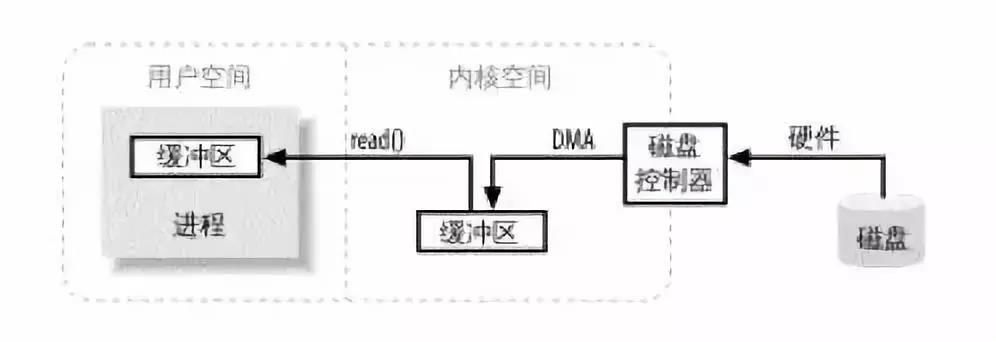

进程发起read请求之后，内核接收到read请求之后，会先检查内核空间中是否已经存在进程所需要的数据，如果已经存在，则直接把数据copy给进程的缓冲区；

如果没有内核随即向磁盘控制器发出命令，要求从磁盘读取数据，磁盘控制器把数据直接写入内核read缓冲区，这一步通过DMA完成；接下来就是内核将数据copy到进程的缓冲区；

如果进程发起write请求，同样需要把用户缓冲区里面的数据copy到内核的socket缓冲区里面，然后再通过DMA把数据copy到网卡中，发送出去；

你可能觉得这样挺浪费空间的，每次都需要把内核空间的数据拷贝到用户空间中，所以零拷贝的出现就是为了解决这种问题的；

关于零拷贝提供了两种方式分别是：mmap+write方式，sendfile方式；

### **2、虚拟内存**

所有现代操作系统都使用虚拟内存，使用虚拟的地址取代物理地址，这样做的好处是：

1）一个以上的虚拟地址可以指向同一个物理内存地址，
2）虚拟内存空间可大于实际可用的物理地址；

利用第一条特性可以把内核空间地址和用户空间的虚拟地址映射到同一个物理地址，这样DMA就可以填充对内核和用户空间进程同时可见的缓冲区了，大致如下图所示：

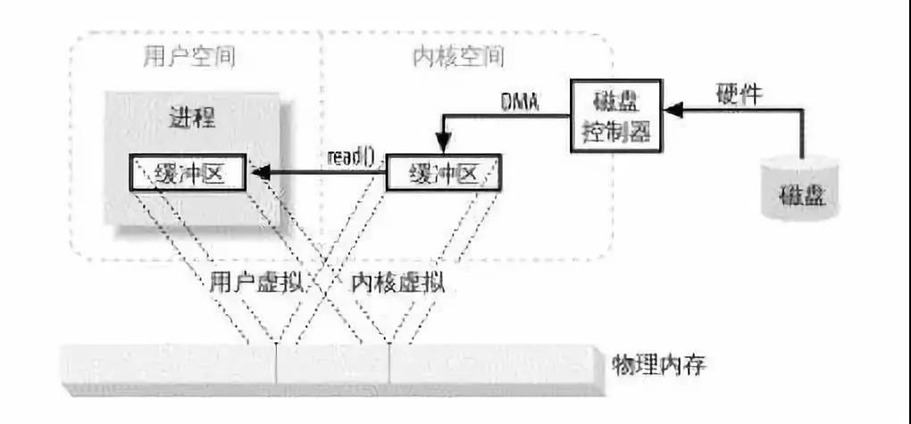

省去了内核与用户空间的往来拷贝，java也利用操作系统的此特性来提升性能，下面重点看看java对零拷贝都有哪些支持。

## 实现


### 1、mmap+write


使用mmap+write方式代替原来的read+write方式，mmap是一种**内存映射**文件的方法，即将一个文件或者其它对象映射到进程的地址空间，实现文件磁盘地址和进程虚拟地址空间中一段虚拟地址的一一对映关系；

**文件映射到内核缓冲区,用户空间可同享内核空间的数据**

这样就可以省掉原来内核read缓冲区copy数据到用户缓冲区，但是还是需要内核read缓冲区将数据copy到内核socket缓冲区，大致如下图所示：

**网络传输时,减少内核空间到用户空间的拷贝次数**

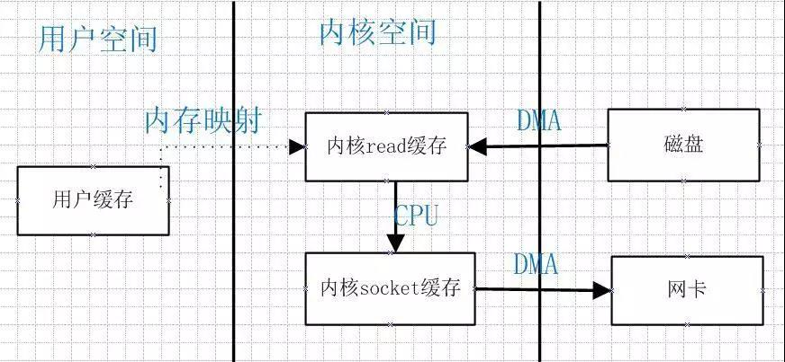

### **2、sendfile方式**

sendfile系统调用在内核版本2.1中被引入，目的是简化通过网络在两个通道之间进行的数据传输过程。sendfile系统调用的引入，不仅减少了数据复制，还减少了上下文切换的次数，大致如下图所示：

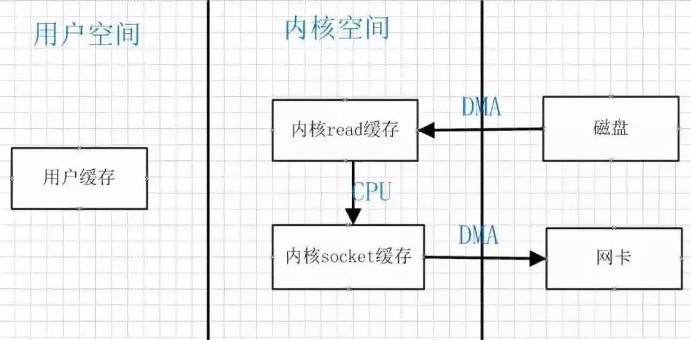

数据传送只发生在内核空间，所以减少了一次上下文切换；但是还是存在一次copy，能不能把这一次copy也省略掉，Linux2.4内核中做了改进，将Kernel buffer中对应的数据描述信息（内存地址，偏移量）记录到相应的socket缓冲区当中，这样连内核空间中的一次cpu copy也省掉了；


#### sendfile优化

Linux 在 2.4 版本中，做了一些修改，避免了从内核缓冲区拷贝到 Socket buffer 的操作，直接拷贝到协议栈，从而再一次减少了数据拷贝。具体如下图和小结：

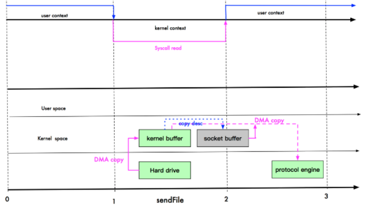

kermel  buffer直接经过DMA cope到protocol engine(协议栈)

### 3. mmap 和 sendFile 的区别

* mmap 适合小数据量读写，sendFile 适合大文件传输。

* mmap 需要 4 次上下文切换，3 次数据拷贝；sendFile 需要 3 次上下文切换，最少 2 次数据拷贝。

* sendFile 可以利用 DMA 方式，减少 CPU 拷贝，mmap 则不能（必须从内核拷贝到 Socket 缓冲区）。


这里其实有 一次cpu 拷贝
kernel buffer -> socket buffer
但是，拷贝的信息很少，比如
lenght , offset , 消耗低，可以忽略

## **Java零拷贝**


### **1、MappedByteBuffer**

java nio提供的FileChannel提供了map()方法，该方法可以在一个打开的文件和MappedByteBuffer之间建立一个虚拟内存映射，MappedByteBuffer继承于ByteBuffer，类似于一个基于内存的缓冲区，只不过该对象的数据元素存储在磁盘的一个文件中；

调用get()方法会从磁盘中获取数据，此数据反映该文件当前的内容，调用put()方法会更新磁盘上的文件，并且对文件做的修改对其他阅读者也是可见的；下面看一个简单的读取实例，然后在对MappedByteBuffer进行分析：

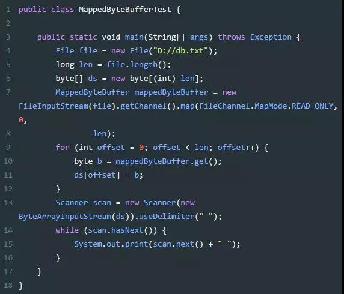

主要通过FileChannel提供的map()来实现映射，map()方法如下：

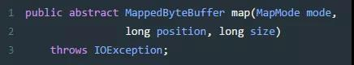

分别提供了三个参数，MapMode，Position和size；分别表示：
**MapMode**：映射的模式，可选项包括：READ_ONLY，READ_WRITE，PRIVATE；
**Position**：从哪个位置开始映射，字节数的位置；
**Size**：从position开始向后多少个字节；

重点看一下MapMode，请两个分别表示只读和可读可写，当然请求的映射模式受到Filechannel对象的访问权限限制，如果在一个没有读权限的文件上启用READ_ONLY，将抛出NonReadableChannelException；

PRIVATE模式表示写时拷贝的映射，意味着通过put()方法所做的任何修改都会导致产生一个私有的数据拷贝并且该拷贝中的数据只有MappedByteBuffer实例可以看到；

该过程不会对底层文件做任何修改，而且一旦缓冲区被施以垃圾收集动作（garbage collected），那些修改都会丢失；大致浏览一下map()方法的源码：

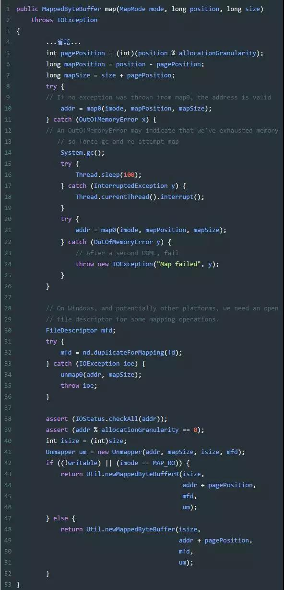

大致意思就是通过native方法获取内存映射的地址，如果失败，手动gc再次映射；最后通过内存映射的地址实例化出MappedByteBuffer，MappedByteBuffer本身是一个抽象类，其实这里真正实例化出来的是DirectByteBuffer；

### **2、DirectByteBuffer**

DirectByteBuffer继承于MappedByteBuffer，从名字就可以猜测出开辟了一段直接的内存，并不会占用jvm的内存空间；上一节中通过Filechannel映射出的MappedByteBuffer其实际也是DirectByteBuffer，当然除了这种方式，也可以手动开辟一段空间：

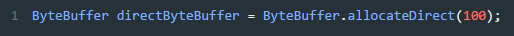

如上开辟了100字节的直接内存空间；

### **3、Channel-to-Channel传输**

经常需要从一个位置将文件传输到另外一个位置，FileChannel提供了transferTo()方法用来提高传输的效率，首先看一个简单的实例：

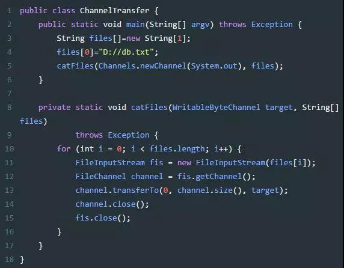

通过FileChannel的transferTo()方法将文件数据传输到System.out通道，接口定义如下：

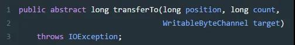

几个参数也比较好理解，分别是开始传输的位置，传输的字节数，以及目标通道；transferTo()允许将一个通道交叉连接到另一个通道，而不需要一个中间缓冲区来传递数据；

注：这里不需要中间缓冲区有两层意思：第一层不需要用户空间缓冲区来拷贝内核缓冲区，另外一层两个通道都有自己的内核缓冲区，两个内核缓冲区也可以做到无需拷贝数据；


## **Netty零拷贝**


netty提供了零拷贝的buffer，在传输数据时，最终处理的数据会需要对单个传输的报文，进行组合和拆分，Nio原生的ByteBuffer无法做到，netty通过提供的Composite(组合)和Slice(拆分)两种buffer来实现零拷贝；看下面一张图会比较清晰：

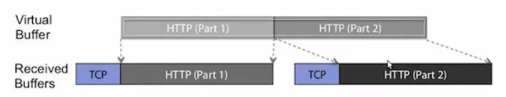


TCP层HTTP报文被分成了两个ChannelBuffer，这两个Buffer对我们上层的逻辑(HTTP处理)是没有意义的。

但是两个ChannelBuffer被组合起来，就成为了一个有意义的HTTP报文，这个报文对应的ChannelBuffer，才是能称之为”Message”的东西，这里用到了一个词”Virtual Buffer”。

可以看一下netty提供的CompositeChannelBuffer源码：

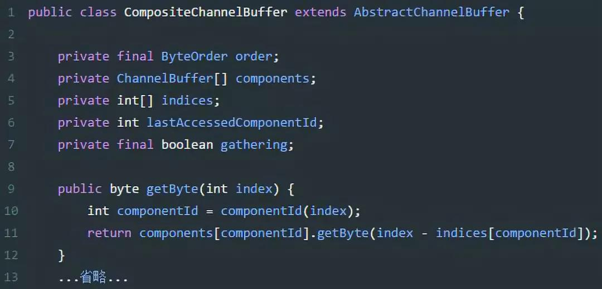

components用来保存的就是所有接收到的buffer，indices记录每个buffer的起始位置，lastAccessedComponentId记录上一次访问的ComponentId；

CompositeChannelBuffer并不会开辟新的内存并直接复制所有ChannelBuffer内容，而是直接保存了所有ChannelBuffer的引用，并在子ChannelBuffer里进行读写，实现了零拷贝。


## **其他零拷贝**


RocketMQ的消息采用顺序写到`commitlog`文件，然后利用consume queue文件作为索引；RocketMQ采用零拷贝mmap+write的方式来回应Consumer的请求；

同样kafka中存在大量的网络数据持久化到磁盘和磁盘文件通过网络发送的过程，kafka使用了sendfile零拷贝方式；

## **总结**

零拷贝如果简单用java里面对象的概率来理解的话，其实就是使用的都是对象的引用，每个引用对象的地方对其改变就都能改变此对象，永远只存在一份对象