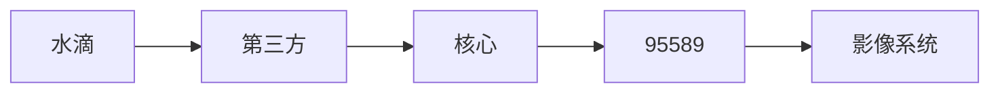

# 水滴理赔业务流程


```flow
start=>start: 提交报案
end=>end: End
heyJude=>operation: hey Jude
doNot=>operation: don't
makeItBad=>condition: make it bad
beAfraid=>condition: be afraid
letMeDown=>condition: let me down
takeASadSong=>operation: take a sad song and make it better
youWereMade=>operation: you were made to go out and get her
youHaveFound=>operation: you have found her, now go and get her
rememberTo=>operation: remember to
letHerInto=>condition: let her into your heart
letHerUnder=>operation: let her under your skin
thenYou=>operation: then you
canStart=>condition: can start
begin=>operation: begin
toMakeItBetter=>operation: to make it better
betterbetter=>operation: better better better better better waaaaa
na=>operation: na

start->heyJude->doNot->end
doNot->makeItBad
makeItBad(no)->beAfraid
beAfraid(no)->letMeDown
makeItBad(yes)->takeASadSong
beAfraid(yes)->youWereMade
letMeDown(yes)->youHaveFound
takeASadSong->rememberTo
youWereMade->rememberTo
youHaveFound->rememberTo
rememberTo->letHerInto
letHerInto(no)->letHerUnder
letHerInto(yes)->thenYou
letHerUnder->thenYou
thenYou->canStart
canStart(no)->begin
canStart(yes)->toMakeItBetter
begin->toMakeItBetter
toMakeItBetter->betterbetter
betterbetter->na
na->end
```

