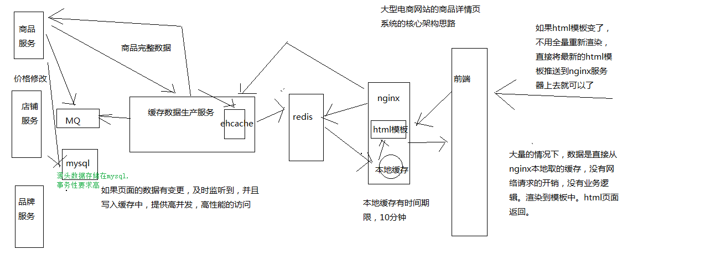
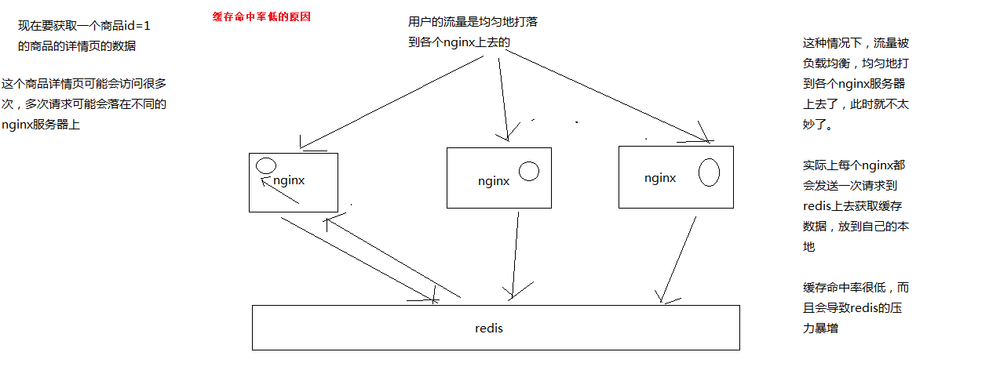
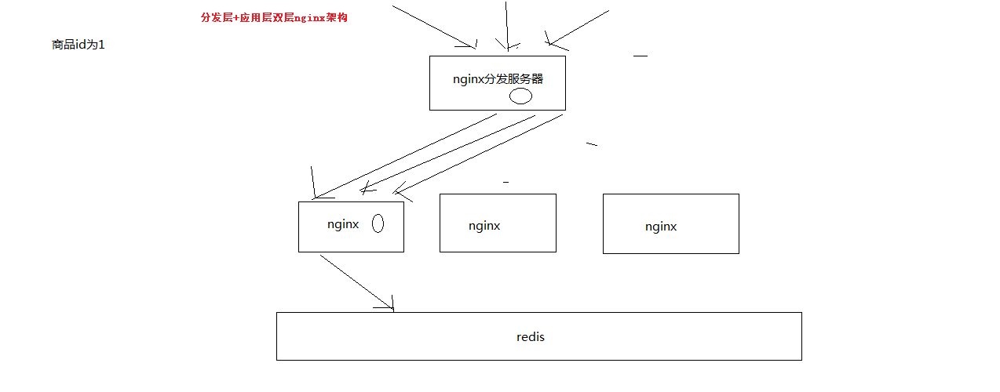

# 亿级流量系统架构

## Override

[如何支撑百亿级数据的存储与计算](https://mp.weixin.qq.com/s/eqtR9QAMIm3F4QnGut1vrA)

[如何设计高容错分布式计算系统](https://mp.weixin.qq.com/s/Omzkr-9BoL3GjyiWn9Nhdg)

[如何设计承载百亿流量的高性能架构](https://mp.weixin.qq.com/s/o8rZwDGkJwPxHsPpBcQh9w)

[如何设计每秒十万查询的高并发架构](https://mp.weixin.qq.com/s/o8rZwDGkJwPxHsPpBcQh9w)

[如何设计全链路99.99%高可用架构](https://mp.weixin.qq.com/s/3-eWMVje_PWnwGmsZZBJog)

[亿级流量系统架构之如何在上万并发场景下设计可扩展架构（上）？](https://mp.weixin.qq.com/s/8zHlTwTQkl3LNS5beOf5AA)

[亿级流量系统架构之如何在上万并发场景下设计可扩展架构（中）？](https://mp.weixin.qq.com/s/ThoeXs-Dz7xbs-Nl7Mbfag)

[亿级流量系统架构之如何在上万并发场景下设计可扩展架构（下）？](https://mp.weixin.qq.com/s/f4We1V8EAIyM8wpvwAHmwQ)

[专栏总结](https://mp.weixin.qq.com/s/AkZn-RjXcZYdZ2PjQ8_YHA)

[如何保证百亿流量下的数据一致性（上）](https://mp.weixin.qq.com/s/hh-kpRLwKRLLK8fG-5jzTQ)

[如何保证百亿流量下的数据一致性（中）？](https://mp.weixin.qq.com/s/suPMfwaXc4ze_csS2WfzHA)

[如何保证百亿流量下的数据一致性（下）？](https://mp.weixin.qq.com/s/TdGiiBzaOTo1TeY40NpSTw)

[互联网面试必杀：如何保证消息中间件全链路数据100%不丢失（1）](https://mp.weixin.qq.com/s/uqWIf0MAet_StszuOrZCwQ)

[互联网面试必杀：如何保证消息中间件全链路数据100%不丢失（2）](https://mp.weixin.qq.com/s/9SFrwaCCLnNyuCqP_KQ0zw)

[数据一致性重构的食用指南](https://mp.weixin.qq.com/s/bZwhgi9MFioSmfPeb9tcsg)

[面试大杀器：消息中间件如何实现消费吞吐量的百倍优化？](https://mp.weixin.qq.com/s/vZ4KVC2eGmssnQUyIKgzfw)

[高并发场景下，如何保证生产者投递到消息中间件的消息不丢失？](https://mp.weixin.qq.com/s/r2_o5wa6Gn94NY4ViRnjpA)

[用大白话给你讲小白都能看懂的分布式系统容错架构](https://mp.weixin.qq.com/s/DKf63ZDJQKoEiOmGqn3NxQ)

[你的系统如何支撑高并发？](https://mp.weixin.qq.com/s/nh_a_ea0JDNFqWJbgRRmNA)

[支撑百万连接的系统应该如何设计其高并发架构？](https://mp.weixin.qq.com/s/12MVd1i-ZRyohI4rh9P4uw)

[如何设计一个百万级的消息推送系统](https://mp.weixin.qq.com/s/wCbBKCR2CIKAOMdBsoj2pQ)


## 如何设计每秒十万查询的高并发架构

### 4.1.分库分表 + 读写分离

### 4.2.每秒10万查询的高并发挑战

统计数据:99%请求为当日数据(热数据),1%请求为历史数据(冷数据)

### 4.3.数据的冷热分离架构

将今日实时计算出来的热数据放在一个MySQL集群里，将离线计算出来的冷数据放在另外一个MySQL集群里

然后开发一个数据查询平台,封装底层的多个MySQL集群,根据查询条件动态路由到热数据存储或者是冷数据存储

### 4.4.冷数据存储和查询的问题

问题:

1).冷数据的数据量不断增长,mysql需要不断扩容

2).分库、分表后,库和表维护麻烦

解决:
ES+HBase+内存的SQL计算引擎

[Elasticsearch+Hbase实现海量数据秒级查询](https://blog.csdn.net/sdksdk0/article/details/53966430)

先决条件:入库时,冗余字段,避免表关联

步骤:
1). where条件,先走ES的分布式高性能索引查询，ES可以针对海量数据高性能的检索出来需要的那部分数据


2). 将检索出来的数据对应的完整的各个数据字段，从HBase里提取出来，拼接成完成的数据

3). 将这份数据集放在内存里，进行复杂的函数计算、分组聚合以及排序等操作

### 4.5.实时数据存储引入缓存集群

缓存集群:实时数据每次更新后写入的时候,都是写数据库集群同时还写缓存集群的,是双写的方式

### 4.6.总结

热数据基于缓存集群+数据库集群来承载高并发的每秒十万级别的查询

冷数据基于ES+HBase+内存计算的自研查询引擎来支撑海量数据存储以及高性能查询

热数据查询响应时间:几十毫秒

冷数据查询响应时间:200毫秒以内


### 高并发连接

[一步步动手实现高并发的Reactor模型 —— Kafka底层如何充分利用多线程优势去处理网络I/O与业务分发](https://my.oschina.net/anur/blog/2988177)


# 亿级流量、高并发与高性能场景下的电商详情页大型缓存架构实战

### 04_大型电商网站的异步多级缓存构建+nginx数据本地化动态渲染的架构

模板，可能所有的页面要重新渲染，很坑，大网站


参考: 乐优商城 Rabbitmq及数据同步

#### nginx请求数据，动态渲染网页模板
分发层nginx，lua应用，会将商品id，商品店铺id，都转发到后端的应用nginx


1、应用nginx的lua脚本接收到请求
2、获取请求参数中的商品id，以及商品店铺id
3、根据商品id和商品店铺id，在nginx本地缓存中尝试获取数据
4、如果在nginx本地缓存中没有获取到数据，那么就到redis分布式缓存中获取数据，如果获取到了数据，还要设置到nginx本地缓存中


但是这里有个问题，建议不要用nginx+lua直接去获取redis数据
因为openresty没有太好的redis cluster的支持包，所以建议是发送http请求到缓存数据生产服务，由该服务提供一个http接口

缓存数生产服务可以基于redis cluster api从redis中直接获取数据，并返回给nginx


下载相关http的lua包
> cd /usr/hello/lualib/resty/  

> wget https://raw.githubusercontent.com/pintsized/lua-resty-http/master/lib/resty/http_headers.lua  

> wget https://raw.githubusercontent.com/pintsized/lua-resty-http/master/lib/resty/http.lua 


5、如果缓存数据生产服务没有在redis分布式缓存中没有获取到数据，那么就在自己本地ehcache中获取数据，返回数据给nginx，也要设置到nginx本地缓存中


6、如果ehcache本地缓存都没有数据，那么就需要去原始的服务中拉去数据，该服务会从mysql中查询，拉去到数据之后，返回给nginx，并重新设置到ehcache和redis中


这里先不考虑，后面要专门讲解一套分布式缓存重建并发冲突的问题和解决方案


7、nginx最终利用获取到的数据，动态渲染网页模板


下载网页模板相关的lua包
> cd /usr/hello/lualib/resty/
> wget https://raw.githubusercontent.com/bungle/lua-resty-template/master/lib/resty/template.lua
> mkdir /usr/hello/lualib/resty/html
> cd /usr/hello/lualib/resty/html
> wget https://raw.githubusercontent.com/bungle/lua-resty-template/master/lib/resty/template/html.lua


在/usr/hello/hello.conf的server中配置模板位置  
vi  /usr/hello/hello.conf
set $template_location "/templates";  
set $template_root "/usr/hello/templates";

创建目录并新建页面
mkdir /usr/hello/templates
vi /usr/hello/templates/product.html
```html
<html>
     <head>
            <meta http-equiv="Content-Type" content="text/html; charset=UTF-8">
            <title>商品详情页</title>
    </head>
    <body>
        商品id: {* productId *}<br/>
        商品名称: {* productName *}<br/>
        商品图片列表: {* productPictureList *}<br/>
        商品规格: {* productSpecification *}<br/>
        商品售后服务: {* productService *}<br/>
        商品颜色: {* productColor *}<br/>
        商品大小: {* productSize *}<br/>
        店铺id: {* shopId *}<br/>
        店铺名称: {* shopName *}<br/>
        店铺等级: {* shopLevel *}<br/>
        店铺好评率: {* shopGoodCommentRate *}<br/>
    </body>
</html>
```


8、将渲染后的网页模板作为http响应，返回给分发层nginx


在 vi /usr/servers/nginx/conf/nginx.conf中的http加入：
lua_shared_dict my_cache 128m;
创建lua脚本
vi /usr/hello/lua/product.lua

lua脚本中：

```lua
local uri_args = ngx.req.get_uri_args()
local productId = uri_args["productId"]
local shopId = uri_args["shopId"]
local cache_ngx = ngx.shared.my_cache
local productCacheKey = "product_info_"..productId
local shopCacheKey = "shop_info_"..shopId
local productCache = cache_ngx:get(productCacheKey)
local shopCache = cache_ngx:get(shopCacheKey)
if productCache == "" or productCache == nil then
local http = require("resty.http")
local httpc = http.new()
local resp, err = httpc:request_uri("http://192.168.31.179:8080",{
  method = "GET",
  path = "/getProductInfo?productId="..productId
})
productCache = resp.body
cache_ngx:set(productCacheKey, productCache, 10 * 60)
end


if shopCache == "" or shopCache == nil then
local http = require("resty.http")
local httpc = http.new()
local resp, err = httpc:request_uri("http://192.168.31.179:8080",{
  method = "GET",
  path = "/getShopInfo?shopId="..shopId
})
shopCache = resp.body
cache_ngx:set(shopCacheKey, shopCache, 10 * 60)
end

local cjson = require("cjson")
local productCacheJSON = cjson.decode(productCache)
local shopCacheJSON = cjson.decode(shopCache)

local context = {
productId = productCacheJSON.id,
productName = productCacheJSON.name,
productPrice = productCacheJSON.price,
productPictureList = productCacheJSON.pictureList,
productSpecification = productCacheJSON.specification,
productService = productCacheJSON.service,
productColor = productCacheJSON.color,
productSize = productCacheJSON.size,
shopId = shopCacheJSON.id,
shopName = shopCacheJSON.name,
shopLevel = shopCacheJSON.level,
shopGoodCommentRate = shopCacheJSON.goodCommentRate
}

local template = require("resty.template")
template.render("product.html", context)
```


重启nginx
> cd/usr/servers/nginx/sbin/nginx -s reload

### 14_redis如何通过读写分离来承载读请求QPS超过10万+？


1、redis高并发跟整个系统的高并发之间的关系

redis，你要搞高并发的话，不可避免，要把底层的缓存搞得很好

mysql，高并发，做到了，那么也是通过一系列复杂的分库分表，订单系统，事务要求的，QPS到几万，比较高了

要做一些电商的商品详情页，真正的超高并发，QPS上十万，甚至是百万，一秒钟百万的请求量

光是redis是不够的，但是redis是整个大型的缓存架构中，支撑高并发的架构里面，非常重要的一个环节

首先，你的底层的缓存中间件，缓存系统，必须能够支撑的起我们说的那种高并发，其次，再经过良好的整体的缓存架构的设计（多级缓存架构、热点缓存），支撑真正的上十万，甚至上百万的高并发


2、redis不能支撑高并发的瓶颈在哪里？

​	单机

redis单机的瓶颈


3、如果redis要支撑超过10万+的并发，那应该怎么做？

单机的redis几乎不太可能说QPS超过10万+，除非一些特殊情况，比如你的机器性能特别好，配置特别高，物理机，维护做的特别好，而且你的整体的操作不是太复杂

单机在几万

读写分离，一般来说，对缓存，一般都是用来支撑读高并发的，写的请求是比较少的，可能写请求也就一秒钟几千，一两千

大量的请求都是读，一秒钟二十万次读

读写分离

主从架构 -> 读写分离 -> 支撑10万+读QPS的架构


redis主从实现读写分离支撑10万+的高并发


4、接下来要讲解的一个topic

​	redis replication

​	redis主从架构 -> 读写分离架构 -> 可支持水平扩展的读高并发架构


### 31_redis_cluster的自动化slaver迁移实现更强的高可用架构的部署方案

slave的自动迁移

比如现在有10个master，每个有1个slave，然后新增了3个slave作为冗余，有的master就有2个slave了，有的master出现了salve冗余

如果某个master的slave挂了，那么redis cluster会自动迁移一个冗余的slave给那个master

只要多加一些冗余的slave就可以了

为了避免的场景，就是说，如果你每个master只有一个slave，万一说一个slave死了，然后很快，master也死了，那可用性还是降低了

但是如果你给整个集群挂载了一些冗余slave，那么某个master的slave死了，冗余的slave会被自动迁移过去，作为master的新slave，此时即使那个master也死了

还是有一个slave会切换成master的

之前有一个master是有冗余slave的，直接让其他master其中的一个slave死掉，然后看有冗余slave会不会自动挂载到那个master


### 48_redis的LRU缓存清除算法讲解以及相关配置使用

之前给大家讲解过，多级缓存架构，缓存数据生产服务，监听各个数据源服务的数据变更的消息，得到消息之后，然后调用接口拉去数据

将拉去到的数据，写入本地ehcache缓存一份，spring boot整合，演示过

数据写入redis分布式缓存中一份，你不断的将数据写入redis，写入redis，然后redis的内存是有限的，每个redis实例最大一般也就是设置给10G

那如果你不断的写入数据，当数据写入的量超过了redis能承受的范围之后，改该怎么玩儿呢？？？

redis是会在数据达到一定程度之后，超过了一个最大的限度之后，就会将数据进行一定的清理，从内存中清理掉一些数据

只有清理掉一些数据之后，才能将新的数据写入内存中

1、LRU算法概述

redis默认情况下就是使用LRU策略的，因为内存是有限的，但是如果你不断地往redis里面写入数据，那肯定是没法存放下所有的数据在内存的

所以redis默认情况下，当内存中写入的数据很满之后，就会使用LRU算法清理掉部分内存中的数据，腾出一些空间来，然后让新的数据写入redis缓存中

LRU：Least Recently Used，最近最少使用算法

将最近一段时间内，最少使用的一些数据，给干掉。比如说有一个key，在最近1个小时内，只被访问了一次; 还有一个key在最近1个小时内，被访问了1万次

这个时候比如你要将部分数据给清理掉，你会选择清理哪些数据啊？肯定是那个在最近小时内被访问了1万次的数据

2、缓存清理设置

redis.conf

maxmemory，设置redis用来存放数据的最大的内存大小，一旦超出这个内存大小之后，就会立即使用LRU算法清理掉部分数据

如果用LRU，那么就是将最近最少使用的数据从缓存中清除出去

对于64 bit的机器，如果maxmemory设置为0，那么就默认不限制内存的使用，直到耗尽机器中所有的内存为止; 但是对于32 bit的机器，有一个隐式的闲置就是3GB

maxmemory-policy，可以设置内存达到最大闲置后，采取什么策略来处理

（1）noeviction: 如果内存使用达到了maxmemory，client还要继续写入数据，那么就直接报错给客户端
（2）allkeys-lru: 就是我们常说的LRU算法，移除掉最近最少使用的那些keys对应的数据
（3）volatile-lru: 也是采取LRU算法，但是仅仅针对那些设置了指定存活时间（TTL）的key才会清理掉
（4）allkeys-random: 随机选择一些key来删除掉
（5）volatile-random: 随机选择一些设置了TTL的key来删除掉
（6）volatile-ttl: 移除掉部分keys，选择那些TTL时间比较短的keys

在redis里面，写入key-value对的时候，是可以设置TTL，存活时间，比如你设置了60s。那么一个key-value对，在60s之后就会自动被删除

redis的使用，各种数据结构，list，set，等等

allkeys-lru

这边拓展一下思路，对技术的研究，一旦将一些技术研究的比较透彻之后，就喜欢横向对比底层的一些原理

storm，科普一下

玩儿大数据的人搞得，领域，实时计算领域，storm

storm有很多的流分组的一些策略，按shuffle分组，global全局分组，direct直接分组，fields按字段值hash后分组

分组策略也很多，但是，真正公司里99%的场景下，使用的也就是shuffle和fields，两种策略

redis，给了这么多种乱七八糟的缓存清理的算法，其实真正常用的可能也就那么一两种，allkeys-lru是最常用的

3、缓存清理的流程

（1）客户端执行数据写入操作
（2）redis server接收到写入操作之后，检查maxmemory的限制，如果超过了限制，那么就根据对应的policy清理掉部分数据
（3）写入操作完成执行


4、redis的LRU近似算法

科普一个相对来说稍微高级一丢丢的知识点

redis采取的是LRU近似算法，也就是对keys进行采样，然后在采样结果中进行数据清理

redis 3.0开始，在LRU近似算法中引入了pool机制，表现可以跟真正的LRU算法相当，但是还是有所差距的，不过这样可以减少内存的消耗

redis LRU算法，是采样之后再做LRU清理的，跟真正的、传统、全量的LRU算法是不太一样的

maxmemory-samples，比如5，可以设置采样的大小，如果设置为10，那么效果会更好，不过也会耗费更多的CPU资源


### 51_基于“分发层+应用层”双层nginx架构提升缓存命中率方案分析


1、缓存命中率低

缓存数据生产服务那一层已经搞定了，相当于三层缓存架构中的本地堆缓存+redis分布式缓存都搞定了

就要来做三级缓存中的nginx那一层的缓存了

如果一般来说，你默认会部署多个nginx，在里面都会放一些缓存，就默认情况下，此时缓存命中率是比较低的




2、如何提升缓存命中率

分发层+应用层，双层nginx

分发层nginx，负责流量分发的逻辑和策略，这个里面它可以根据你自己定义的一些规则，比如根据productId去进行hash，然后对后端的nginx数量取模

将某一个商品的访问的请求，就固定路由到一个nginx后端服务器上去，保证说只会从redis中获取一次缓存数据，后面全都是走nginx本地缓存了

后端的nginx服务器，就称之为应用服务器; 最前端的nginx服务器，被称之为分发服务器

看似很简单，其实很有用，在实际的生产环境中，可以大幅度提升你的nginx本地缓存这一层的命中率，大幅度减少redis后端的压力，提升性能




### 69_缓存预热解决方案：基于storm实时热点统计的分布式并行缓存预热

0、缓存预热

缓存冷启动，redis启动后，一点数据都没有，直接就对外提供服务了，mysql就裸奔

（1）提前给redis中灌入部分数据，再提供服务
（2）肯定不可能将所有数据都写入redis，因为数据量太大了，第一耗费的时间太长了，第二根本redis容纳不下所有的数据
（3）需要根据当天的具体访问情况，实时统计出访问频率较高的热数据
（4）然后将访问频率较高的热数据写入redis中，肯定是热数据也比较多，我们也得多个服务并行读取数据去写，并行的分布式的缓存预热
（5）然后将灌入了热数据的redis对外提供服务，这样就不至于冷启动，直接让数据库裸奔了


1、nginx+lua将访问流量上报到kafka中

要统计出来当前最新的实时的热数据是哪些，我们就得将商品详情页访问的请求对应的流浪，日志，实时上报到kafka中


2、storm从kafka中消费数据，实时统计出每个商品的访问次数，访问次数基于LRU内存数据结构的存储方案

优先用内存中的一个LRUMap去存放，性能高，而且没有外部依赖

我之前做过的一些项目，不光是这个项目，还有很多其他的，一些广告计费类的系统，storm

否则的话，依赖redis，我们就是要防止redis挂掉数据丢失的情况，就不合适了; 用mysql，扛不住高并发读写; 用hbase，hadoop生态系统，维护麻烦，太重了

其实我们只要统计出最近一段时间访问最频繁的商品，然后对它们进行访问计数，同时维护出一个前N个访问最多的商品list即可

热数据，最近一段时间，可以拿到最近一段，比如最近1个小时，最近5分钟，1万个商品请求，统计出最近这段时间内每个商品的访问次数，排序，做出一个排名前N的list

计算好每个task大致要存放的商品访问次数的数量，计算出大小

然后构建一个LRUMap，apache commons collections有开源的实现，设定好map的最大大小，就会自动根据LRU算法去剔除多余的数据，保证内存使用限制

即使有部分数据被干掉了，然后下次来重新开始计数，也没关系，因为如果它被LRU算法干掉，那么它就不是热数据，说明最近一段时间都很少访问了


3、每个storm task启动的时候，基于zk分布式锁，将自己的id写入zk同一个节点中


4、每个storm task负责完成自己这里的热数据的统计，每隔一段时间，就遍历一下这个map，然后维护一个前3个商品的list，更新这个list


5、写一个后台线程，每隔一段时间，比如1分钟，都将排名前3的热数据list，同步到zk中去，存储到这个storm task对应的一个znode中去


6、我们需要一个服务，比如说，代码可以跟缓存数据生产服务放一起，但是也可以放单独的服务

服务可能部署了很多个实例

每次服务启动的时候，就会去拿到一个storm task的列表，然后根据taskid，一个一个的去尝试获取taskid对应的znode的zk分布式锁

如果能获取到分布式锁的话，那么就将那个storm task对应的热数据的list取出来

然后将数据从mysql中查询出来，写入缓存中，进行缓存的预热，多个服务实例，分布式的并行的去做，基于zk分布式锁做了协调了，分布式并行缓存的预热
